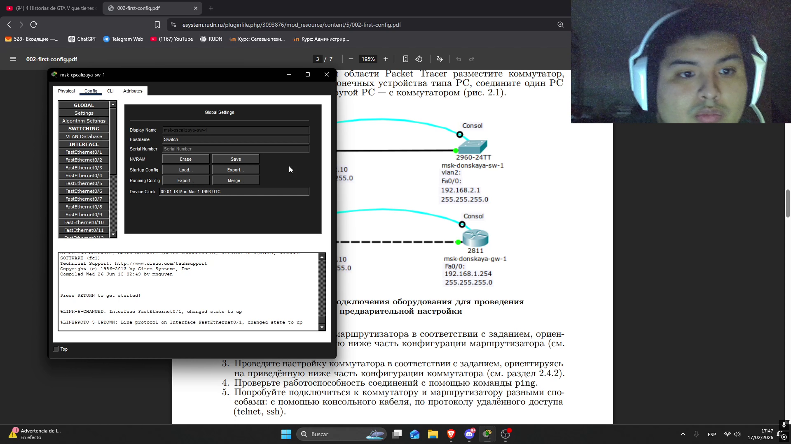

---
## Author
author:
  name: Кхари Жекка Кализая арсе
  email: 1032234412@pfur.ur
  affiliation:
    - name: Российский университет дружбы народов
      country: Российская Федерация
      postal-code: 117198
      city: Москва
      address: ул. Миклухо-Маклая, д. 6
## Title
title: Лабораторная работа № 2
subtitle: Предварительная настройкаоборудования Cisco
license: CC BY
date: today
date-format: "YYYY-MM-DD" # Example: 2025-09-06
---

# выполнение лабораторная работа

## создание топологии

:::::::::::::: {.columns align=center}

::: {.column width="70%"}

:::
::::::::::::::

## настройка названия

:::::::::::::: {.columns align=center}

::: {.column width="70%"}

:::
::::::::::::::

## настройка названия

:::::::::::::: {.columns align=center}

::: {.column width="70%"}

:::
::::::::::::::

## настройка ip-адреса

:::::::::::::: {.columns align=center}

::: {.column width="70%"}

:::
::::::::::::::

## настройка ip-адреса

:::::::::::::: {.columns align=center}

::: {.column width="70%"}

:::
::::::::::::::

## настройка интрефейса маршрутизатора

:::::::::::::: {.columns align=center}

::: {.column width="70%"}

:::
::::::::::::::

## настройка интрефейса коммутатора

:::::::::::::: {.columns align=center}

::: {.column width="70%"}

:::
::::::::::::::

