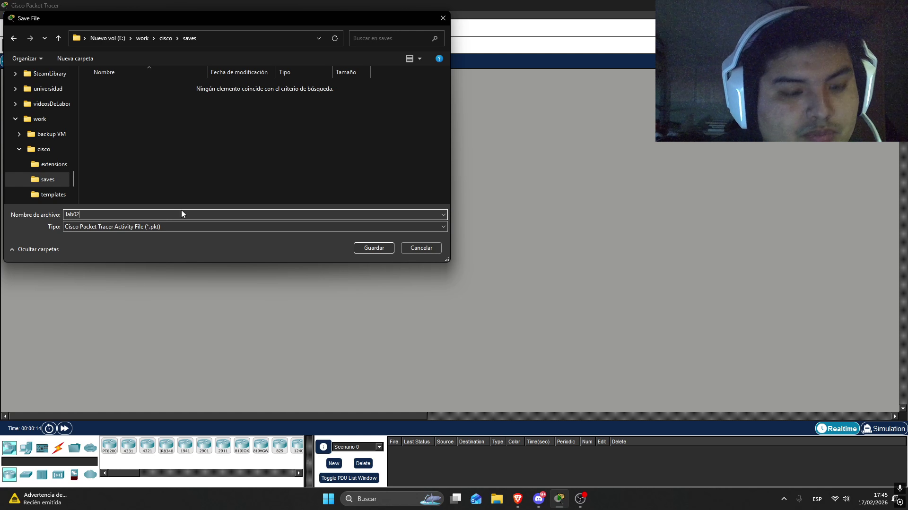
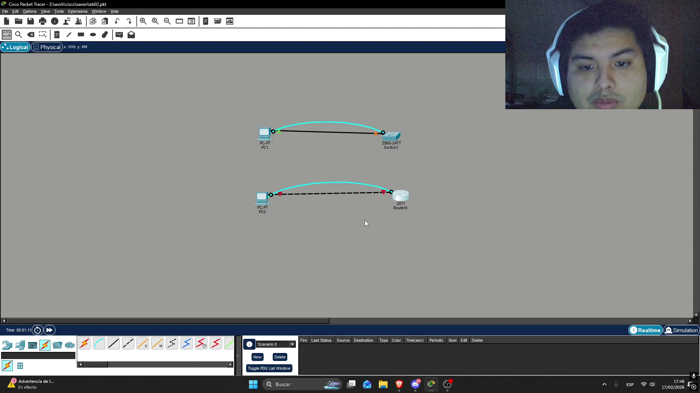
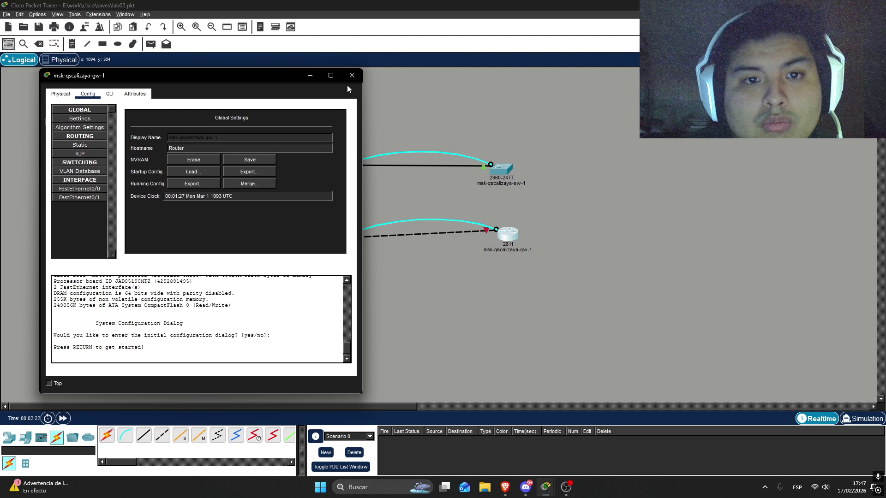
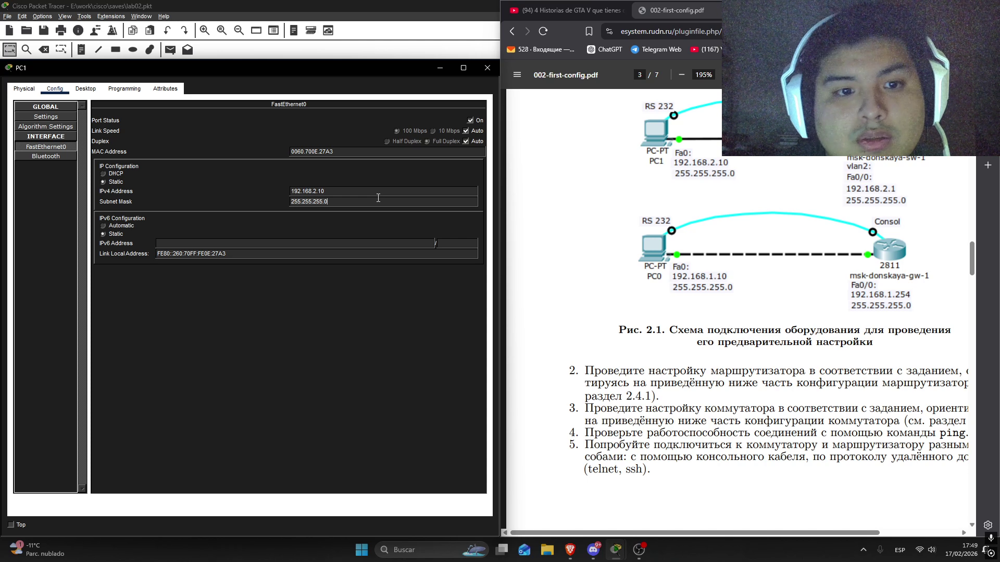
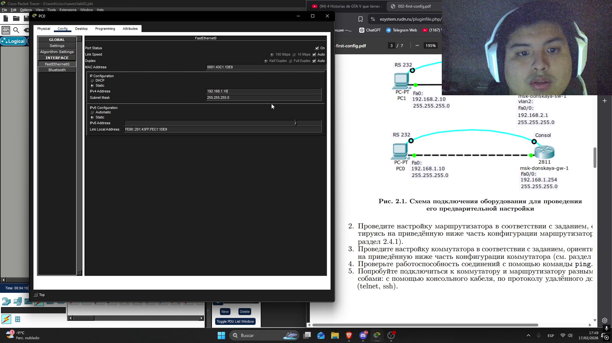
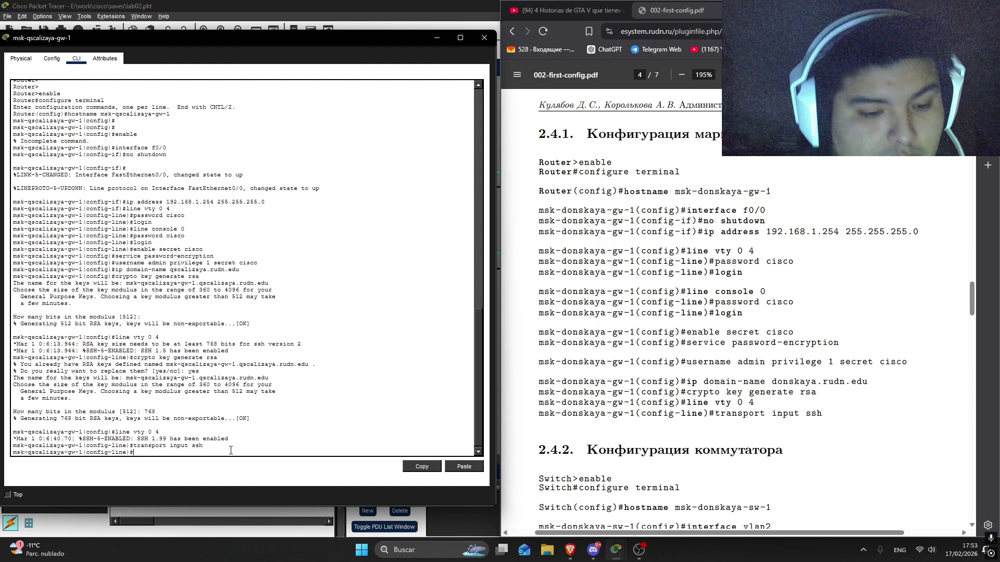
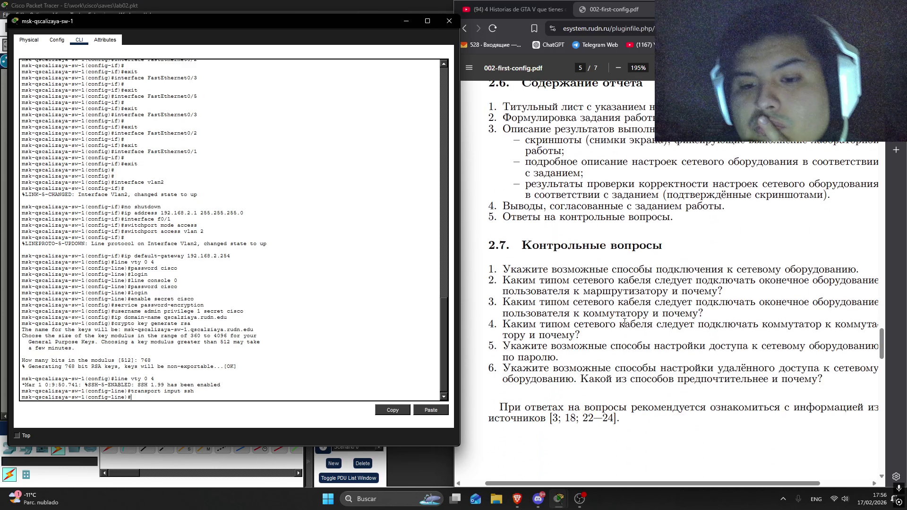

---
## Author
author:
  name: Кхари Жекка Кализая Арсе
  email: 1032234412@pfur.ru
  affiliation:
    - name: Российский университет дружбы народов
      country: Российская Федерация
      postal-code: 117198
      city: Москва
      address: ул. Миклухо-Маклая, д. 6

## Title
title: "отчёт по лабораторной работе №2"
subtitle: "Предварительная настройка оборудования Cisco"
license: "CC BY"
---

# Цель работы

Получить основные навыки по начальному конфигурированию оборудования Cisco

# Задание

1. Сделать предварительную настройку маршрутизатора:

    - задать имя в виде «город-территория-учётная_записьтип_оборудования-номер» (см. пункт 2.5), например msk-donskaya-osbender-gw-1;
    - задать интерфейсу Fast Ethernet с номером 0 ip-адрес 192.168.1.254 и маску 255.255.255.0, затем поднять интерфейс;
    - задать пароль для доступа к привилегированному режиму (сначала в открытом виде, затем — в зашифрованном);
    - настроить доступ к оборудованию сначала через telnet, затем — через ssh (используя в качестве имени домена donskaya.rudn.edu);
    - сохранить и экспортировать конфигурацию в отдельный файл.

2. Сделать предварительную настройку коммутатора:

    - задать имя в виде «город-территория-учётная_записьтип_оборудования-номер» (см. пункт 2.5), например msk-donskaya-osbender-sw-1;
    - задать интерфейсу vlan 2 ip-адрес 192.168.2.1 и маску 255.255.255.0, затем поднять интерфейс;
    - привязать интерфейс Fast Ethernet с номером 1 к vlan 2;
    - задать в качестве адреса шлюза по умолчанию адрес 192.168.2.254;
    - задать пароль для доступа к привилегированному режиму (сначала в открытом виде, затем — в зашифрованном);
    - настроить доступ к оборудованию сначала через telnet, затем — через ssh (используя в качестве имени домена donskaya.rudn.edu);
    - для пользователя admin задать доступ 1-го уровня по паролю;
    - сохранить и экспортировать конфигурацию в отдельный файл.

# Выполнение лабораторной работы

## создание топология

в этом разделе я сначала запустил cisco paket tracker и создал новый файл, который сохранил

{#fig-001 width=70%}

Потом я я полажил все элементы: две компьютера, один switch 2960-24TT и один router 2811. дальше я соединил их используя кабель ethernet и глубой кабель

{#fig-002 width=70%}

## настройка элементов

### настройка названий

Сначала я настроил switch и я назвал его msk-qscalizaya-sw-1 ([рис. @fig-003]). потом переименовал router на msk-qscalizaya-gw-1 ([рис. @fig-004]).

{#fig-003 width=70%}

{#fig-004 width=70%}

### настройка IP-адреса

я настроил IP-адрес компьютеров

- PC1 : 192.168.2.10 ([рис. @fig-005]).
- PC0 : 192.168.1.10 ([рис. @fig-006]).

{#fig-005 width=70%}

{#fig-006 width=70%}

### настройка интерфейсов

я шел в раздель CLI. там я смог смотреть терминал, в котором я смог вводить следующие командные строки

- команды для маршрутизатора:

    
        msk-qscalizaya-gw-1(config)#interface f0/0
        msk-qscalizaya-gw-1(config −if)#no shutdown
        msk-qscalizaya-gw-1(config −if)#ip address 192.168.1.254 255.255.255.0
        msk-qscalizaya-gw-1(config)#line vty 0 4
        msk-qscalizaya-gw-1(config −line)#password cisco
        msk-qscalizaya-gw-1(config −line)#login
        msk-qscalizaya-gw-1(config)#line console 0
        msk-qscalizaya-gw-1(config −line)#password cisco
        msk-qscalizaya-gw-1(config −line)#login
        msk-qscalizaya-gw-1(config)#enable secret cisco
        msk-qscalizaya-gw-1(config)#service password −encryption
        msk-qscalizaya-gw-1(config)#username admin privilege 1 secret cisco
        msk-qscalizaya-gw-1(config)#ip domain −name qscalizaya.rudn.edu
        msk-qscalizaya-gw-1(config)#crypto key generate rsa
        msk-qscalizaya-gw-1(config)#line vty 0 4
        msk-qscalizaya-gw-1(config −line)#transport input ssh

здесь была выполнена настройка интерфейса FastEthernet 0/0 с присвоением IP-адреса 192.168.1.254/24 и активацией интерфейса.
Настроена защита доступа через консоль и виртуальные линии VTY.
Задана привилегированная парольная защита (enable secret). Включено шифрование паролей. Создан локальный пользователь. Сгенерированы RSA-ключи и включён доступ по SSH.

{#fig-007 width=70%}    

- команды для коммутатора:

    
        msk-qscalizaya-sw-1(config)#interface vlan2
        msk-qscalizaya-sw-1(config −if)#no shutdown
        msk-qscalizaya-sw-1(config −if)#ip address 192.168.2.1 255.255.255.0
        msk-qscalizaya-sw-1(config)#interface f0/1
        msk-qscalizaya-sw-1(config −if)#switchport mode access
        msk-qscalizaya-sw-1(config −if)#switchport access vlan 2
        msk-qscalizaya-sw-1(config)#ip default −gateway 192.168.2.254
        msk-qscalizaya-sw-1(config)#line vty 0 4
        msk-qscalizaya-sw-1(config −line)#password cisco
        msk-qscalizaya-sw-1(config −line)#login
        msk-qscalizaya-sw-1(config)#line console 0
        msk-qscalizaya-sw-1(config −line)#password cisco
        msk-qscalizaya-sw-1(config −line)#login
        msk-qscalizaya-sw-1(config)#enable secret cisco
        msk-qscalizaya-sw-1(config)#service password −encryption
        msk-qscalizaya-sw-1(config)#username admin privilege 1 secret cisco
        msk-qscalizaya-sw-1(config)#ip domain −name qscalizaya.rudn.edu
        msk-qscalizaya-sw-1(config)#crypto key generate rsa
        msk-qscalizaya-sw-1(config)#line vty 0 4
        msk-qscalizaya-sw-1(config −line)#transport input ssh

здесь была настроена виртуальная интерфейс VLAN 2 с IP-адресом 192.168.2.1/24 для удалённого управления коммутатором. Порт FastEthernet 0/1 переведён в режим access и назначен в VLAN 2. Задана шлюз по умолчанию 192.168.2.254 для обеспечения удалённого доступа из других сетей. Настроена защита консольного и удалённого доступа. Сгенерированы RSA-ключи и включён доступ по SSH.

{#fig-008 width=70%}    

# Выводы

в этой лабораторной работе я смог смотреть как настроить интерфейсы через терминал, как настроить логин пароль и протоколь ssh 

# Список литературы{.unnumbered}

::: {#refs}
:::
