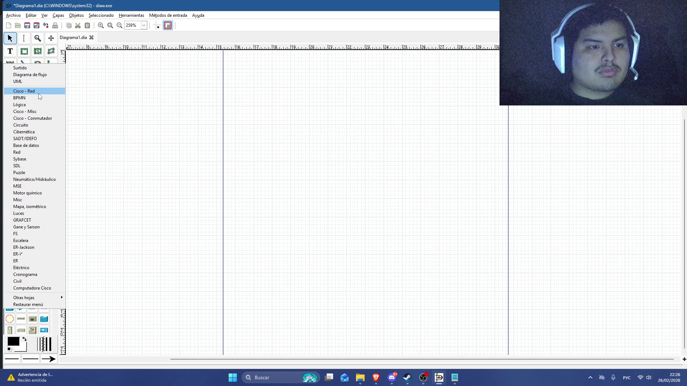
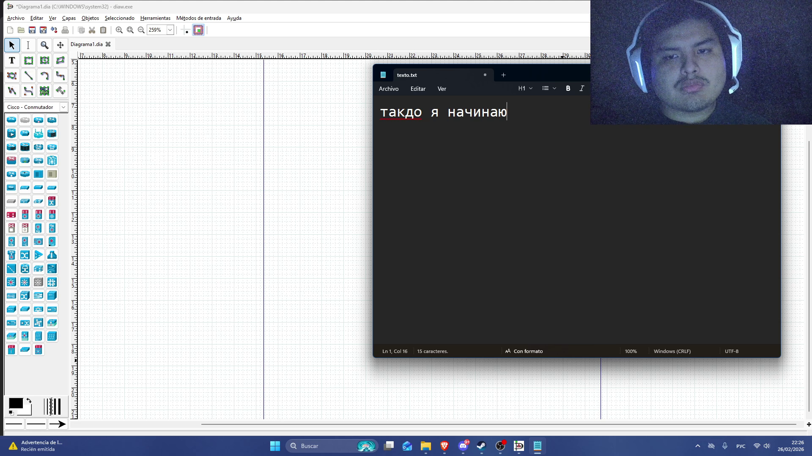
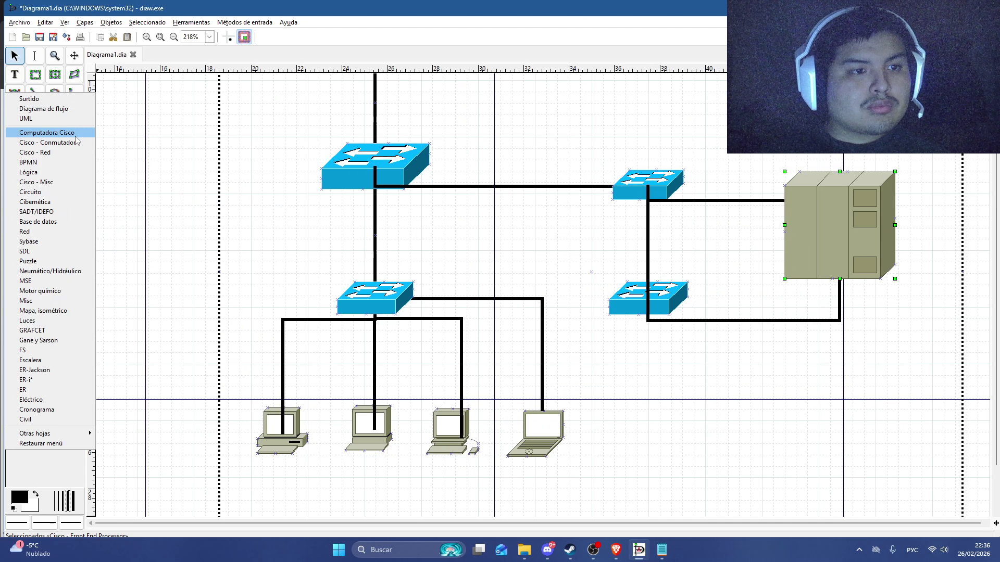
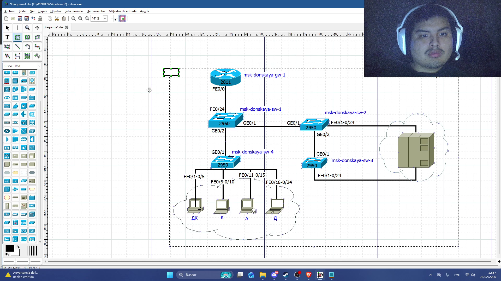
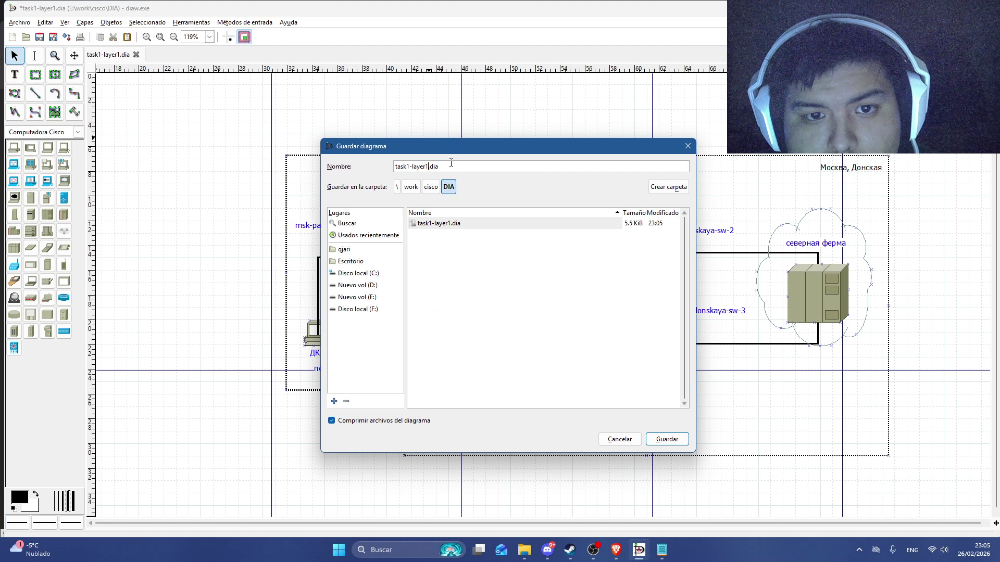
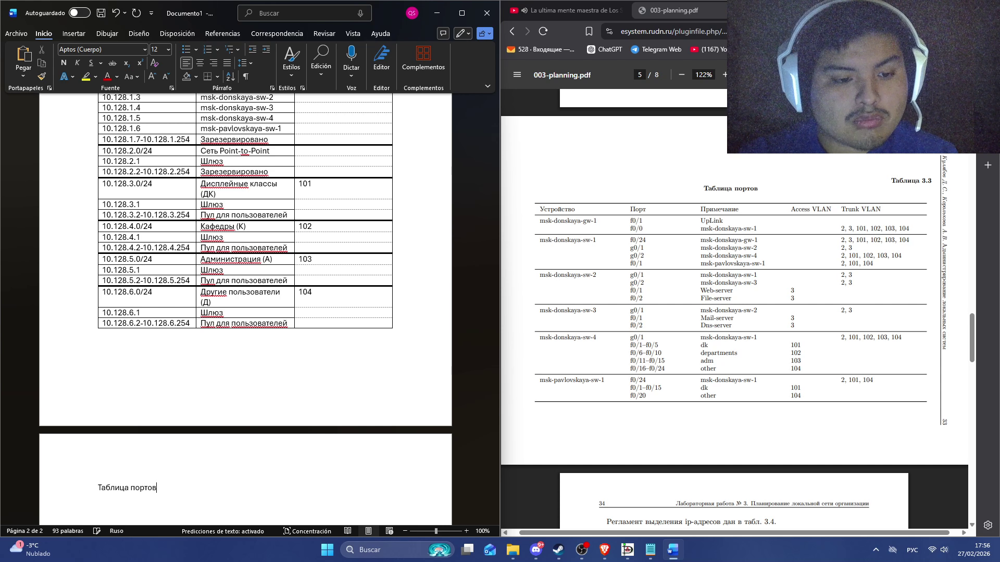
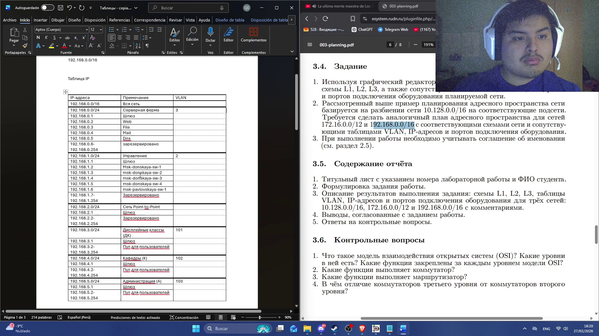
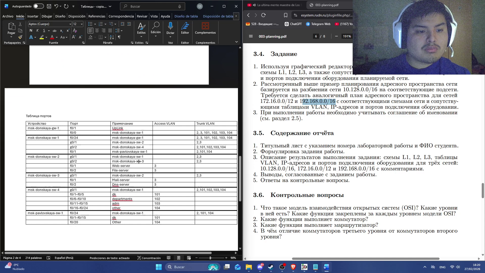
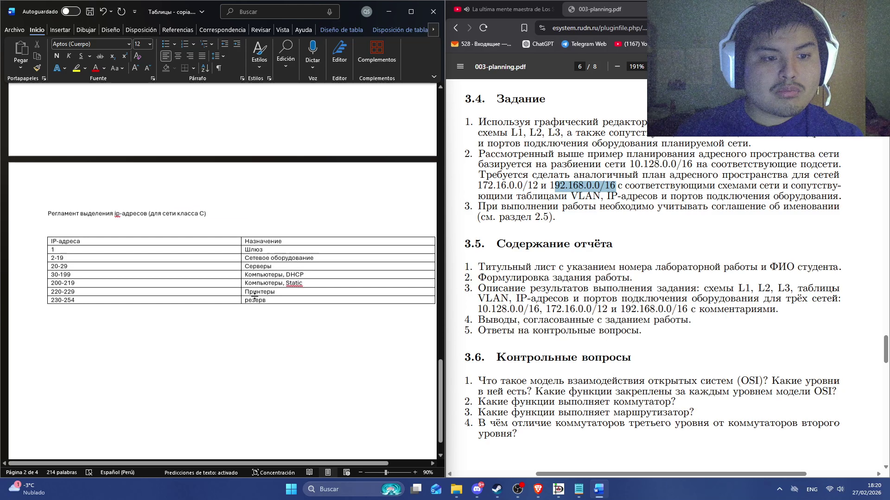

---
## Author
author:
  name: Кхари Жекка Кализая Арсе
  email: 1032234412@rudn.ru
  affiliation:
    - name: Российский университет дружбы народов
      country: Российская Федерация
      postal-code: 117198
      city: Москва
      address: ул. Миклухо-Маклая, д. 6
## Title
title: презентация Лабораторной работы № 3
subtitle: Планирование локальной сети организации
license: CC BY
date: today
date-format: "YYYY-MM-DD" # Example: 2025-09-06
---

# приложение DIA

## рабочее пространство

:::::::::::::: {.columns align=center}

::: {.column width="70%"}

:::
::::::::::::::

## список элементов

:::::::::::::: {.columns align=center}

::: {.column width="70%"}

:::
::::::::::::::

# Layer 1

## маршрутизатор и коммутаторы

:::::::::::::: {.columns align=center}

::: {.column width="70%"}

:::
::::::::::::::

## компьютеры и сервер

:::::::::::::: {.columns align=center}

::: {.column width="70%"}

:::
::::::::::::::

## соединение компонентов

:::::::::::::: {.columns align=center}

::: {.column width="70%"}

:::
::::::::::::::

## описание

:::::::::::::: {.columns align=center}

::: {.column width="70%"}

:::
::::::::::::::

## павловская

:::::::::::::: {.columns align=center}

::: {.column width="70%"}

:::
::::::::::::::

## сохранение файла

:::::::::::::: {.columns align=center}

::: {.column width="70%"}

:::
::::::::::::::

# Layer 2

## описание

:::::::::::::: {.columns align=center}

::: {.column width="70%"}

:::
::::::::::::::

# Layer 3

## части сети и IP-адерсы

:::::::::::::: {.columns align=center}

::: {.column width="70%"}

:::
::::::::::::::

# Таблица IP-адресов

## Таблица IP-адресов

:::::::::::::: {.columns align=center}

::: {.column width="70%"}

:::
::::::::::::::

## Таблица IP-адресов

:::::::::::::: {.columns align=center}

::: {.column width="70%"}

:::
::::::::::::::

# Таблица портов

## Таблица портов

:::::::::::::: {.columns align=center}

::: {.column width="70%"}

:::
::::::::::::::

# регламент выделения IP-адресов

## регламент выделения IP-адресов

:::::::::::::: {.columns align=center}

::: {.column width="70%"}

:::
::::::::::::::

# Задение 2

## Таблица IP-адресов

:::::::::::::: {.columns align=center}

::: {.column width="70%"}

:::
::::::::::::::

## Таблица IP-адресов

:::::::::::::: {.columns align=center}

::: {.column width="70%"}

:::
::::::::::::::

## Таблица портов

:::::::::::::: {.columns align=center}

::: {.column width="70%"}

:::
::::::::::::::

## регламент выделения IP-адресов

:::::::::::::: {.columns align=center}

::: {.column width="70%"}

:::
::::::::::::::

## диаграмма IP-адресов

:::::::::::::: {.columns align=center}

::: {.column width="70%"}

:::
::::::::::::::

# Задание 3

## Таблица IP-адресов

:::::::::::::: {.columns align=center}

::: {.column width="70%"}

:::
::::::::::::::

# Спасибо за внимание