---
## Author
author:
  name: кхари жекка кализая арсе
  email: 1032234412@rudn.ru
  affiliation:
    - name: Российский университет дружбы народов
      country: Российская Федерация
      postal-code: 117198
      city: Москва
      address: ул. Миклухо-Маклая, д. 6

## Title
title: "отчёт по лабораторной работе №3"
subtitle: "Планирование локальной сети организации"
license: "CC BY"
---

# Цель работы

Познакомится с принципами планирования локальной сети организации

# Задание

1. Используя графический редактор (например, Dia), требуется повторить схемы L1, L2, L3, а также сопутствующие им таблицы VLAN, IP-адресов и портов подключения оборудования планируемой сети.

2. Рассмотренный выше пример планирования адресного пространства сети базируется на разбиении сети 10.128.0.0/16 на соответствующие подсети. Требуется сделать аналогичный план адресного пространства для сетей 172.16.0.0/12 и 192.168.0.0/16 с соответствующими схемами сети и сопутствующими таблицами VLAN, IP-адресов и портов подключения оборудования.

3. При выполнении работы необходимо учитывать соглашение об именовании.

# Выполнение лабораторной работы

## пункт задания 1

### layer 1

Сначала в этой лабораторной работе я запустил приложение DIA там я смог смотреть рабочее пространство ([рис. @fig-001]). и опции, также список с элементы ([рис. @fig-002 и рис. @fig-003]), которые можно быть расположенные в рабочом области 

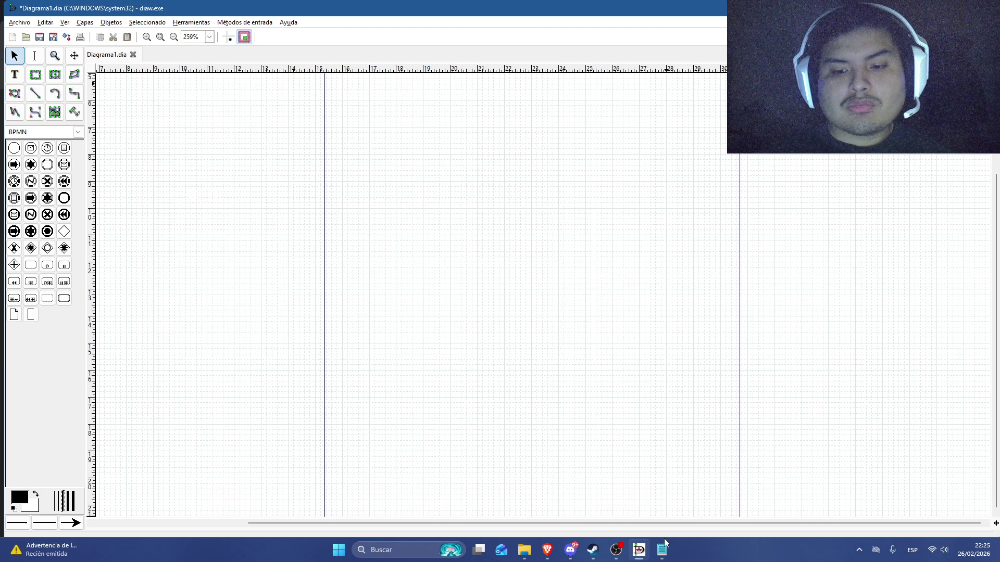{#fig-001 width=70%}

{#fig-002 width=70%}

{#fig-003 width=70%}

Дальше было расположенны маршрутизатор (1) и коммутаторы (4) в рабочем области, также прямоугольник чтобы представлять одельный область (донская)  ([рис. @fig-004]).

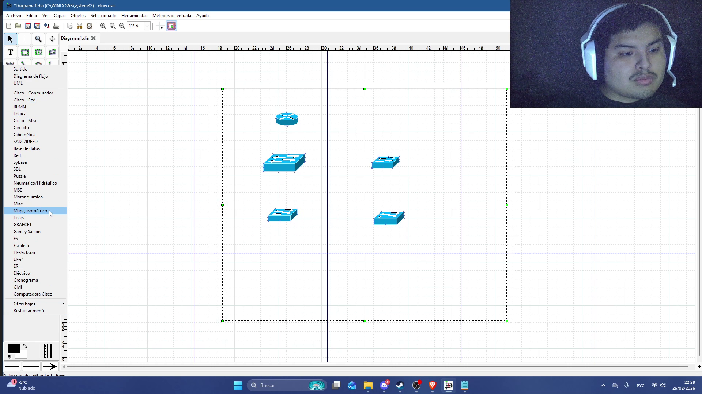{#fig-004 width=70%}

Дальше былы расположенны компьютеры (представляющие администрацию,  преподавательский состав кафедр, пользователи дисплейных классов общего пользования, другие пользователи) и сервер ([рис. @fig-006]).

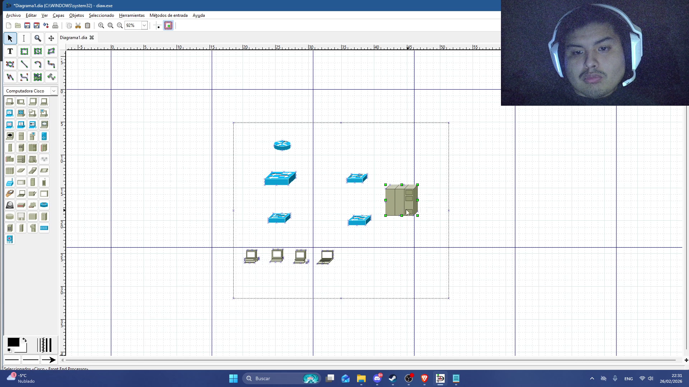{#fig-006 width=70%}

Дальше я соединил все с прямыми линиями ([рис. @fig-008]).

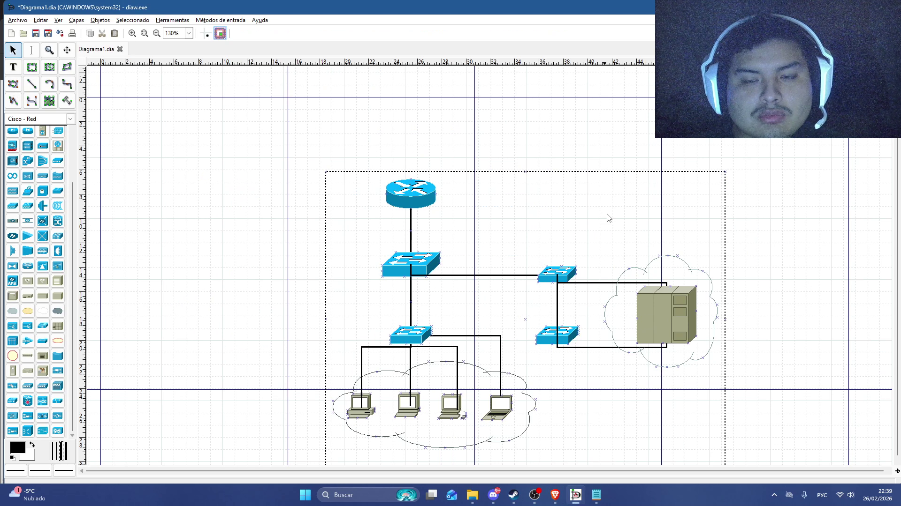{#fig-008 width=70%}

Потом я добавил текст, чтобы определенить какие порты будут использованны в каждом коммутаторе и маршрутизаторе ([рис. @fig-009]).

{#fig-009 width=70%}

Потом я повторил все чтобы создать раздел павловская ([рис. @fig-010]).

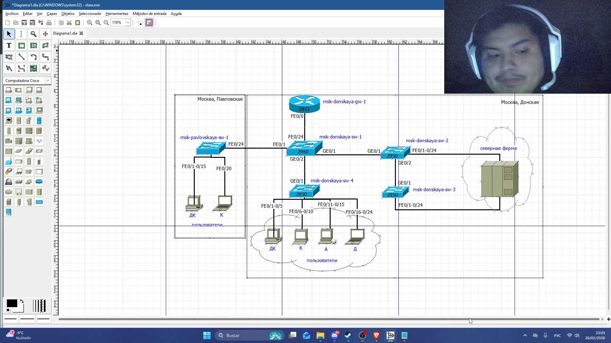{#fig-010 width=70%}

### layer 2

сначала я сохранил layer1 и скопировал его чтобы создать новый файл task1-layer2 ([рис. @fig-011]).

{#fig-011 width=70%}

Потом я заменил текст портов на домаины VLAN ([рис. @fig-013]).

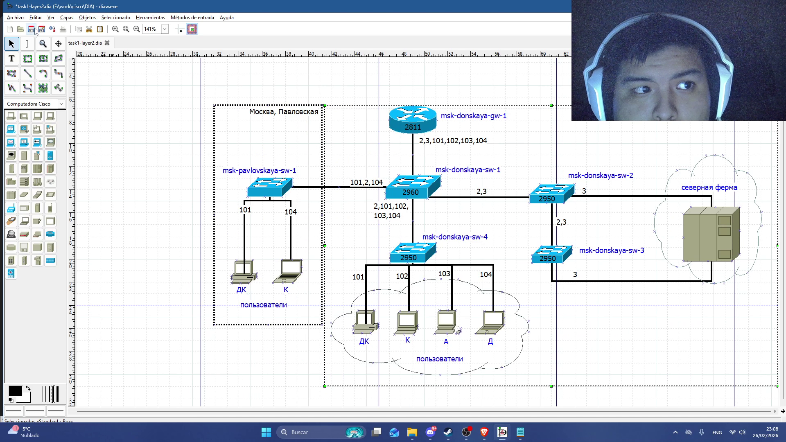{#fig-013 width=70%}

### Layer 3

Здесь я расположил все элементы (маршрутизатор и неба) и написал IP-адресы с частей сети, к которому принадлежат они

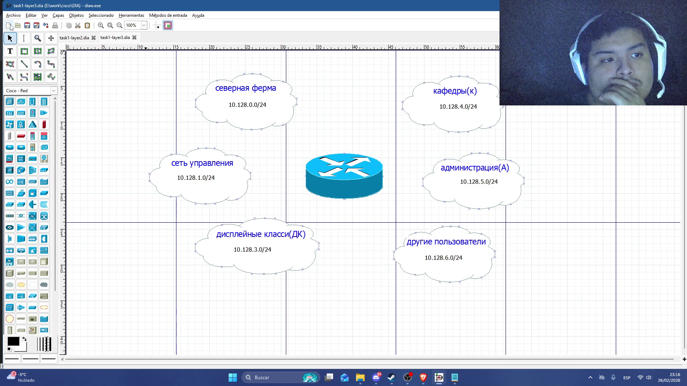{#fig-014 width=70%}

### таблица

#### таблица IP-адресов

Здесь я измпользовал word, потому что в DIA нет возможности создать таблицы. там я скопирвал информацию видно в интрукциях

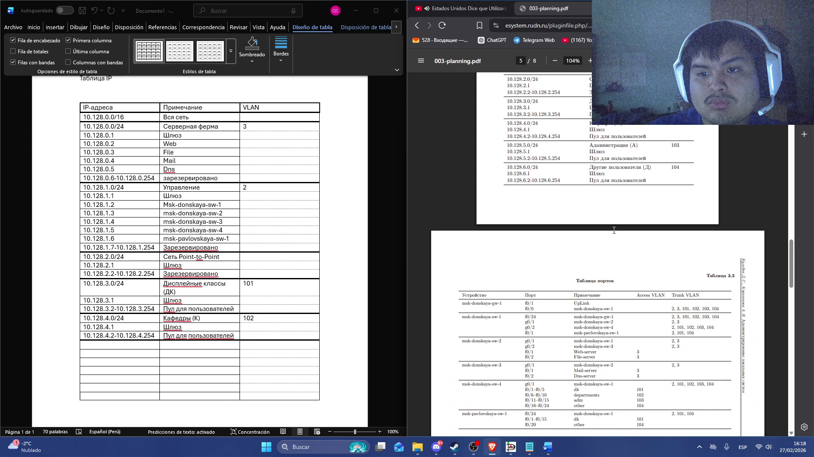{#fig-016 width=70%}

{#fig-017 width=70%}

и также я повторил все для таблицы портов и регламента

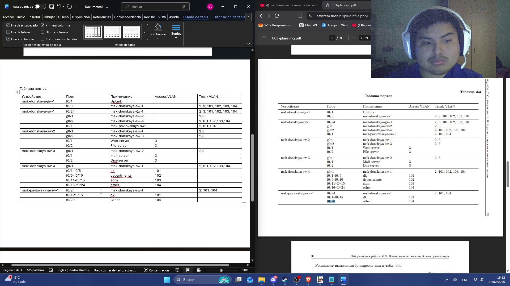{#fig-018 width=70%}

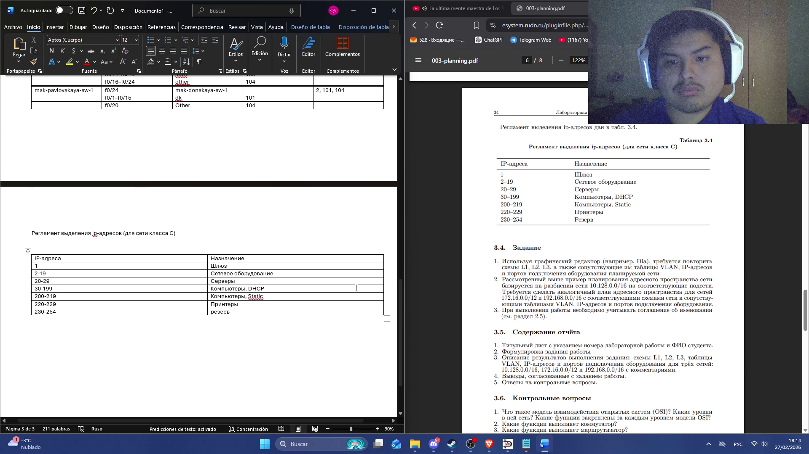{#fig-019 width=70%}

## пункт задания 2

### таблица

теоритически сеть видно в примере подходить в сети 192.168.0.0/16, поэтому только надо изменить IP-адерсы в таблице и в диаграмме

{#fig-020 width=70%}

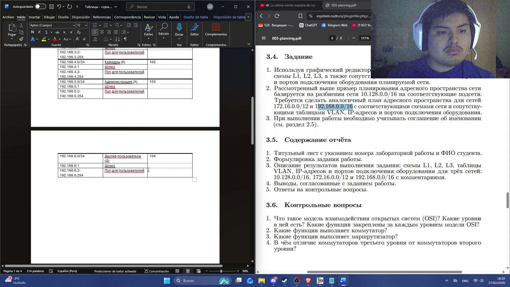{#fig-021 width=70%}

{#fig-022 width=70%}

{#fig-023 width=70%}

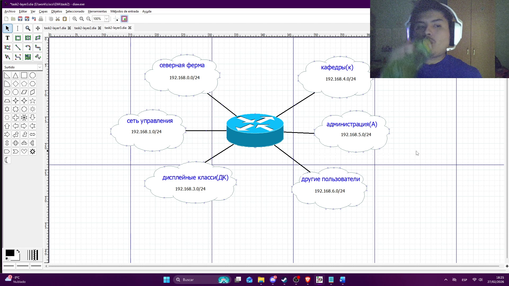{#fig-024 width=70%}

также для второй сети  172.16.0.0/12

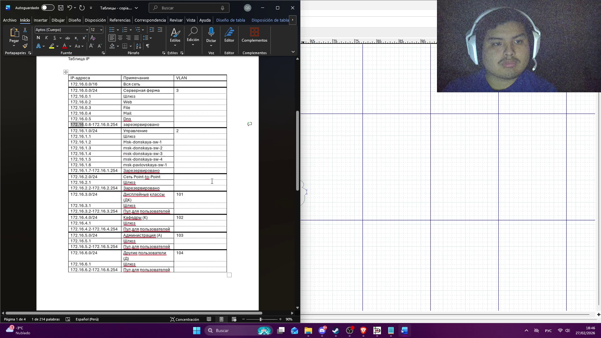{#fig-025 width=70%}

# Выводы

В этой лабораторной работе я смог смотреть как создать диаграммы для создания сети, также как настроить таблицы и какие пункты это необходимо учитывать

# Список литературы{.unnumbered}

::: {#refs}
:::
