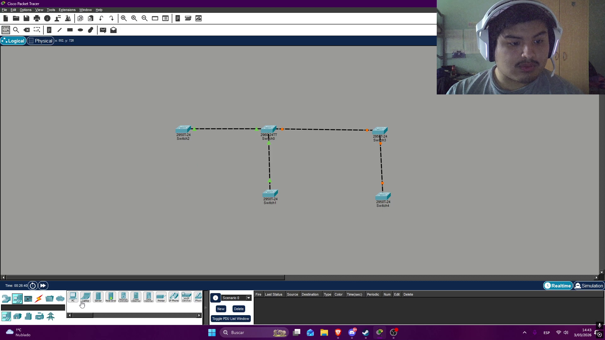
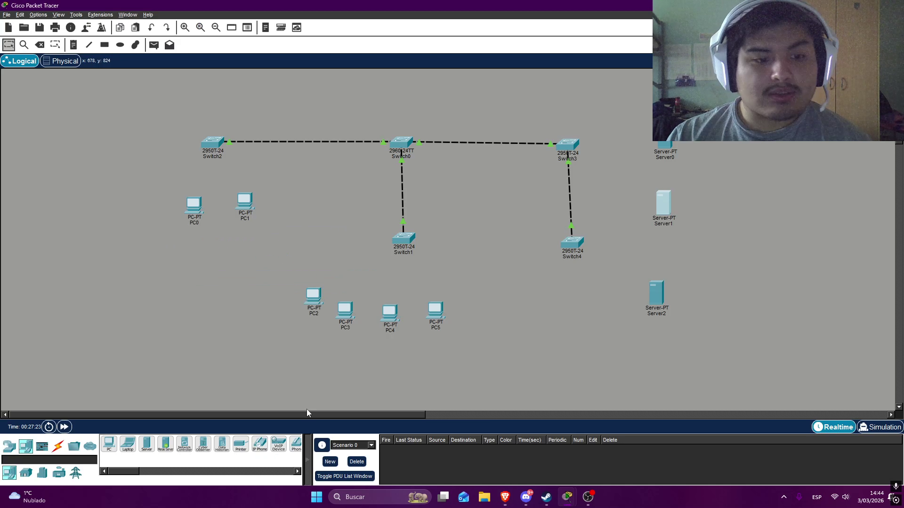
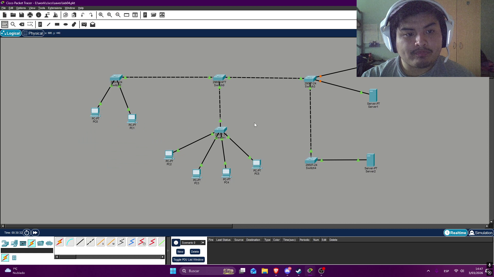
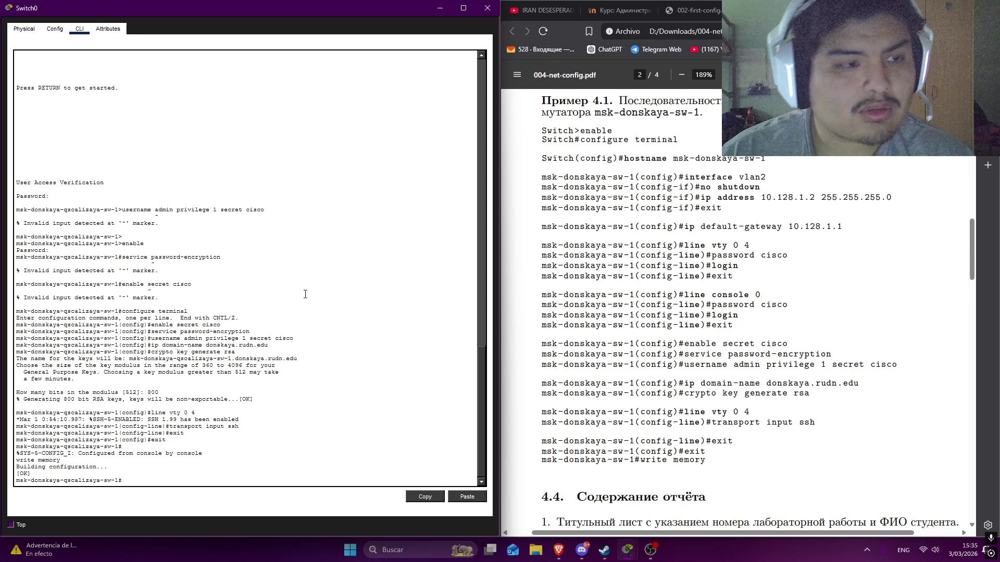
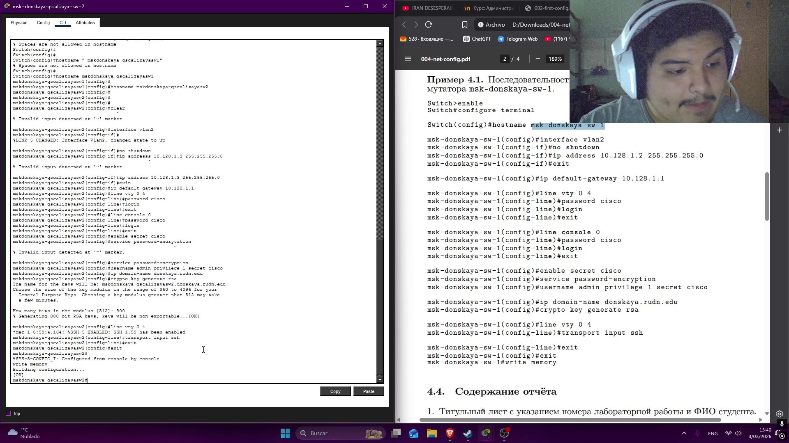
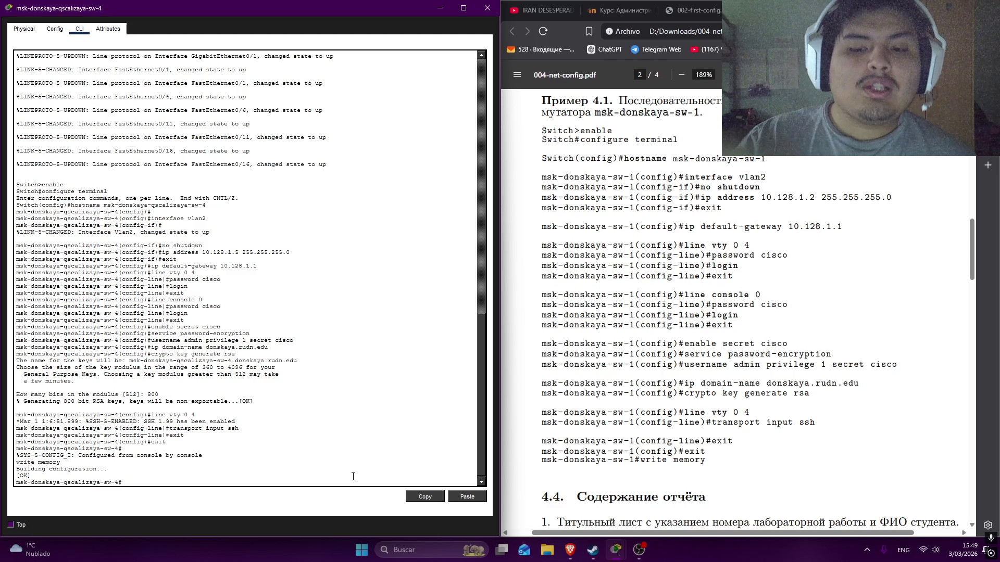
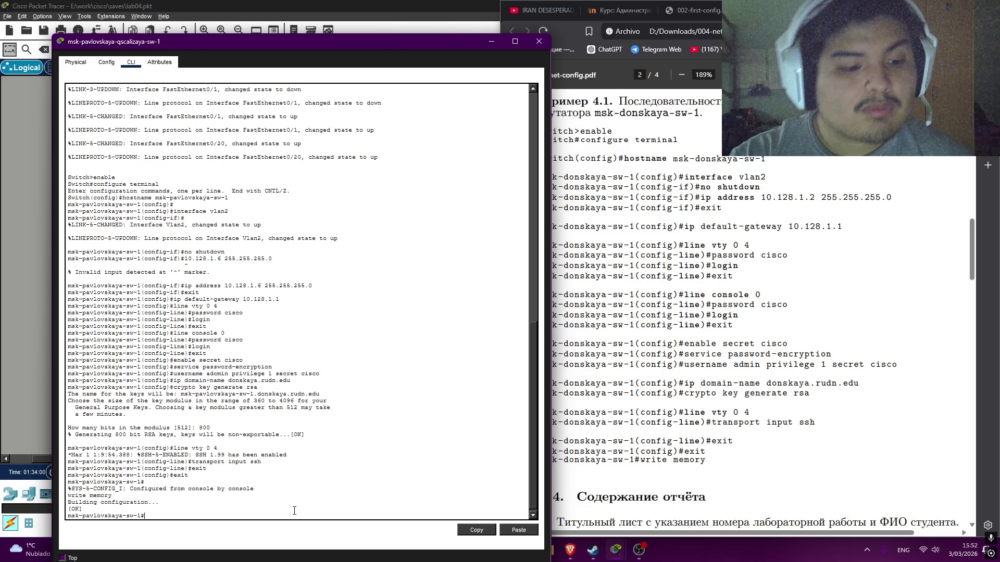
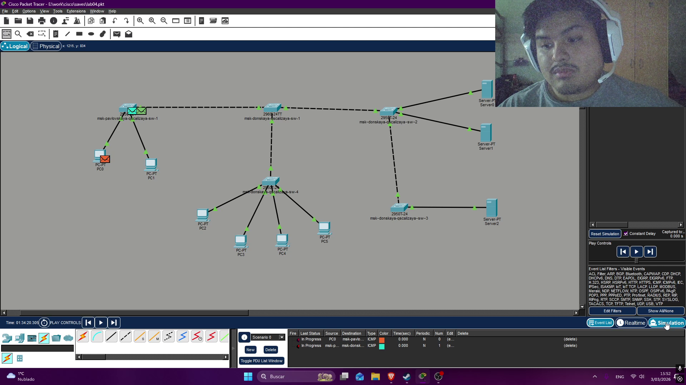

---
## Author
author:
  name: Кхари Жекка Кализая Арсе
  email: 1032234412@rudn.ru
  affiliation:
    - name: Российский университет дружбы народов
      country: Российская Федерация
      postal-code: 117198
      city: Москва
      address: ул. Миклухо-Маклая, д. 6
## Title
title: презентация №4
subtitle: Первоначальное конфигурирование сети
license: CC BY
date: today
date-format: "YYYY-MM-DD" # Example: 2025-09-06
---

# создание топологии

## расположение коммутаторов

:::::::::::::: {.columns align=center}
::: {.column width="70%"}

:::
::::::::::::::

## соединение коммутаторов

:::::::::::::: {.columns align=center}
::: {.column width="70%"}

:::
::::::::::::::

## расположение компьютеров и серверов

:::::::::::::: {.columns align=center}
::: {.column width="70%"}

:::
::::::::::::::

## соединение компьютеров и серверов

:::::::::::::: {.columns align=center}
::: {.column width="70%"}

:::
::::::::::::::

# настройка коммутаторов

## настройка VLAN2, virtual teletype и паролей (msk-donskaya-qscalizaya-sw-1)

:::::::::::::: {.columns align=center}
::: {.column width="70%"}

:::
::::::::::::::

## настройка пользователя и протокол SSH(msk-donskaya-qscalizaya-sw-1)

:::::::::::::: {.columns align=center}
::: {.column width="70%"}

:::
::::::::::::::

## настройка коммутатора msk-donskaya-qscalizaya-sw-2

:::::::::::::: {.columns align=center}
::: {.column width="70%"}

:::
::::::::::::::

## настройка коммутатора msk-donskaya-qscalizaya-sw-3

:::::::::::::: {.columns align=center}
::: {.column width="70%"}

:::
::::::::::::::

## настройка коммутатора msk-donskaya-qscalizaya-sw-4

:::::::::::::: {.columns align=center}
::: {.column width="70%"}

:::
::::::::::::::

## настройка коммутатора msk-pavlovskaya-sw-1

:::::::::::::: {.columns align=center}
::: {.column width="70%"}

:::
::::::::::::::

# проверка сети

## проверка с пакетами

:::::::::::::: {.columns align=center}
::: {.column width="70%"}

:::
::::::::::::::

## проверка с пакетами

:::::::::::::: {.columns align=center}
::: {.column width="70%"}

:::
::::::::::::::