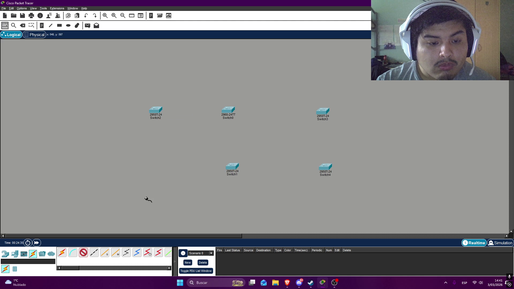
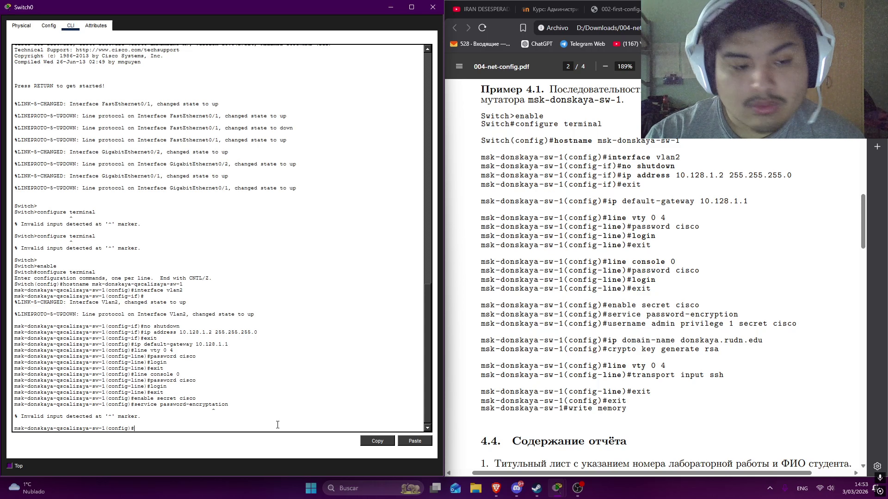
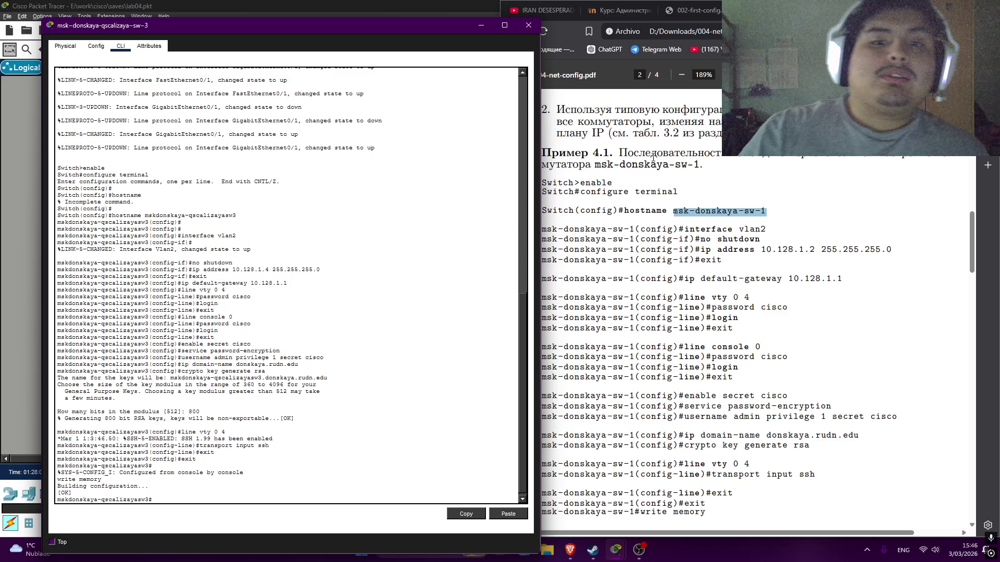
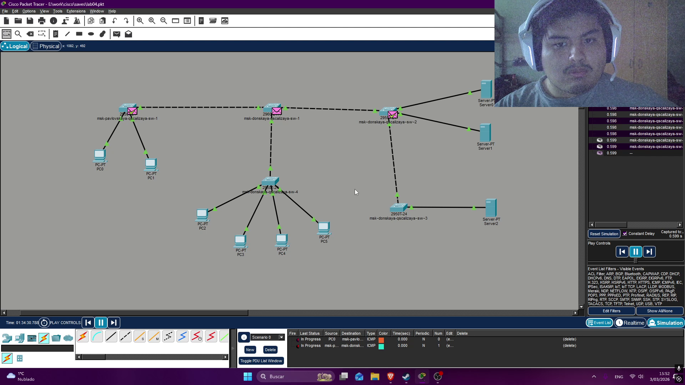

---
## Author
author:
  name: Кхари Жекка Кализая арсе
  email: 1032234412@rudn.ru
  affiliation:
    - name: Российский университет дружбы народов
      country: Российская Федерация
      postal-code: 117198
      city: Москва
      address: ул. Миклухо-Маклая, д. 6

## Title
title: "отчёт по лабораторной работе №"
subtitle: "Первоначальное конфигурирование сети"
license: "CC BY"
---

# Цель работы

Провести подготовительную работу по первоначальной настройке коммутаторов сети.

# Задание

Требуется сделать первоначальную настройку коммутаторов сети, представленной на схеме L1 (см. рис. 3.1 из раздела 3.3). Под первоначальной
настройкой понимается указание имени устройства, его IP-адреса, настройка
доступа по паролю к виртуальным терминалам и консоли, настройка удалённого доступа к устройству по ssh.
При выполнении работы необходимо учитывать соглашение об именовании
(см. раздел 2.5).

# Выполнение лабораторной работы

## создание топологии

Сначала былы расположенны все коммутаторы в рабочей области ([рис. @fig-001]), здесь былы использованые один коммутатор 2960 и  четыре коммутатора 2950.

{#fig-001 width=70%}

Потом коммутаторы были соединенные проводами следуя таблицу быдно в предыдущей лабораторной работе ([рис. @fig-002]).

{#fig-002 width=70%}

Дальше были расположенны обычные компьютеры и серверы ([рис. @fig-003]).

{#fig-003 width=70%}

Затем были соединенны с помощью проводов  ([рис. @fig-004]).

{#fig-004 width=70%}

## настройка коммутаторы

Сначала я щелкал коммутатор 1 чтобы открывать окно и там я щелкал CLI. там я смог смотреть терминал, с которым я мог настроить коммутатор. 

Сначала я изменил hostname на msk-donskaya-qscalizaya-sw-1, потом я начал настройку интерфейса VLAN2. я включил его и дал IP-адрес 10.128.1.2 и маску подсети 255.255.255.0 (этот IP-адрес будет измениться в каждом коммутаторе следуя таблицу IP-адресов) дальше я указал по умолчанию gateway 10.128.1.1. Дальше я настроил удаленный доступ 

Затем настраиваются линии VTY (Virtual Teletype), чтобы обеспечить возможность одновременного подключения от 1 до 5 сессий (0–4). Далее задаётся пароль, который будет использоваться для этих сессий (cisco), и с помощью команды login принудительно активируется требование ввода пароля.

После этого настраивается физический доступ к коммутатору через консоль. снова устанавливается пароль (cisco) и принудительно включается его использование.

В завершение задаётся пароль (cisco) для привилегированного режима и активируется служба шифрования паролей. ([рис. @fig-005])  .

{#fig-005 width=70%}

Затем был настроен пользователь для подключения по SSH с именем пользователя admin и паролем cisco, которому был назначен базовый уровень привилегий 1. После этого было задано доменное имя donskaya.rudn.edu. Также была создана RSA-ключевая пара с размером модуля 800 бит.

Далее я вернулся к настройке линий виртуального терминала (VTY), чтобы принудительно разрешить только подключение по SSH. После завершения конфигурации я вышел из режима настройки и сохранил изменения в памяти устройства. ([рис. @fig-006]).

{#fig-006 width=70%}

Потом я сделал тоже самое для всех остальных коммутаторов. ([с рис. @fig-007 до рис. @fig-010]).

ip-адрес VLAN2:

- msk-donskaya-qscalizaya-sw-2: 10.128.1.3 ([рис. @fig-007]).
- msk-donskaya-qscalizaya-sw-3: 10.128.1.4 ([рис. @fig-008]).
- msk-donskaya-qscalizaya-sw-4: 10.128.1.5 ([рис. @fig-009]).
- msk-pavlovskaya-qscalizaya-sw-1: 10.128.1.6 ([рис. @fig-010]).

{#fig-007 width=70%}

{#fig-008 width=70%}

{#fig-009 width=70%}

{#fig-010 width=70%}

Дальше я проверил работоспособность системы

{#fig-011 width=70%}

{#fig-012 width=70%}

# Выводы

В этой лабораторной работе я смог смотреть как можно настроить коммутаторы чтобы указывать IP-адрес VLAN2 и также как настроить Virtual teletype пароли и протокол SSH

# Список литературы{.unnumbered}

::: {#refs}
:::
