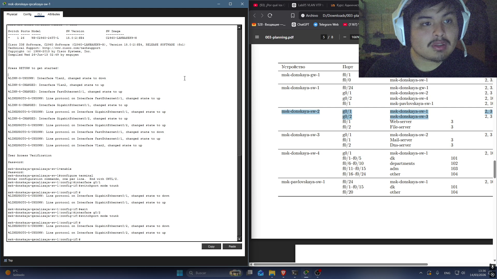
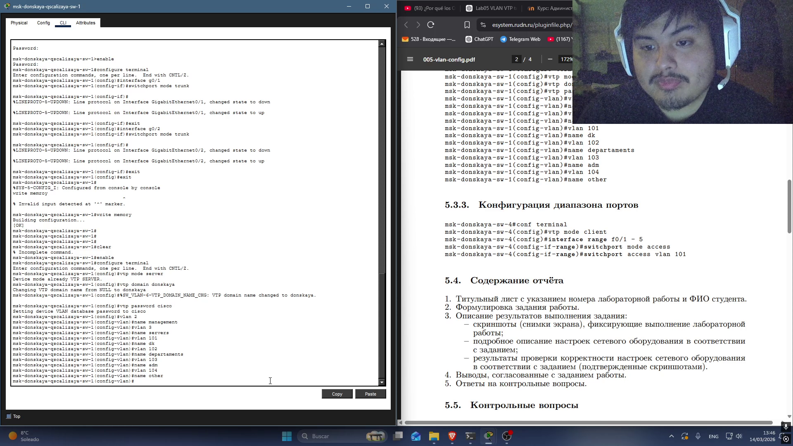
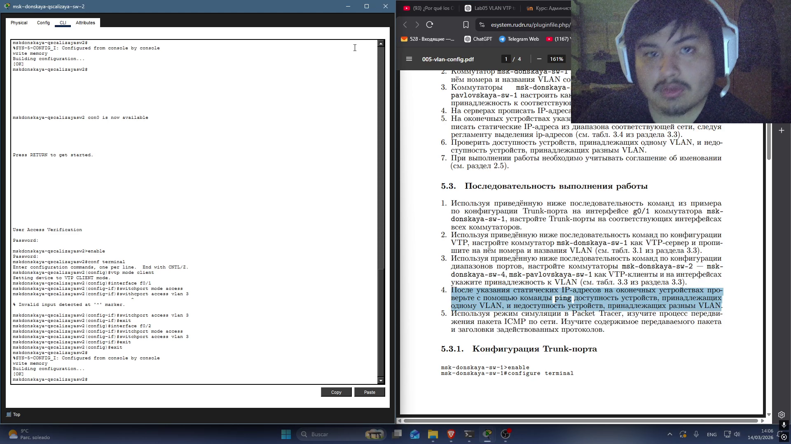
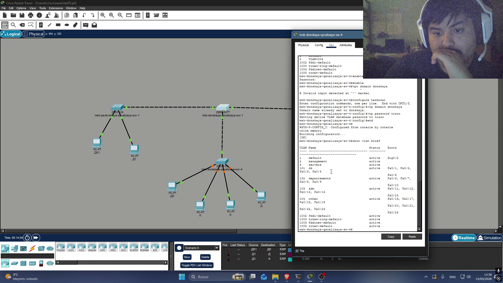
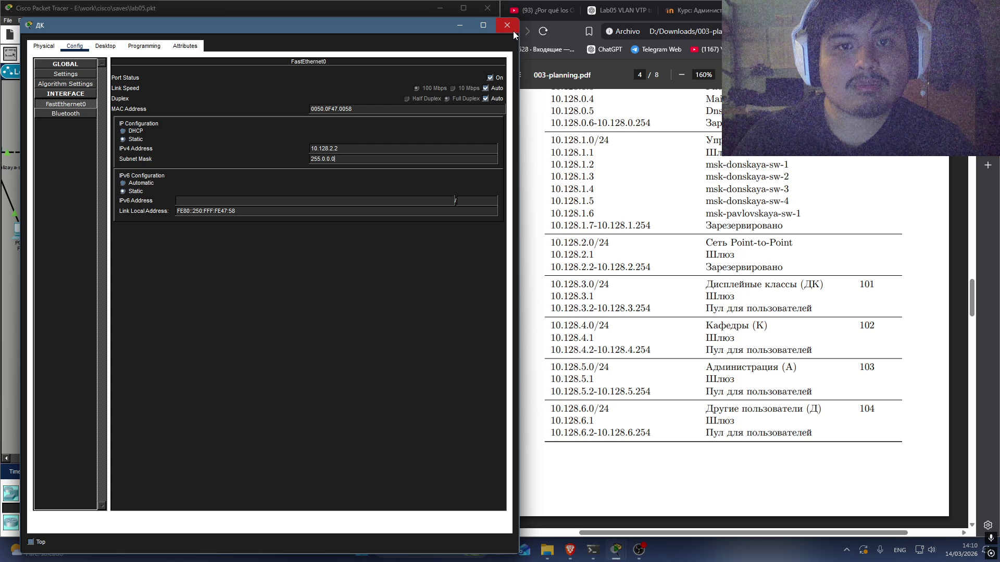
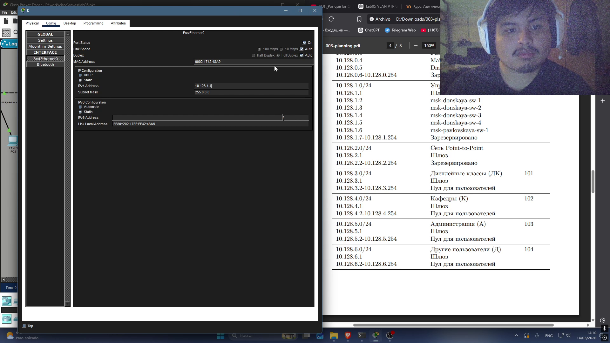
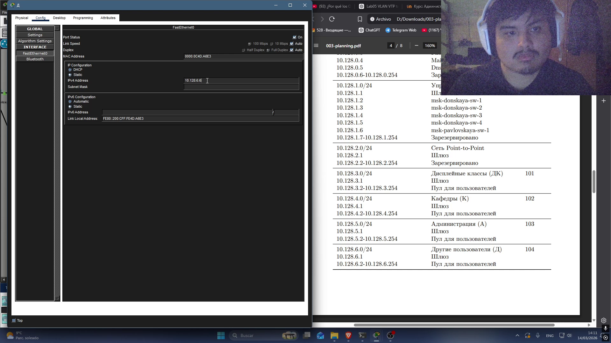
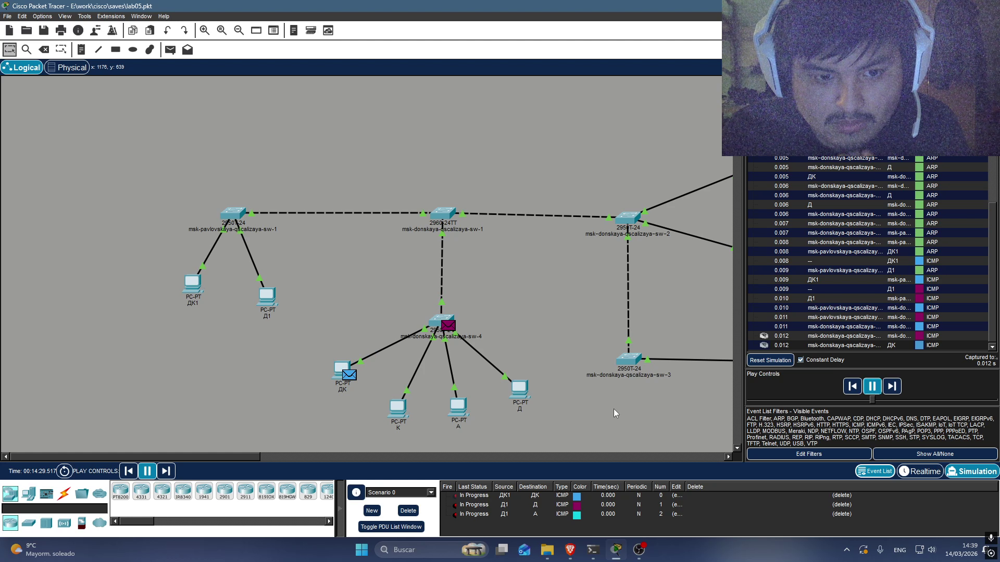
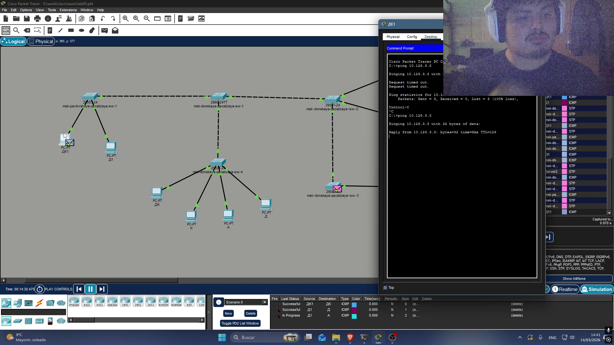

---
## Author
author:
  name: Кхари Жекка Кализая Арсе
  email: 1032234412@rudn.ru
  affiliation:
    - name: Российский университет дружбы народов
      country: Российская Федерация
      postal-code: 117198
      city: Москва
      address: ул. Миклухо-Маклая, д. 6
## Title
title: презентация №5 
subtitle: Конфигурирование VLAN
license: CC BY
date: today
date-format: "YYYY-MM-DD" # Example: 2025-09-06
---

# Конфигурация Trunk-порта

## msk-donskaya-qscalizaya-sw-1

:::::::::::::: {.columns align=center}

::: {.column width="100%"}

:::
::::::::::::::

## msk-donskaya-qscalizaya-sw-2

:::::::::::::: {.columns align=center}

::: {.column width="100%"}

:::
::::::::::::::

## msk-donskaya-qscalizaya-sw-3

:::::::::::::: {.columns align=center}

::: {.column width="100%"}

:::
::::::::::::::

## msk-donskaya-qscalizaya-sw-4

:::::::::::::: {.columns align=center}

::: {.column width="100%"}

:::
::::::::::::::

## msk-donskaya-qscalizaya-sw-5

:::::::::::::: {.columns align=center}

::: {.column width="100%"}

:::
::::::::::::::

#  Конфигурация VTP

## Конфигурация VTP

:::::::::::::: {.columns align=center}

::: {.column width="100%"}

:::
::::::::::::::

# Конфигурация диапазона портов

## Конфигурация msk-donskaya-qscalizaya-sw-4

:::::::::::::: {.columns align=center}

::: {.column width="100%"}

:::
::::::::::::::

## Конфигурация msk-pavlovskaya-qscalizaya-sw-1

:::::::::::::: {.columns align=center}

::: {.column width="100%"}

:::
::::::::::::::

## Конфигурация msk-donskaya-qscalizaya-sw-2

:::::::::::::: {.columns align=center}

::: {.column width="100%"}

:::
::::::::::::::

## настройка domain и пароль в коммутаторах

:::::::::::::: {.columns align=center}

::: {.column width="100%"}

:::
::::::::::::::

# проверка работы сети

## настройка IP-адерса ДК

:::::::::::::: {.columns align=center}

::: {.column width="100%"}

:::
::::::::::::::

## настройка IP-адерса К

:::::::::::::: {.columns align=center}

::: {.column width="100%"}

:::
::::::::::::::

## настройка IP-адерса А

:::::::::::::: {.columns align=center}

::: {.column width="100%"}

:::
::::::::::::::

## настройка IP-адерса Д

:::::::::::::: {.columns align=center}

::: {.column width="100%"}

:::
::::::::::::::

## настройка IP-адерса ДК1

:::::::::::::: {.columns align=center}

::: {.column width="100%"}

:::
::::::::::::::

## настройка IP-адерса Д1

:::::::::::::: {.columns align=center}

::: {.column width="100%"}

:::
::::::::::::::

## проверка с пакетами

:::::::::::::: {.columns align=center}

::: {.column width="100%"}

:::
::::::::::::::

## проверка с пакетами

:::::::::::::: {.columns align=center}

::: {.column width="100%"}

:::
::::::::::::::

## проверка с пакетами

:::::::::::::: {.columns align=center}

::: {.column width="100%"}

:::
::::::::::::::

## проверка с пакетами

:::::::::::::: {.columns align=center}

::: {.column width="100%"}

:::
::::::::::::::

## проверка с пакетами

:::::::::::::: {.columns align=center}

::: {.column width="100%"}

:::
::::::::::::::

## проверка с командой ping

:::::::::::::: {.columns align=center}

::: {.column width="100%"}

:::
::::::::::::::

## проверка с командой ping

:::::::::::::: {.columns align=center}

::: {.column width="100%"}

:::
::::::::::::::

## проверка с командой ping

:::::::::::::: {.columns align=center}

::: {.column width="100%"}

:::
::::::::::::::

## проверка изолации

:::::::::::::: {.columns align=center}

::: {.column width="100%"}

:::
::::::::::::::

# спасибо за внимание

