---
## Author
author:
  name: Кхари Жекка Кализая арсе
  email: 1032234412@rudn.ru
  affiliation:
    - name: Российский университет дружбы народов
      country: Российская Федерация
      postal-code: 117198
      city: Москва
      address: ул. Миклухо-Маклая, д. 6

## Title
title: "отчёт по лабораторной работе №5"
subtitle: " Конфигурирование VLAN"
license: "CC BY"
---

# Цель работы

Получить основные навыки по настройке VLAN на коммутаторах сети

# Задание

1. На коммутаторах сети настроить Trunk-порты на соответствующих интерфейсах (см. табл. 3.2 из раздела 3.3), связывающих коммутаторы между собой.
2. Коммутатор msk-donskaya-sw-1 настроить как VTP-сервер и прописать на нём номера и названия VLAN согласно табл. 3.1 из раздела 3.3.
3. Коммутаторы msk-donskaya-sw-2 — msk-donskaya-sw-4, mskpavlovskaya-sw-1 настроить как VTP-клиенты, на интерфейсах указать принадлежность к соответствующему VLAN (см. табл. 3.3 из раздела 3.3).
4. На серверах прописать IP-адреса, как указано в табл. 3.2 из раздела 3.3.
5. На оконечных устройствах указать соответствующий адрес шлюза и прописать статические IP-адреса из диапазона соответствующей сети, следуя регламенту выделения ip-адресов (см. табл. 3.4 из раздела 3.3).
6. Проверить доступность устройств, принадлежащих одному VLAN, и недоступность устройств, принадлежащих разным VLAN.
7. При выполнении работы необходимо учитывать соглашение об именовании (см. раздел 2.5).

# Выполнение лабораторной работы

## Конфигурация Trunk-порта

Сначала было настроен trunk в всех коммутаторах ([рис. @fig-001 - @fig-005]). используя команду 

    swichport mode trunk

это действие было повторено для каждого интерфейса, к которому подключены коммутаторы следуя таблицу видно в разделе 3.3

### использованные команды:

#### msk-donskaya-qscalizaya-sw-1

    msk-donskaya-qscalizaya-sw-1>enable
    msk-donskaya-qscalizaya-sw-1#configure terminal
    msk-donskaya-qscalizaya-sw-1(config)#interface g0/1
    msk-donskaya-qscalizaya-sw-1(config −if)#switchport mode trunk
    msk-donskaya-qscalizaya-sw-1(config −if)#exit
    msk-donskaya-qscalizaya-sw-1(config)#interface g0/2
    msk-donskaya-qscalizaya-sw-1(config −if)#switchport mode trunk
    msk-donskaya-qscalizaya-sw-1(config)#exit
    msk-donskaya-qscalizaya-sw-1#write memory

#### msk-donskaya-qscalizaya-sw-2

    msk-donskaya-qscalizaya-sw-2>enable
    msk-donskaya-qscalizaya-sw-2#configure terminal
    msk-donskaya-qscalizaya-sw-2(config)#interface g0/1
    msk-donskaya-qscalizaya-sw-2(config −if)#switchport mode trunk
    msk-donskaya-qscalizaya-sw-2(config −if)#exit
    msk-donskaya-qscalizaya-sw-2(config)#interface g0/2
    msk-donskaya-qscalizaya-sw-2(config −if)#switchport mode trunk
    msk-donskaya-qscalizaya-sw-2(config)#exit
    msk-donskaya-qscalizaya-sw-2#write memory

#### msk-donskaya-qscalizaya-sw-3

    msk-donskaya-qscalizaya-sw-3>enable
    msk-donskaya-qscalizaya-sw-3#configure terminal
    msk-donskaya-qscalizaya-sw-3(config)#interface g0/1
    msk-donskaya-qscalizaya-sw-3(config −if)#switchport mode trunk
    msk-donskaya-qscalizaya-sw-3(config −if)#exit
    msk-donskaya-qscalizaya-sw-3(config)#exit
    msk-donskaya-qscalizaya-sw-3#write memory

#### msk-donskaya-qscalizaya-sw-4

    msk-donskaya-qscalizaya-sw-4>enable
    msk-donskaya-qscalizaya-sw-4#configure terminal
    msk-donskaya-qscalizaya-sw-4(config)#interface g0/1
    msk-donskaya-qscalizaya-sw-4(config −if)#switchport mode trunk
    msk-donskaya-qscalizaya-sw-4(config −if)#exit
    msk-donskaya-qscalizaya-sw-4(config)#exit
    msk-donskaya-qscalizaya-sw-4#write memory

### msk-pablovskaya-qscalizaya-sw-1

    msk-pablovskaya-qscalizaya-sw-1>enable
    msk-pablovskaya-qscalizaya-sw-1#configure terminal
    msk-pablovskaya-qscalizaya-sw-1(config)#interface f0/24
    msk-pablovskaya-qscalizaya-sw-1(config −if)#switchport mode trunk
    msk-pablovskaya-qscalizaya-sw-1(config −if)#exit
    msk-pablovskaya-qscalizaya-sw-1(config)#exit
    msk-pablovskaya-qscalizaya-sw-1#write memory

{#fig-001 width=70%}

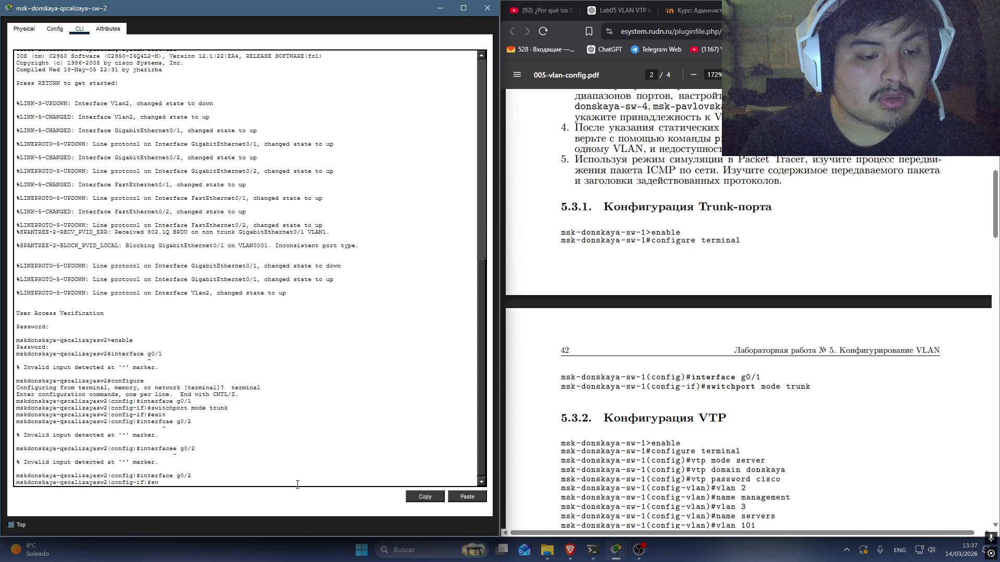{#fig-002 width=70%}

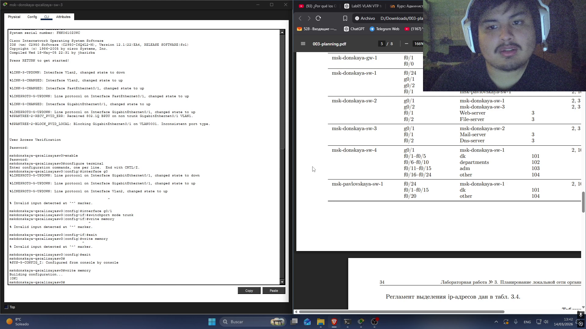{#fig-003 width=70%}

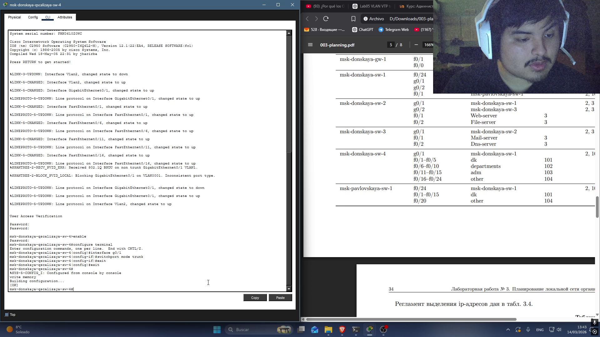{#fig-004 width=70%}

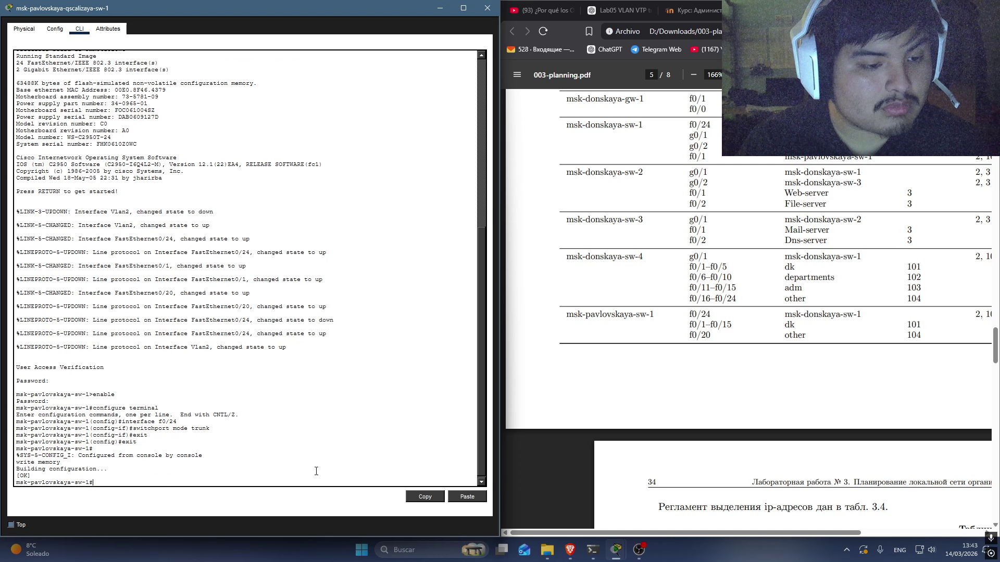{#fig-005 width=70%}

## Конфигурация VTP

Здесь было настроено vtp (VLAN Trunking Protocol) с домейном donskaya и пароль cisco, дальше былы указаны имени vlan2 (management) , vlan3 (servers) , vlan101 (dk) , vlan102 (departments), vlan103 (adm), vlan104 (other).

    msk-donskaya-sw-1>enable
    msk-donskaya-sw-1#configure terminal
    msk-donskaya-sw-1(config)#vtp mode server
    msk-donskaya-sw-1(config)#vtp domain donskaya
    msk-donskaya-sw-1(config)#vtp password cisco
    msk-donskaya-sw-1(config-vlan)#vlan 2
    msk-donskaya-sw-1(config-vlan)#name management
    msk-donskaya-sw-1(config-vlan)#vlan 3
    msk-donskaya-sw-1(config-vlan)#name servers
    msk-donskaya-sw-1(config-vlan)#vlan 101
    msk-donskaya-sw-1(config-vlan)#name dk
    msk-donskaya-sw-1(config-vlan)#vlan 102
    msk-donskaya-sw-1(config-vlan)#name departaments
    msk-donskaya-sw-1(config-vlan)#vlan 103
    msk-donskaya-sw-1(config-vlan)#name adm
    msk-donskaya-sw-1(config-vlan)#vlan 104
    msk-donskaya-sw-1(config-vlan)#name other

{#fig-006 width=70%}

## Конфигурация диапазона портов

Здесь былы настроены интерфейсы коммутаторов чтобы делить сеть на vlan1-104 следуя таблицу 3.3 

### использованны команды:

#### msk-donskaya-qscalizaya-sw-4

    msk-donskaya-qscalizaya-sw-4>enable
    password:cisco
    msk-donskaya-qscalizaya-sw-4#conf terminal
    msk-donskaya-qscalizaya-sw-4(config)#vtp mode client
    msk-donskaya-qscalizaya-sw-4(config)#vtp domain donskaya
    msk-donskaya-qscalizaya-sw-4(config)#vtp password cisco
    msk-donskaya-qscalizaya-sw-4(config)#interface range f0/1 − 5
    msk-donskaya-qscalizaya-sw-4(config-if-range)#switchport mode access
    msk-donskaya-qscalizaya-sw-4(config-if-range)#switchport access vlan 101
    msk-donskaya-qscalizaya-sw-4(config-if-range)#exit
    msk-donskaya-qscalizaya-sw-4(config)#interface range f0/6 − 10
    msk-donskaya-qscalizaya-sw-4(config-if-range)#switchport mode access
    msk-donskaya-qscalizaya-sw-4(config-if-range)#switchport access vlan 102
    msk-donskaya-qscalizaya-sw-4(config-if-range)#exit
    msk-donskaya-qscalizaya-sw-4(config)#interface range f0/11 − 15
    msk-donskaya-qscalizaya-sw-4(config-if-range)#switchport mode access
    msk-donskaya-qscalizaya-sw-4(config-if-range)#switchport access vlan 103
    msk-donskaya-qscalizaya-sw-4(config-if-range)#exit
    msk-donskaya-qscalizaya-sw-4(config)#interface range f0/16 − 24
    msk-donskaya-qscalizaya-sw-4(config-if-range)#switchport mode access
    msk-donskaya-qscalizaya-sw-4(config-if-range)#switchport access vlan 104
    msk-donskaya-qscalizaya-sw-4(config-if-range)#exit
    msk-donskaya-qscalizaya-sw-4(config)#exit
    msk-donskaya-qscalizaya-sw-4#write memory

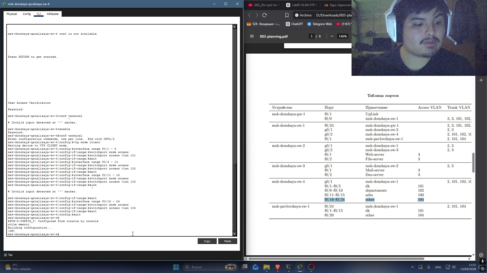{#fig-007 width=70%}

#### msk-pavlovskaya-qscalizaya-sw-1

    msk-pavlovskaya-sw-1>enable
    password:cisco
    msk-pavlovskaya-qscalizaya-sw-4#conf terminal
    msk-pavlovskaya-qscalizaya-sw-4(config)#vtp mode client
    msk-pavlovskaya-qscalizaya-sw-4(config)#vtp domain donskaya
    msk-pavlovskaya-qscalizaya-sw-4(config)#vtp password cisco
    msk-pavlovskaya-qscalizaya-sw-4(config)#interface range f0/1 − 15
    msk-pavlovskaya-qscalizaya-sw-4(config-if-range)#switchport mode access
    msk-pavlovskaya-qscalizaya-sw-4(config-if-range)#switchport access vlan 101
    msk-pavlovskaya-qscalizaya-sw-4(config-if-range)#exit
    msk-pavlovskaya-qscalizaya-sw-4(config)#interface range f0/20
    msk-pavlovskaya-qscalizaya-sw-4(config-if-range)#switchport mode access
    msk-pavlovskaya-qscalizaya-sw-4(config-if-range)#switchport access vlan 104
    msk-pavlovskaya-qscalizaya-sw-4(config-if-range)#exit
    msk-pavlovskaya-qscalizaya-sw-4(config)#exit
    msk-pavlovskaya-qscalizaya-sw-4#write memory

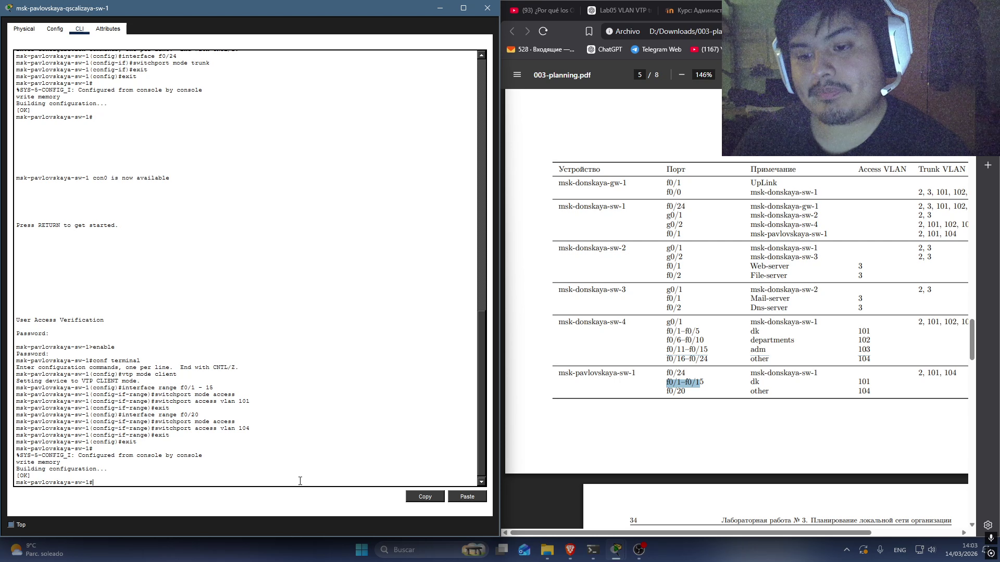{#fig-008 width=70%}

#### msk-donskaya-qscalizaya-sw2

    msk-donskaya-qscalizaya-sw-2>enable
    password:cisco
    msk-donskaya-qscalizaya-sw-2#conf terminal
    msk-donskaya-qscalizaya-sw-2(config)#vtp mode client
    msk-donskaya-qscalizaya-sw-2(config)#vtp domain donskaya
    msk-donskaya-qscalizaya-sw-2(config)#vtp password cisco
    msk-donskaya-qscalizaya-sw-2(config)#interface f0/1
    msk-donskaya-qscalizaya-sw-2(config-if-range)#switchport mode access
    msk-donskaya-qscalizaya-sw-2(config-if-range)#switchport access vlan 3
    msk-donskaya-qscalizaya-sw-2(config-if-range)#exit
    msk-donskaya-qscalizaya-sw-2(config)#interface f0/2
    msk-donskaya-qscalizaya-sw-2(config-if-range)#switchport mode access
    msk-donskaya-qscalizaya-sw-2(config-if-range)#switchport access vlan 3
    msk-donskaya-qscalizaya-sw-2(config-if-range)#exit
    msk-donskaya-qscalizaya-sw-2(config)#exit
    msk-donskaya-qscalizaya-sw-2#write memory

{#fig-00 width=70%}

## проверка работаспособности

Здесь сначала былы настроены IP-адресы компьютеров чтобы проверять работу сети

список IP-адерсы:
- ДК  : 10.128.3.3 ([рис. @fig-012]).
- К   : 10.128.4.4 ([рис. @fig-013]).
- А   : 10.128.5.5 ([рис. @fig-014]).
- Д   : 10.128.6.6 ([рис. @fig-015]).
- ДК1 : 10.128.3.4 ([рис. @fig-016]).
- Д1  : 10.128.6.6 ([рис. @fig-018]).

{#fig-012 width=70%}

{#fig-013 width=70%}

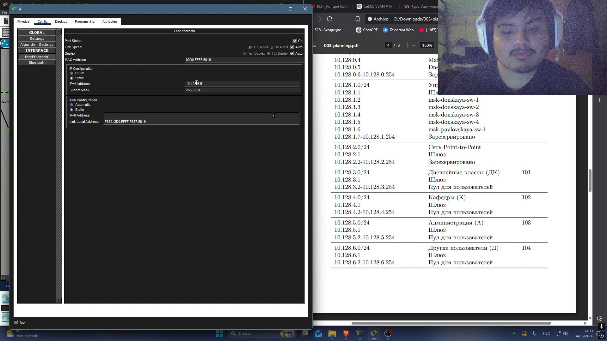{#fig-014 width=70%}

{#fig-015 width=70%}

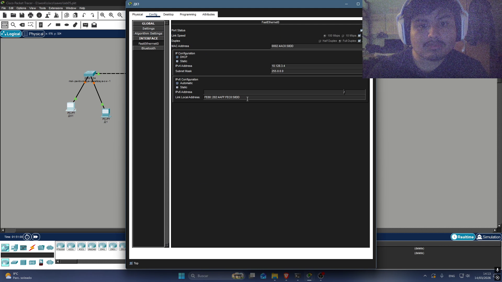{#fig-016 width=70%}

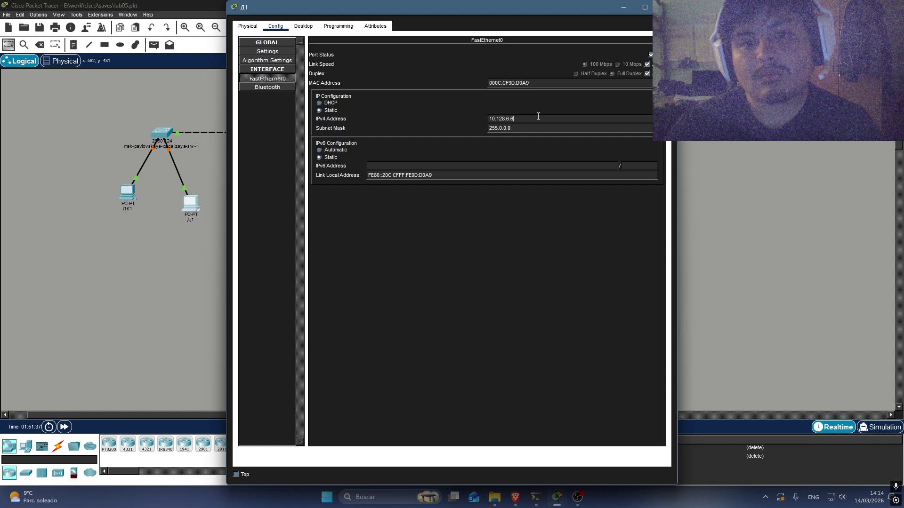{#fig-018 width=70%}

Потом я создал пакеты чтобы смотреть в цимулации каким они двигаются по сети

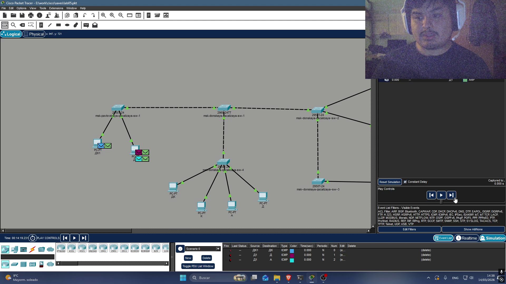{#fig-019 width=70%}

{#fig-020 width=70%}

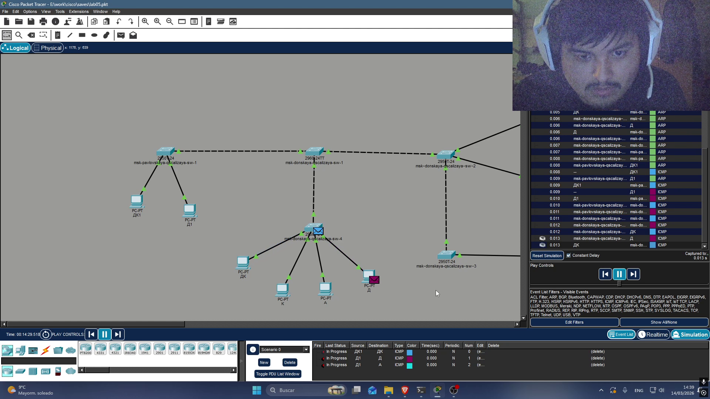{#fig-021 width=70%}

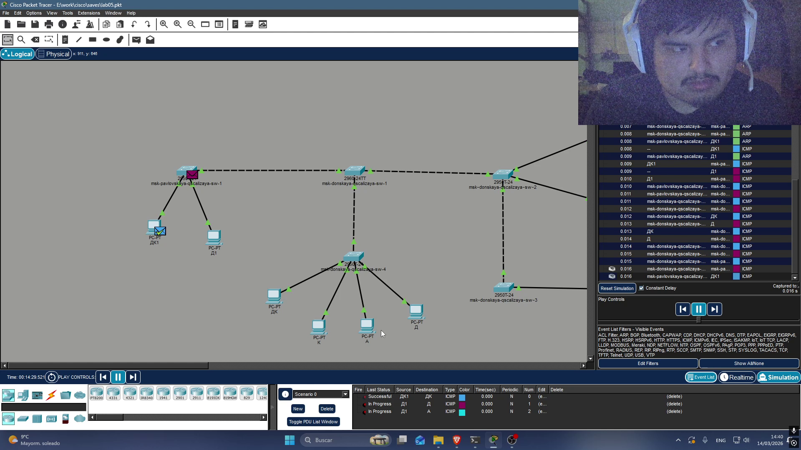{#fig-022 width=70%}

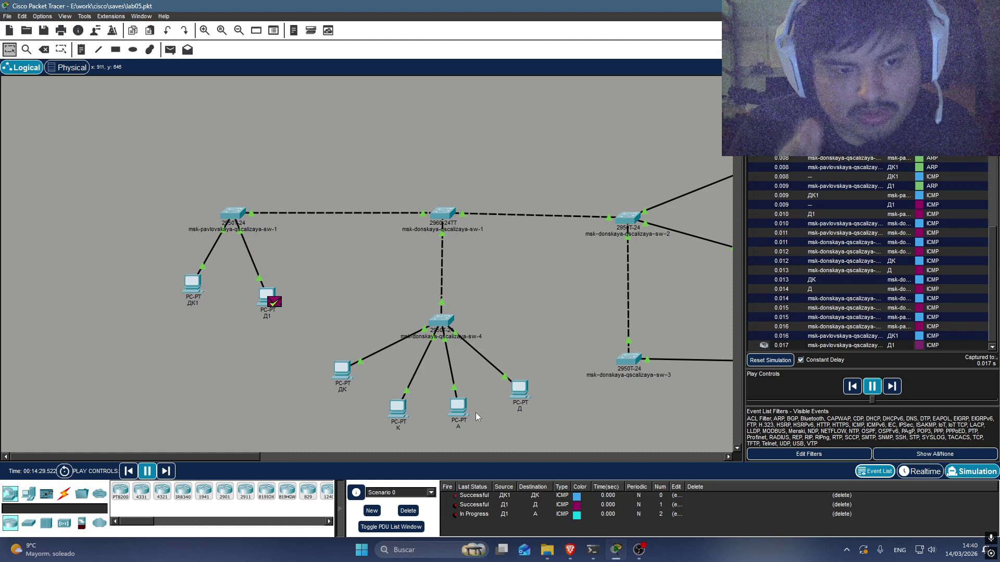{#fig-023 width=70%}

Затем команда ping была использована для проверки изоляции сетей VLAN друг от друга.

    ping 10.128.3.3

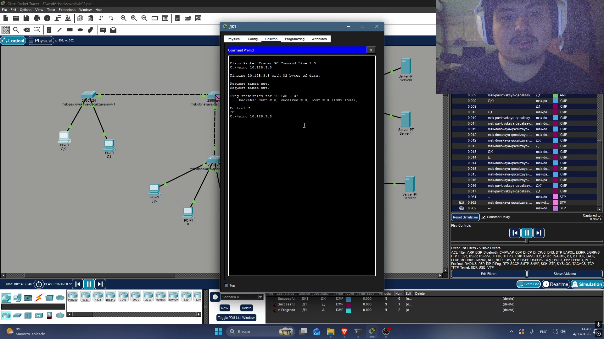{#fig-024 width=70%}

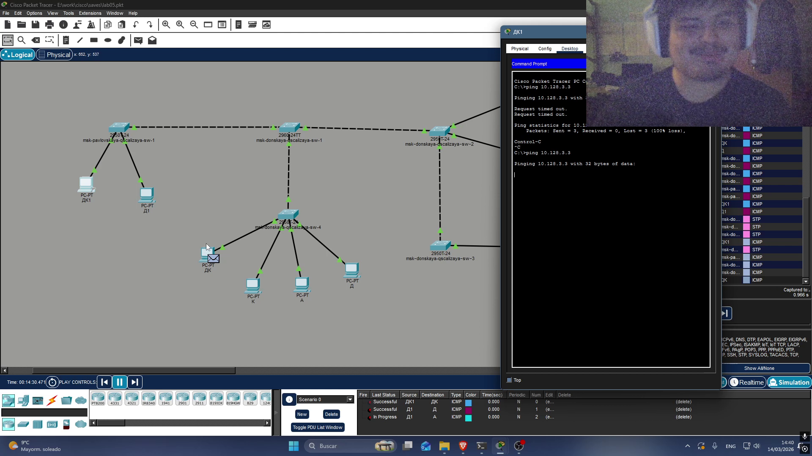{#fig-024 width=70%}

{#fig-024 width=70%}

    ping 10.128.4.4 

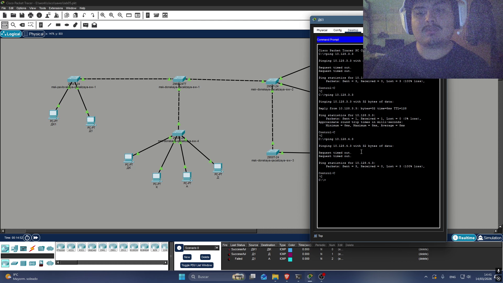{#fig-027 width=70%}

# Выводы

В этой лабораторной работе я смог смотреть как можно настроить VLAN в коммутаторах, также как настроить vtp и trunk следуя таблицу IP-адресов.

# Список литературы{.unnumbered}

::: {#refs}
:::
