---
## Author
author:
  name: Кхари Жекка Кализая арсе
  email: 1032234412@rudn.ru
  affiliation:
    - name: Российский университет дружбы народов
      country: Российская Федерация
      postal-code: 117198
      city: Москва
      address: ул. Миклухо-Маклая, д. 6

## Title
title: "отчёт по лабораторной работе №"
subtitle: "change"
license: "CC BY"
---

# Цель работы

Настроить статическую маршрутизацию VLAN в сети.

# Задание

1. Добавить в локальную сеть маршрутизатор, провести его первоначальную настройку.
2. Настроить статическую маршрутизацию VLAN.
3. При выполнении работы необходимо учитывать соглашение об именовании (см. раздел 2.5).

# Выполнение лабораторной работы

## Первичная конфигурация маршрутизатора

Сначала я открыл Сisco Packer Tracer и скопировал предыдущий файл, потом я добавил новый маршрутизатор 2811 ([рис. @fig-001]).

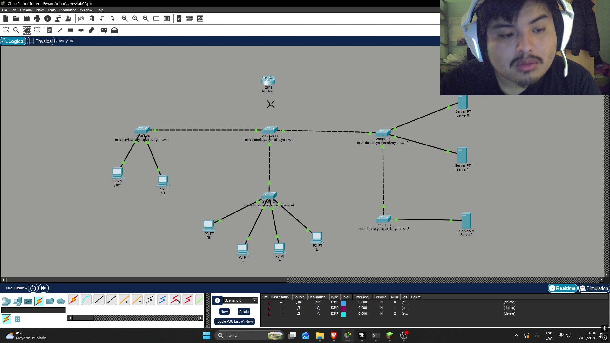{#fig-001 width=70%}

Потом я соединил его с коммутатором msk-donskaya-qscalizaya-sw-1 с интерфейса f0/0 на f0/24  ([рис. @fig-002]).

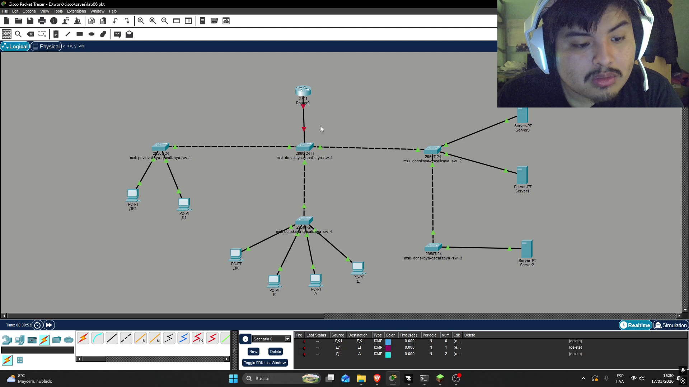{#fig-002 width=70%}

Потом я открыл терминал чтобы начинать настроить его. для того я выполнил следующие команды ([рис. @fig-003]). чтобы:

- дать название маршрутизатору
- настроить virtual teletype (количество сесии и пароль)
- настроить терминал (пароль чтобы исползовать его)
- создать пользователя
- создать ключ rsa
- использовать ssh

Router >enable
Router#configure terminal
Router(config)#hostname msk-donskaya-gw-1
msk−donskaya-qscalizaya-gw-1(config)#line vty 0 4
msk−donskaya-qscalizaya-gw-1(config-line)#password cisco
msk−donskaya-qscalizaya-gw-1(config-line)#login
msk−donskaya-qscalizaya-gw-1(config)#line console 0
msk−donskaya-qscalizaya-gw-1(config-line)#password cisco
msk−donskaya-qscalizaya-gw-1(config-line)#login
msk−donskaya-qscalizaya-gw-1(config)#enable secret cisco
msk−donskaya-qscalizaya-gw-1(config)#service password-encryption
msk−donskaya-qscalizaya-gw-1(config)#username admin privilege 1 secret cisco
msk−donskaya-qscalizaya-gw-1(config)#ip domain-name donskaya.rudn.edu
msk−donskaya-qscalizaya-gw-1(config)#crypto key generate rsa
msk−donskaya-qscalizaya-gw-1(config)#line vty 0 4
msk−donskaya-qscalizaya-gw-1(config-line)#transport input ssh

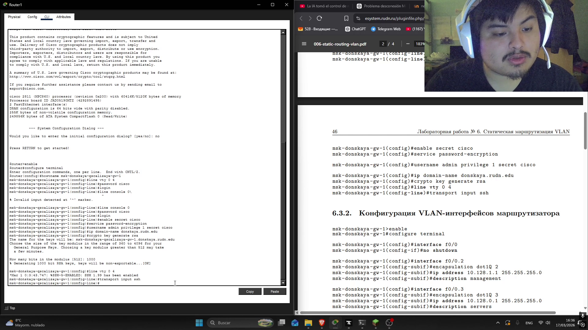{#fig-003 width=70%}

## Конфигурация VLAN-интерфейсов маршрутизатора

Здесь былы настроенны VLAN, для того я выполнил следующий команду которые выключают интерфейс f0/0, также дает IP-адерс каждому VLAN-интерфейсу следуя таблицу ip-адресов

### команды чтобы включить интерфейс

msk−donskaya-gw-1>enable
msk−donskaya-gw-1#configure terminal
msk−donskaya-gw-1(config)#interface f0/0
msk−donskaya-gw-1(config-if)#no shutdown

{#fig-004 width=70%}

### команды для настройки vlan-интерфейса 2

msk−donskaya-gw-1(config)#interface f0/0.2
msk−donskaya-gw-1(config-subif)#encapsulation dot1Q 2
msk−donskaya-gw-1(config-subif)#ip address 10.128.1.1 255.255.255.0
msk−donskaya-gw-1(config-subif)#description management

{#fig-005 width=70%}

### команды для настройки vlan-интерфейса 3

msk−donskaya-gw-1(config)#interface f0/0.3
msk−donskaya-gw-1(config-subif)#encapsulation dot1Q 3
msk−donskaya-gw-1(config-subif)#ip address 10.128.0.1 255.255.255.0
msk−donskaya-gw-1(config-subif)#description servers

{#fig-006 width=70%}

### команды для настройки vlan-интерфейса 101

msk−donskaya-gw-1(config-subif)#interface f0/0.101
msk−donskaya-gw-1(config-subif)#encapsulation dot1Q 101
msk−donskaya-gw-1(config-subif)#ip address 10.128.3.1 255.255.255.0
msk−donskaya-gw-1(config-subif)#description dk

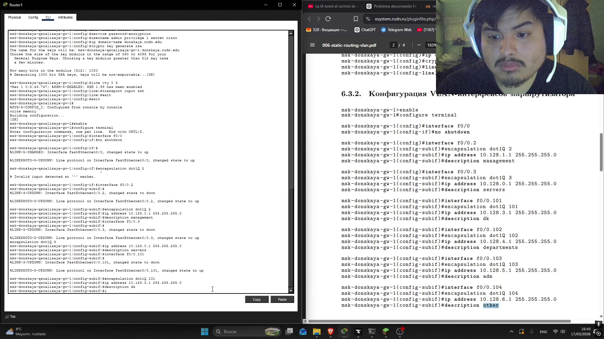{#fig-007 width=70%}

### команды для настройки vlan-интерфейса 102

msk−donskaya-gw-1(config-subif)#interface f0/0.102
msk−donskaya-gw-1(config-subif)#encapsulation dot1Q 102
msk−donskaya-gw-1(config-subif)#ip address 10.128.4.1 255.255.255.0
msk−donskaya-gw-1(config-subif)#description departments

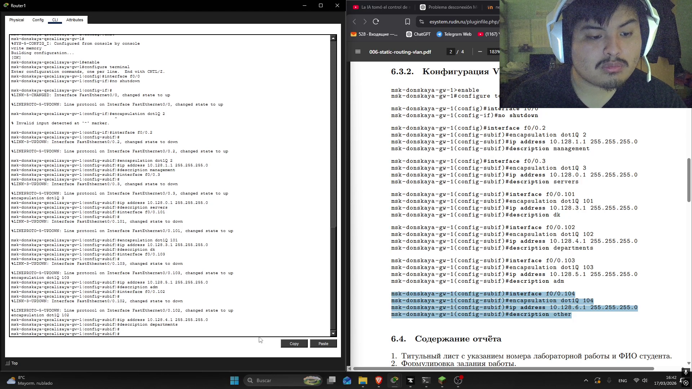{#fig-009 width=70%}

### команды для настройки vlan-интерфейса 103

msk−donskaya-gw-1(config-subif)#interface f0/0.103
msk−donskaya-gw-1(config-subif)#encapsulation dot1Q 103
msk−donskaya-gw-1(config-subif)#ip address 10.128.5.1 255.255.255.0
msk−donskaya-gw-1(config-subif)#description adm

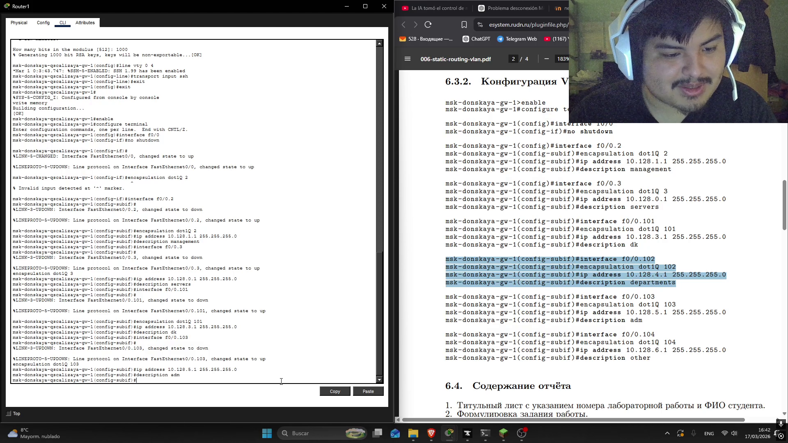{#fig-008 width=70%}

### команды для настройки vlan-интерфейса 104

msk−donskaya-gw-1(config-subif)#interface f0/0.104
msk−donskaya-gw-1(config-subif)#encapsulation dot1Q 104
msk−donskaya-gw-1(config-subif)#ip address 10.128.6.1 255.255.255.0
msk−donskaya-gw-1(config-subif)#description other

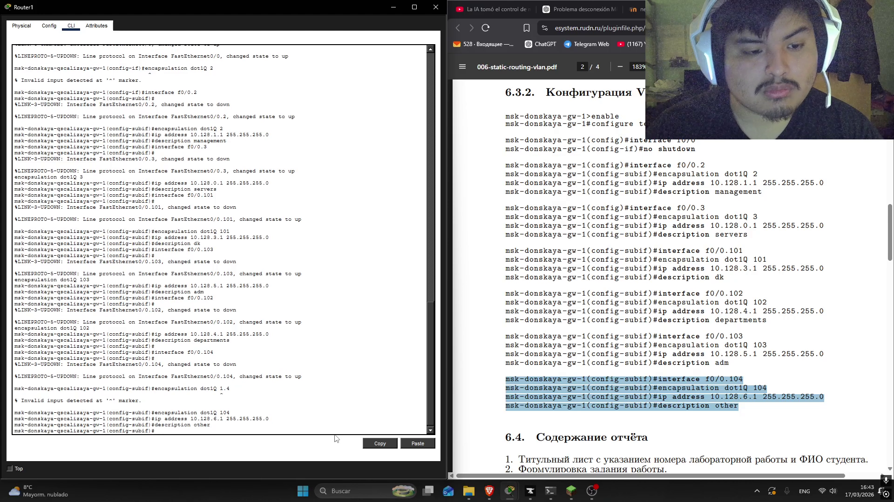{#fig-010 width=70%}

### cохранение конфигурации

msk−donskaya-gw-1#write memeory

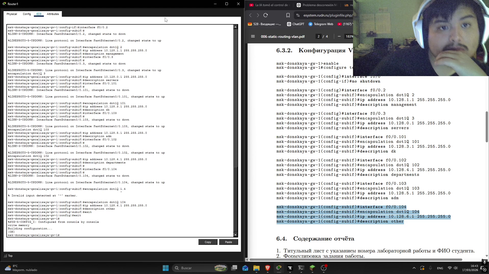{#fig-011 width=70%}

## проверка адресации

я открыл один VPC и запустил терминал, в котором выполнил команду ping на IP-адрес 10.128.6.7 ([рис. @fig-012]). и работал без проблем, также в другом компьютере я выполнил ту же команду но изменил IP-адрес на 10.128.3.3 ([рис. @fig-013]). и также работал. оба были в разных VLAN-интерфейсах 

{#fig-012 width=70%}

{#fig-013 width=70%}

## проверка с пакетами

Здесь я изпользовал инструмент чтобы создать пакеты ICPM и также я проверал его движение по сети и также работал без проблем 

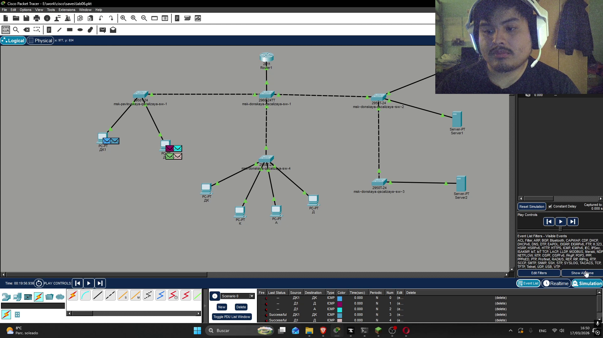{#fig-014 width=70%}

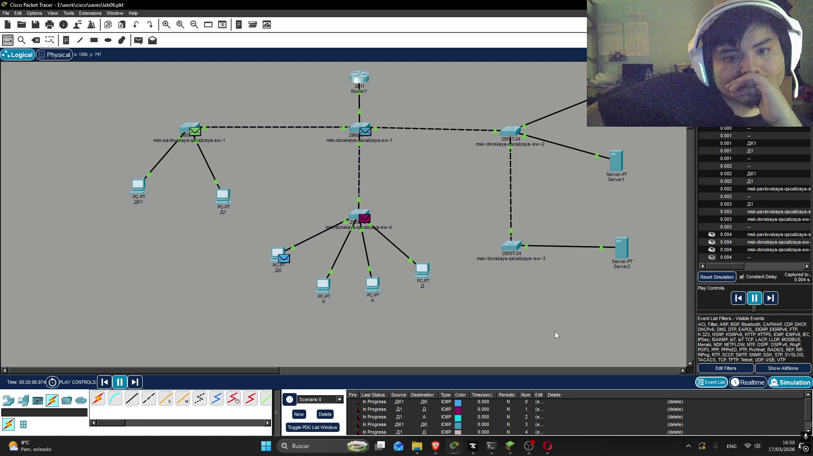{#fig-015 width=70%}

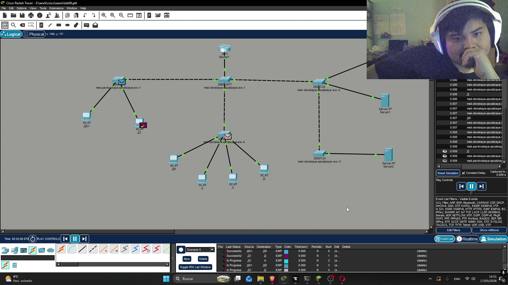{#fig-016 width=70%}

{#fig-017 width=70%18}

# Выводы

В этой лабораторной работе я смог смотреть какие комадны можно использовать чтобы настроить маршрутизатор в сети. как дать название, пароль, создать пользователя и настройть VLAN

# Список литературы{.unnumbered}

::: {#refs}
:::
