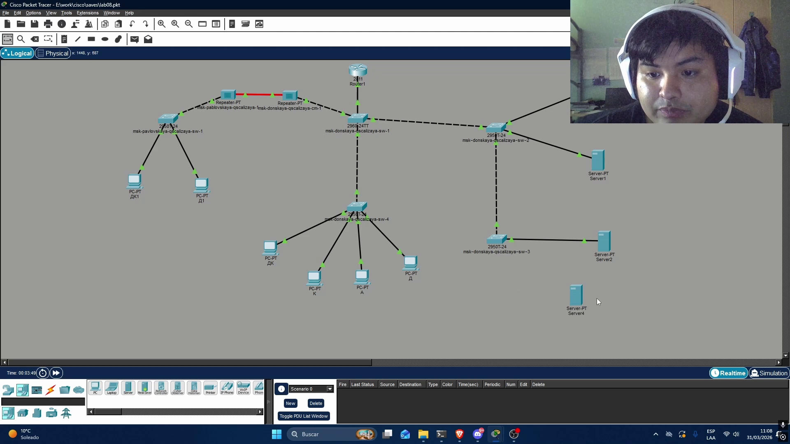
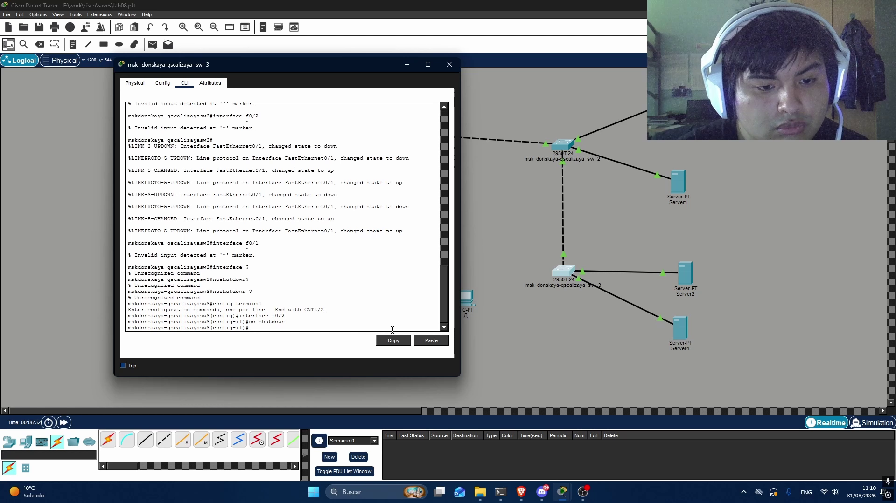
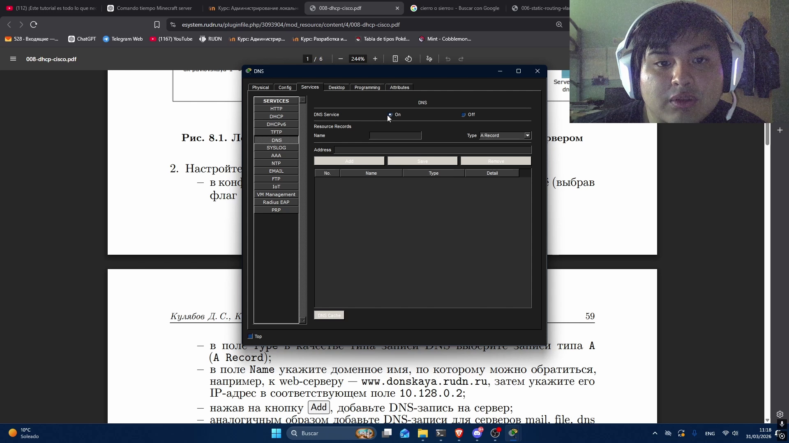
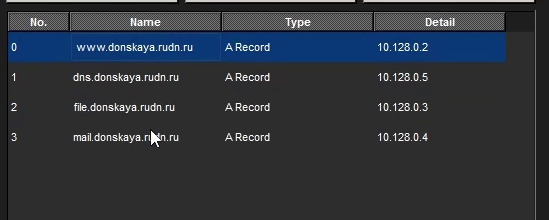
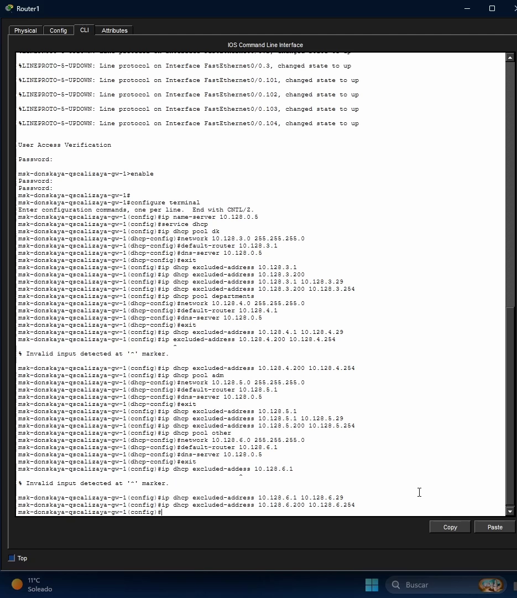
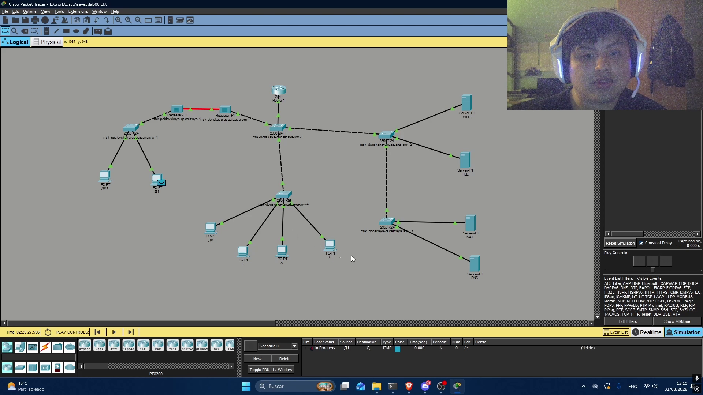

---
## Author
author:
  name: Кхари Жекка Кализая Арсе
  email: 1032234412@rudn.ru
  affiliation:
    - name: Российский университет дружбы народов
      country: Российская Федерация
      postal-code: 117198
      city: Москва
      address: ул. Миклухо-Маклая, д. 6
## Title
title: презентация №8
subtitle: Настройка сетевых сервисов. DHCP
license: CC BY
date: today
date-format: "YYYY-MM-DD" # Example: 2025-09-06
---

# расположение сервера

## сервер PT 

:::::::::::::: {.columns align=center}

::: {.column width="100%"}

:::
::::::::::::::

## порт

:::::::::::::: {.columns align=center}

::: {.column width="100%"}

:::
::::::::::::::

## включение порта

:::::::::::::: {.columns align=center}

::: {.column width="100%"}

:::
::::::::::::::

# настройка DNS-сервера 

## выключение сервиса DNS
:::::::::::::: {.columns align=center}

::: {.column width="100%"}

:::
::::::::::::::

## добавить новый url

:::::::::::::: {.columns align=center}

::: {.column width="100%"}

:::
::::::::::::::

## все домайны

:::::::::::::: {.columns align=center}

::: {.column width="100%"}

:::
::::::::::::::

# настройка маршрутизатора

## команды для конфигурации

:::::::::::::: {.columns align=center}

::: {.column width="100%"}

:::
::::::::::::::

## смотреть настройку

:::::::::::::: {.columns align=center}

::: {.column width="100%"}

:::
::::::::::::::

# проверка работы сети

## проверка с командой ping

:::::::::::::: {.columns align=center}

::: {.column width="100%"}

:::
::::::::::::::

## проверка с пакетами

:::::::::::::: {.columns align=center}

::: {.column width="100%"}

:::
::::::::::::::