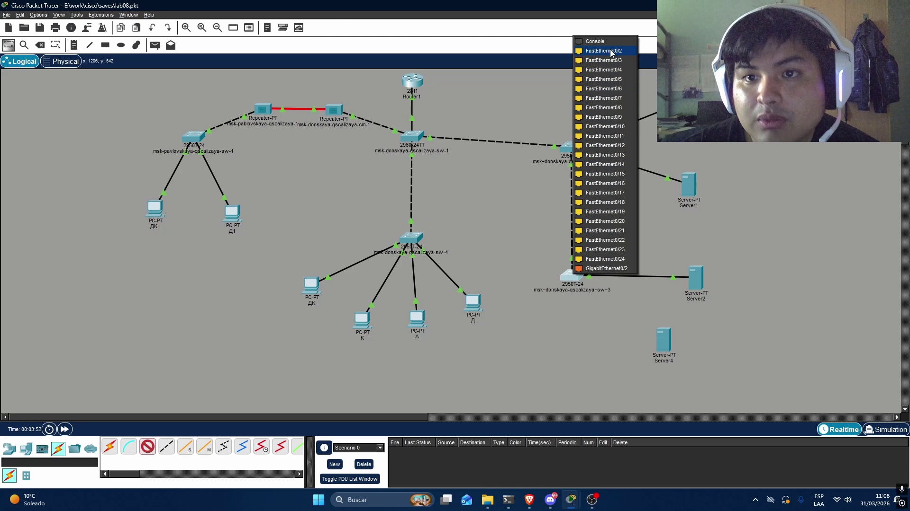
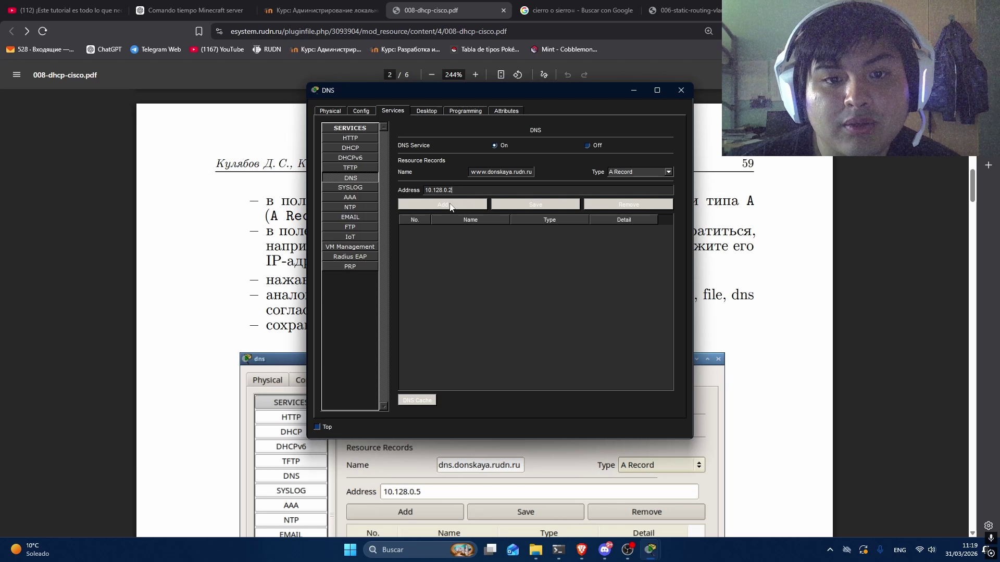
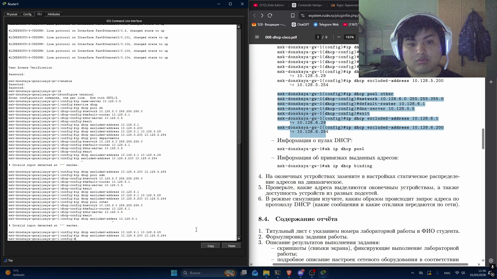
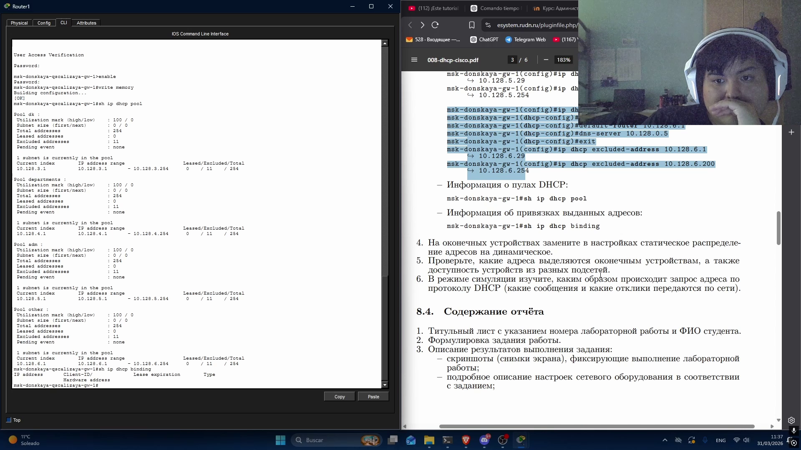
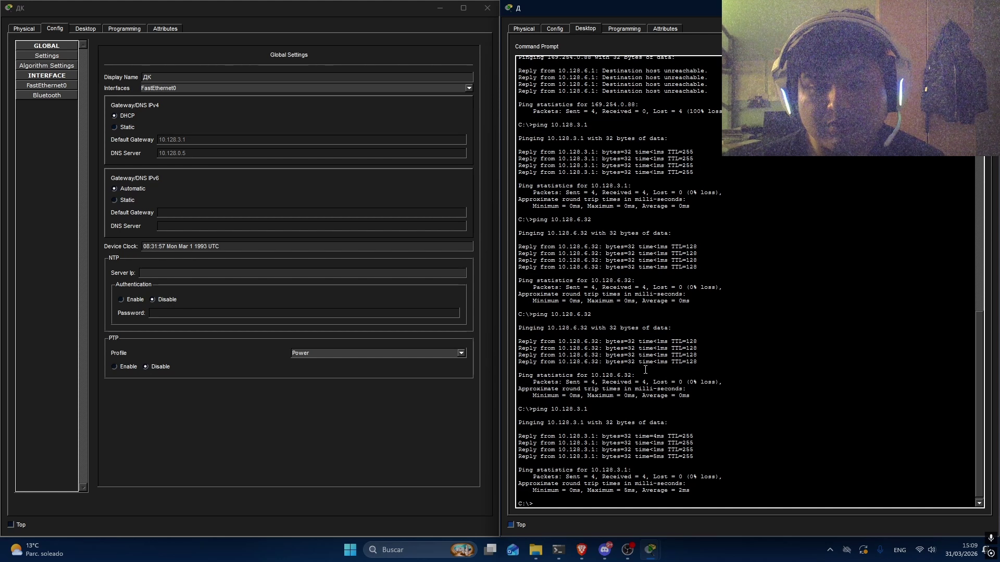

---
## Author
author:
  name: Кхари Жекка Кализая арсе
  email: 1032234412@rudn.ru
  affiliation:
    - name: Российский университет дружбы народов
      country: Российская Федерация
      postal-code: 117198
      city: Москва
      address: ул. Миклухо-Маклая, д. 6

## Title
title: "отчёт по лабораторной работе №8"
subtitle: "Настройка сетевых сервисов. DHCP"
license: "CC BY"
---

# Цель работы

Приобретение практических навыков по настройке динамического распределения IP-адресов посредством протокола DHCP (Dynamic Host Configuration
Protocol)  в локальной сети.

# Задание

1. Добавить DNS-записи для домена donskaya.rudn.ru на сервер dns.
2. Настроить DHCP-сервис на маршрутизаторе.
3. Заменить в конфигурации оконечных устройствах статическое распределение адресов на динамическое.
4. При выполнении работы необходимо учитывать соглашение об именовании (см. раздел 2 5).

# Выполнение лабораторной работы

## сервер DNS

Сначала было распаложено в рабочей области сервер PT  ([рис. @fig-001]) и соединил его к порту FastEthernet0/2 коммутатора sw3 ([рис. @fig-002]).

{#fig-001 width=70%}

{#fig-002 width=70%}

Дальше было включен порт FastEthernet0/2 в коммутаторе через терминал ([рис. @fig-003]).

{#fig-003 width=70%}

## Настройка Сервер

Сначала я щелкал в сервер и открылся панель настройка. там я перешел в раздел Service/DNS там я смог смотреть флаги чтобы включить или выключит DNS service. я включил его ([рис. @fig-004]).

Дальше я добавил название(url) в части `name` и выбрал `A Record` в `часть Type` дальше в части `address` я добавил соответствующий к домайну IP-адрес и нажал `add`  ([рис. @fig-005]) . я повторил то же действие для всех серверов ([рис. @fig-008]).

{#fig-004 width=70%} 

{#fig-005 width=70%}

{#fig-008 width=70%}

## настройка DHCP

я открыл терминал маршрутизатора gw1 и начал настройку DHCP ([рис. @fig-009]).

### общая настройка 

я ввшел в конфигурационный режим и указал IP-адрес DNS, дальше я включил сервис DHCP в маршрутизаторе

    msk−donskaya-qscalizaya-gw-1>enable
    msk−donskaya-qscalizaya-gw-1#configure terminal
    msk−donskaya-qscalizaya-gw-1(config)#ip name-server 10.128.0.5
    msk−donskaya-qscalizaya-gw-1(config)#service dhcp

## настройка VLAN  дисплейных классов

Сначала я создал пул dk и указал IP-адрес и маску подсети. дальше я указал gateway 10.128.3.1. Потом я указал IP-адрес DNS-сервера. потом я указал IP-адреса, который протокол не должен использовать потому что они принадлежат к сетевым оборудованием. такие действия повторяется для каждой VLAN-сети

    msk−donskaya-qscalizaya-gw-1(config)#ip dhcp pool dk
    msk−donskaya-qscalizaya-gw-1(dhcp-config)#network 10.128.3.0 255.255.255.0
    msk−donskaya-qscalizaya-gw-1(dhcp-config)#default-router 10.128.3.1
    msk−donskaya-qscalizaya-gw-1(dhcp-config)#dns−server 10.128.0.5
    msk−donskaya-qscalizaya-gw-1(dhcp-config)#exit
    msk−donskaya-qscalizaya-gw-1(config)#ip dhcp excluded-address 10.128.3.1 10.128.3.29
    msk−donskaya-qscalizaya-gw-1(config)#ip dhcp excluded-address 10.128.3.200 10.128.3.254

## настройка VLAN состава кафедр

    msk−donskaya-qscalizaya-gw-1(config)#ip dhcp pool departments
    msk−donskaya-qscalizaya-gw-1(dhcp-config)#network 10.128.4.0 255.255.255.0
    msk−donskaya-qscalizaya-gw-1(dhcp-config)#default-router 10.128.4.1
    msk−donskaya-qscalizaya-gw-1(dhcp-config)#dns−server 10.128.0.5
    msk−donskaya-qscalizaya-gw-1(dhcp-config)#exit
    msk−donskaya-qscalizaya-gw-1(config)#ip dhcp excluded-address 10.128.4.1 10.128.4.29
    msk−donskaya-qscalizaya-gw-1(config)#ip dhcp excluded-address 10.128.4.200 10.128.4.254

## настройка VLAN администрации

    msk−donskaya-qscalizaya-gw-1(config)#ip dhcp pool adm
    msk−donskaya-qscalizaya-gw-1(dhcp-config)#network 10.128.5.0 255.255.255.0
    msk−donskaya-qscalizaya-gw-1(dhcp-config)#default-router 10.128.5.1
    msk−donskaya-qscalizaya-gw-1(dhcp-config)#dns−server 10.128.0.5
    msk−donskaya-qscalizaya-gw-1(dhcp-config)#exit
    msk−donskaya-qscalizaya-gw-1(config)#ip dhcp excluded-address 10.128.5.1 10.128.5.29
    msk−donskaya-qscalizaya-gw-1(config)#ip dhcp excluded-address 10.128.5.200 10.128.5.254

## настройка VLAN других пользователей

    msk−donskaya-qscalizaya-gw-1(config)#ip dhcp pool other
    msk−donskaya-qscalizaya-gw-1(dhcp-config)#network 10.128.6.0 255.255.255.0
    msk−donskaya-qscalizaya-gw-1(dhcp-config)#default-router 10.128.6.1
    msk−donskaya-qscalizaya-gw-1(dhcp-config)#dns−server 10.128.0.5
    msk−donskaya-qscalizaya-gw-1(dhcp-config)#exit
    msk−donskaya-qscalizaya-gw-1(config)#ip dhcp excluded-address 10.128.6.1 10.128.6.29
    msk−donskaya-qscalizaya-gw-1(config)#ip dhcp excluded-address 10.128.6.200 10.128.6.254

{#fig-009 width=70%}

### проверка конфигурации

используя эти командц можно смотреть конфигурацию DHCP и какие окончевые устройиства соединили и получили IP-адрес с маршрутизатора ([рис. @fig-011]).

msk−donskaya-qscalizaya-gw-1#sh ip dhcp pool
msk−donskaya-qscalizaya-gw-1#sh ip dhcp binding

{#fig-011 width=70%}

## настройка окончевых устройств

я изменил флаг в раздел GatewayDNS IPV4 c static на DHCP чтобы исползовать его и через несколько секунд компьютер получает IP-адрес ([рис. @fig-014]).

## Проверка работы 

я выполнил команюу ping с IP-адрес и получил ответ с другого компьютера  ([рис. @fig-014]).

{#fig-014 width=70%}

Дальше я использовал инструмент чтобы создать пакеты и отправил его по VLAN-Д (другие) ([рис. @fig-015]).

{#fig-015 width=70%}

# Выводы

в этой лабораторной работе я смог смотреть как настроить протокол DHCP в локальной сети и через VLAN, также как настроить сервер DNS

# Список литературы{.unnumbered}

::: {#refs}
:::
