---
## Author
author:
  name: Кхари Жекка Кализая арсе
  email: 1032234412@rudn.ru
  affiliation:
    - name: Российский университет дружбы народов
      country: Российская Федерация
      postal-code: 117198
      city: Москва
      address: ул. Миклухо-Маклая, д. 6

## Title
title: "отчёт по лабораторной работе №9"
subtitle: "Использование протокола STP. Агрегирование каналов"
license: "CC BY"
---

# Цель работы

Изучение возможностей протокола STP и его модификаций по обеспечению
отказоустойчивости сети, агрегированию интерфейсов и перераспределению
нагрузки между ними

# Задание

1. Сформируйте резервное соединение между коммутаторами msk-donskayasw-1 и msk-donskaya-sw-3.
2. Настройте балансировку нагрузки между резервными соединениями.
3. Настройте режим Portfast на тех интерфейсах коммутаторов, к которым подключены серверы.
4. Изучите отказоустойчивость резервного соединения.
5. Сформируйте и настройте агрегированное соединение интерфейсов Fa0/20 – Fa0/23 между коммутаторами msk-donskaya-sw-1 и msk-donskaya-sw-4.
6. При выполнении работы необходимо учитывать соглашение об именовании (см. раздел 2.5).

# Выполнение лабораторной работы

Сначала в этой лабораторной работе я скопировал проект предыдущей лабораторной работы и назвал его lab09 ([рис. @fig-00]) потом я начал выполнение лабораторной работы.

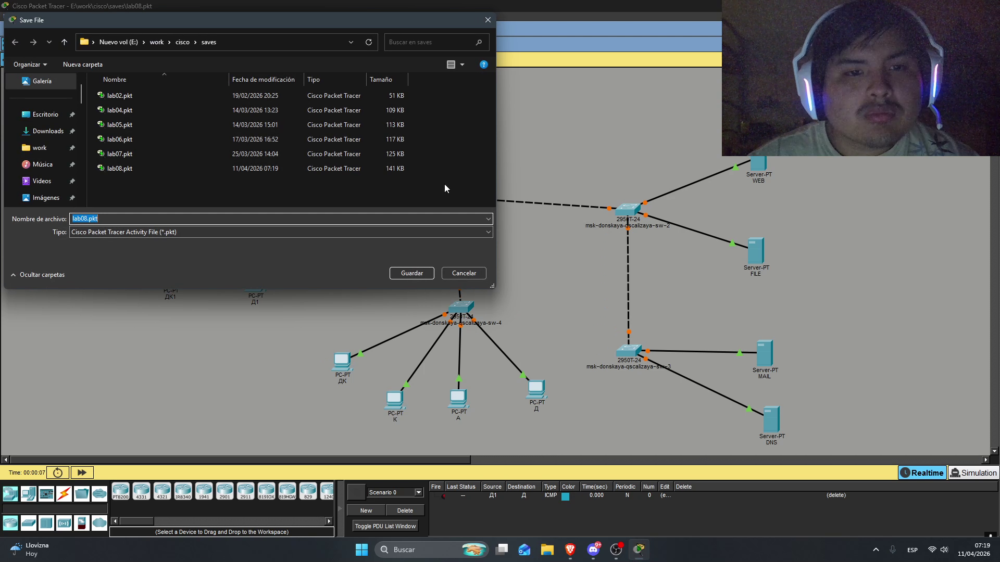{#fig-001 width=70%}

## изменение тополгии

### изменение портов

я изменил топологию между коммутаторами sw1, sw4, sw3 и sw2 как видно в [рис. @fig-002] и [рис. @fig-003]..

{#fig-001 width=70%}

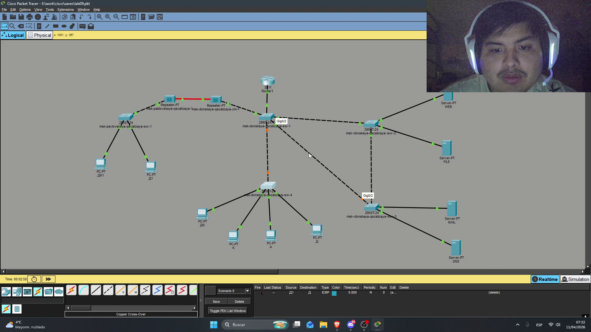{#fig-003 width=70%}

### настройка портов

Дальше я еще раз настроил интерфейсы, включил их и настроил режим trunk

{#fig-001 width=70%}

{#fig-002 width=70%}

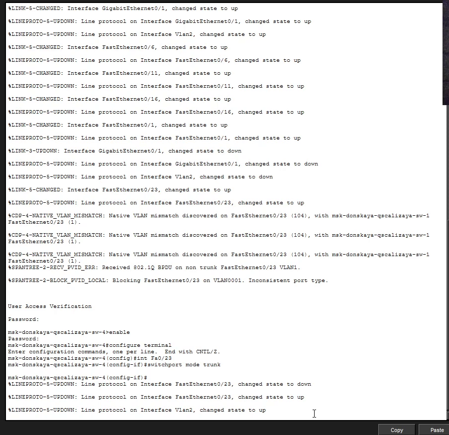{#fig-003 width=70%}

### проверка 

Потом я проверил что сеть работает, для того я отправил пакет с компьютера до сервера ([рис. @fig-007])

{#fig-007 width=70%}

## настройка протокола STP в коммутаторах

Сначала я смотрел состояние протокола в коммутаторе sw2 ([рис. @fig-008])

{#fig-008 width=70%}

Дальше в коммутаторе sw1 я изменил конфигурацию ([рис. @fig-009])

{#fig-00 width=70%}

Дальше я смотрел движение пакетов по сети с дк-компьютера до сервера FILE и MAIL ([рис. @fig-010] - [рис. @fig-013] )

{#fig-010 width=70%}

{#fig-011 width=70%}

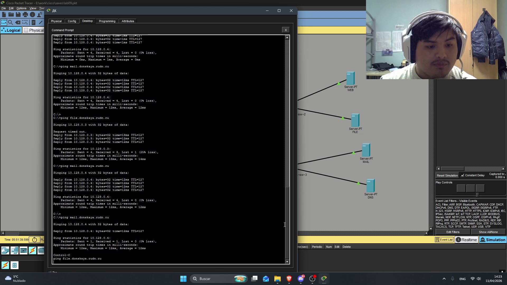{#fig-012 width=70%}

{#fig-013 width=70%}

## настрйока portfast

Я настроил режим Portfast на всех интерфейсах коммутаторов, к которым подключены серверы(sw2, sw3)

{#fig-014 width=70%}

{#fig-015 width=70%}

Потом я смотрел каким он работает, для того я выполнил команду ping с опцией -n 1000 чтобы повторить ping 1000 раз и выключил порт g0/2 в sw3 после того как команда начала работать

{#fig-016 width=70%}

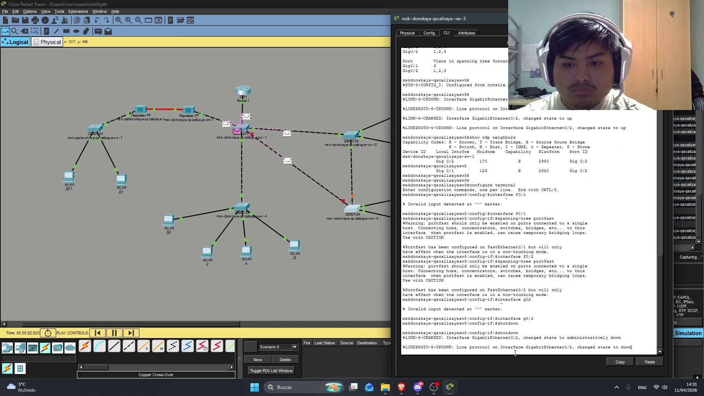{#fig-017 width=70%}

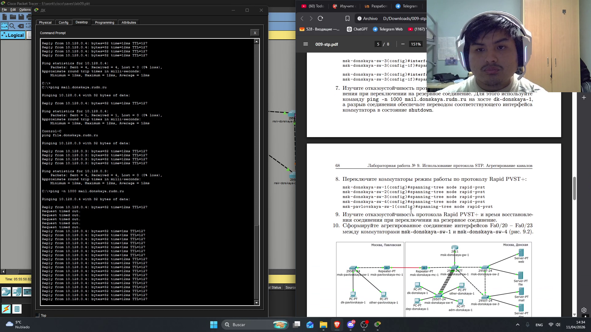{#fig-018 width=70%}

## настройка протокола Rapid PVST+

чтобы настроить протокол Rapid PVST+ я выполнил команду spaning-tree mode rapid-pvst на всех коммутаторах 

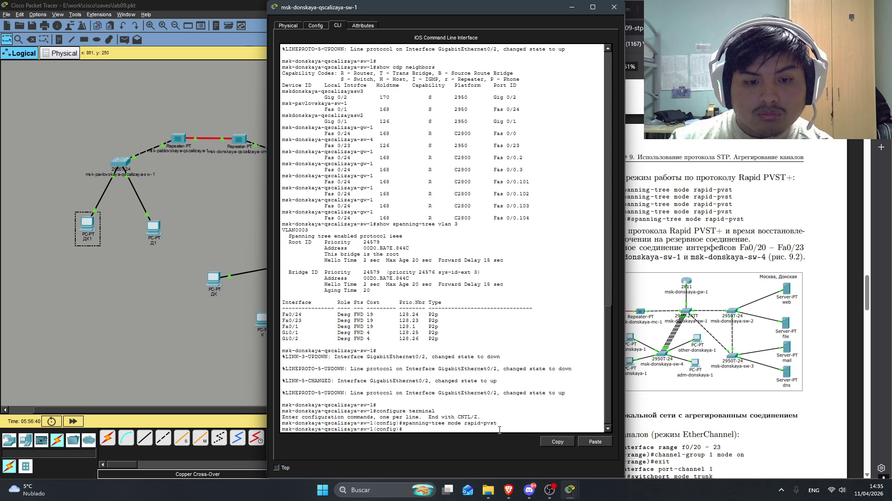{#fig-019 width=70%}
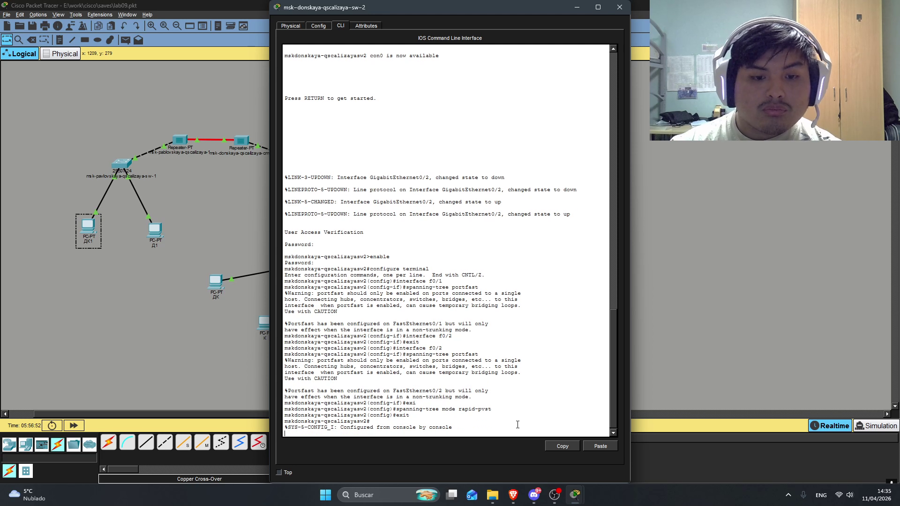{#fig-020 width=70%}
{#fig-021 width=70%}
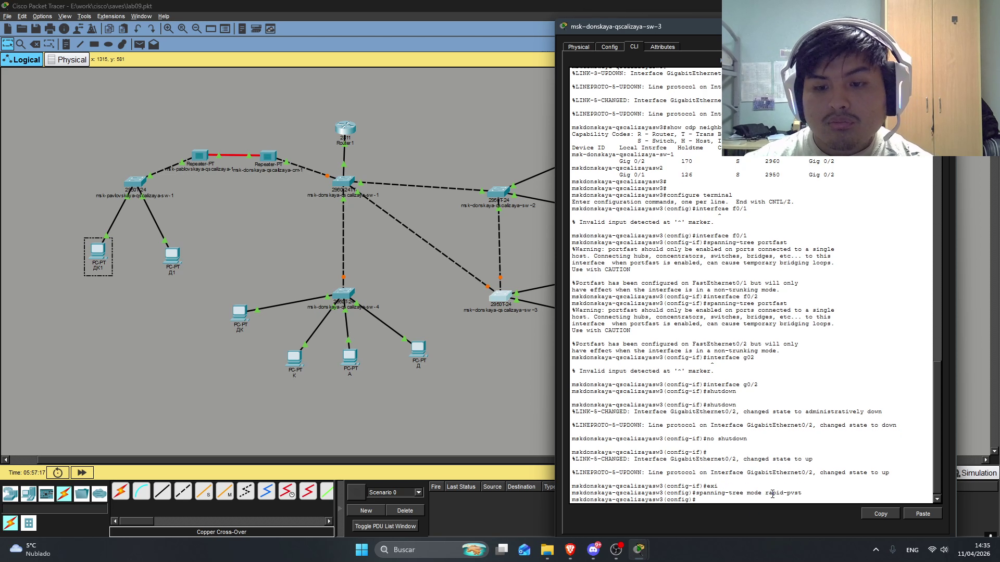{#fig-022 width=70%}
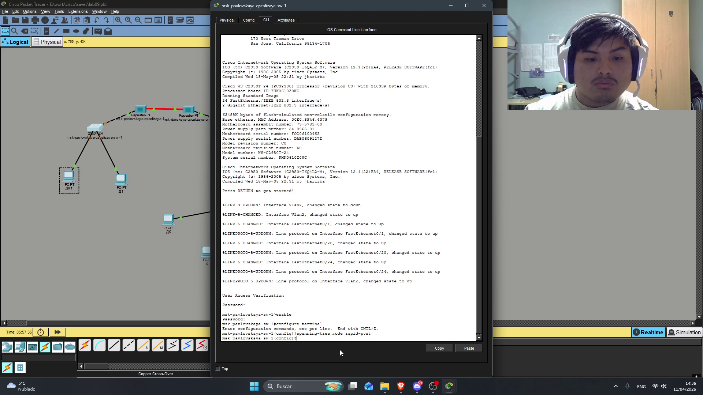{#fig-023 width=70%}

потом я повторил тот же эксперимент как для протокола portfast

{#fig-024 width=70%}

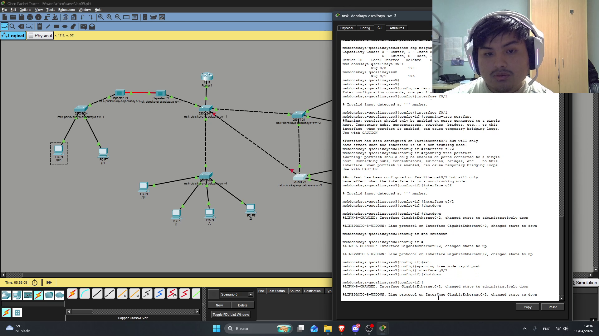{#fig-025 width=70%}

{#fig-026 width=70%}

## настройка EtherChannel

Сначала я изменил топологию и добавил кабели между коммутаторами sw-1 и sw-4 ([рис. @fig-027])

{#fig-027 width=70%}

Потом я настроил Etherchanel в интерфейсах коммутаторов

{#fig-029 width=70%}

{#fig-030 width=70%}

# Выводы

В этой лабораторной работе я смог смотреть команды для настройка протокола STP в режимах portfast и  Rapid PVST+ также как настройть Etherchannel в коммутаторах 

# Список литературы{.unnumbered}

::: {#refs}
:::
