---
## Author
author:
  name: Кхари Жекка Кализая Арсе
  email: 1032234412@rudn.ru
  affiliation:
    - name: Российский университет дружбы народов
      country: Российская Федерация
      postal-code: 117198
      city: Москва
      address: ул. Миклухо-Маклая, д. 6
## Title
title: презентация №10
subtitle: Настройка списков управления доступом (ACL)
license: CC BY
date: today
date-format: "YYYY-MM-DD" # Example: 2025-09-06
---

# установка ноутбука Admin

## ноутбук Admin

:::::::::::::: {.columns align=center}

::: {.column width="90%"}

:::
::::::::::::::

## настройка ноутбука Admin

:::::::::::::: {.columns align=center}

::: {.column width="90%"}

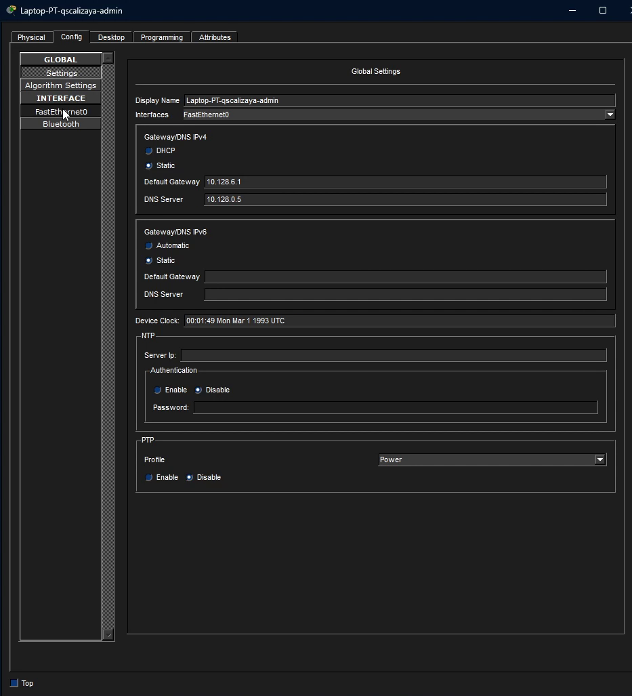

:::
::::::::::::::

## настройка ноутбука Admin

:::::::::::::: {.columns align=center}

::: {.column width="90%"}

:::
::::::::::::::

# настройка маршрутизатора gw-1

## Настройка доступа к web-серверу по порту tcp 80:

:::::::::::::: {.columns align=center}

::: {.column width="90%"}

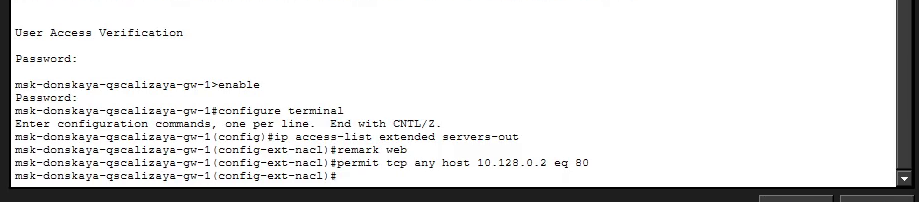

:::
::::::::::::::

## Добавление списка управления доступом к интерфейсу:

:::::::::::::: {.columns align=center}

::: {.column width="90%"}

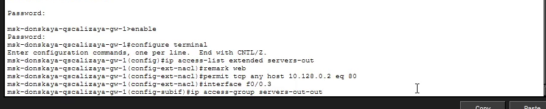

:::
::::::::::::::

## Дополнительный доступ для администратора по протоколам Telnet и FTP:

:::::::::::::: {.columns align=center}

::: {.column width="90%"}

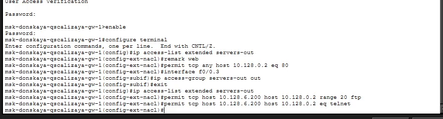

:::
::::::::::::::

## проверка работы протокола FTP с ноутбука
:::::::::::::: {.columns align=center}

::: {.column width="90%"}

:::
::::::::::::::

## проверка работы протокола FTP с компьютера ДК
:::::::::::::: {.columns align=center}

::: {.column width="90%"}

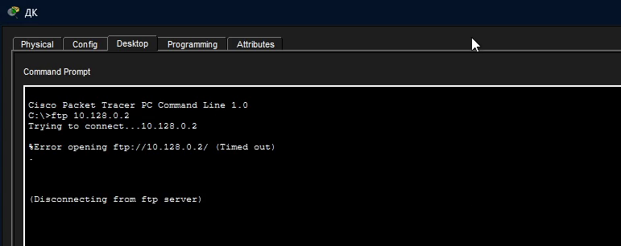

:::
::::::::::::::

## проверка работы протокола FTP с компьютера К
:::::::::::::: {.columns align=center}

::: {.column width="90%"}

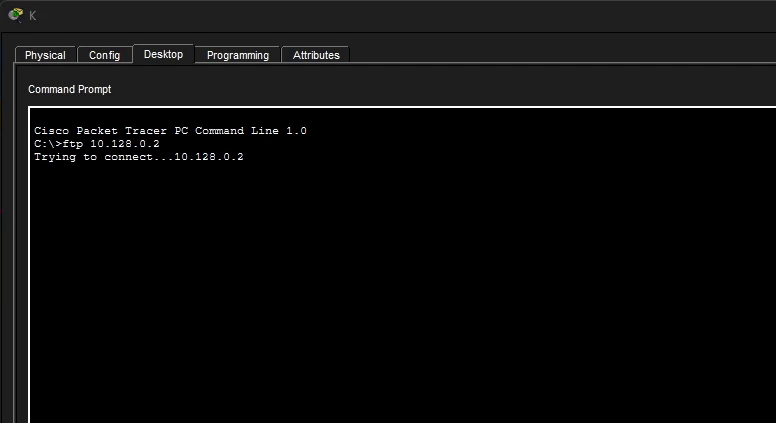

:::
::::::::::::::

## проверка работы протокола FTP с компьютера А
:::::::::::::: {.columns align=center}

::: {.column width="90%"}

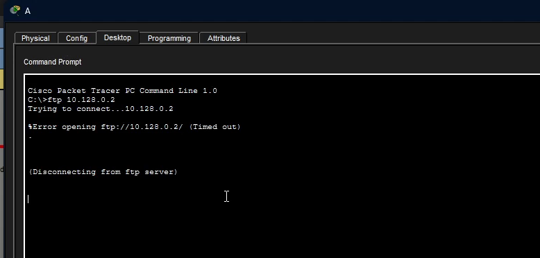

:::
::::::::::::::

## проверка работы протокола FTP с компьютера Д
:::::::::::::: {.columns align=center}

::: {.column width="90%"}

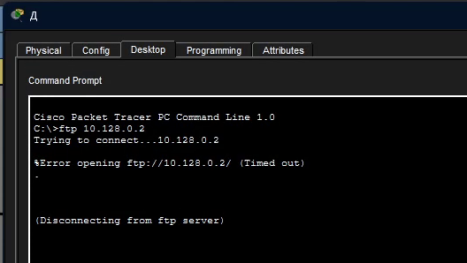

:::
::::::::::::::

## Настройка доступа к файловому серверу
:::::::::::::: {.columns align=center}

::: {.column width="90%"}

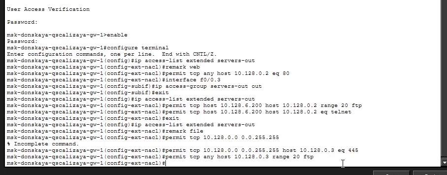

:::
::::::::::::::

## Настройка доступа к почтовому серверу
:::::::::::::: {.columns align=center}

::: {.column width="90%"}

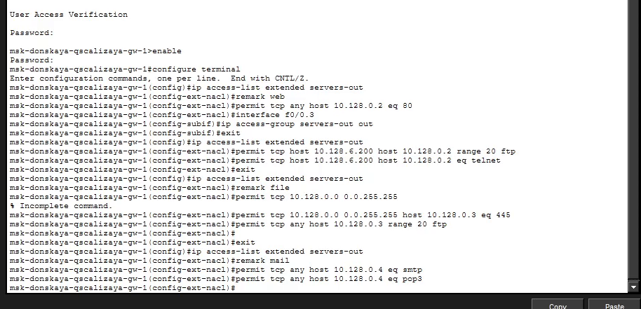

:::
::::::::::::::

## Настройка доступа к DNS-серверу
:::::::::::::: {.columns align=center}

::: {.column width="90%"}

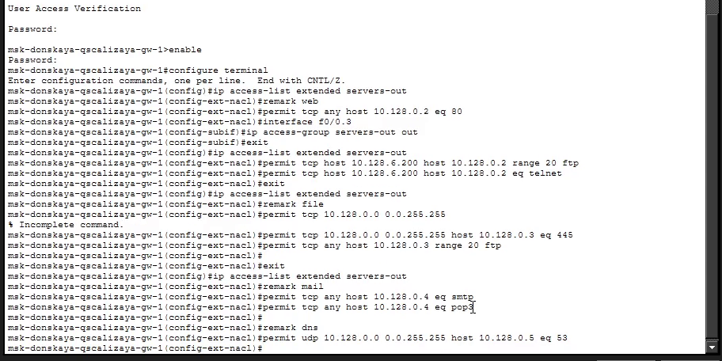

:::
::::::::::::::

## проверка работы DNS-сервера
:::::::::::::: {.columns align=center}

::: {.column width="90%"}

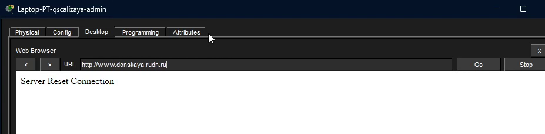

:::
::::::::::::::

## Разрешение icmp-запросов
:::::::::::::: {.columns align=center}

::: {.column width="90%"}

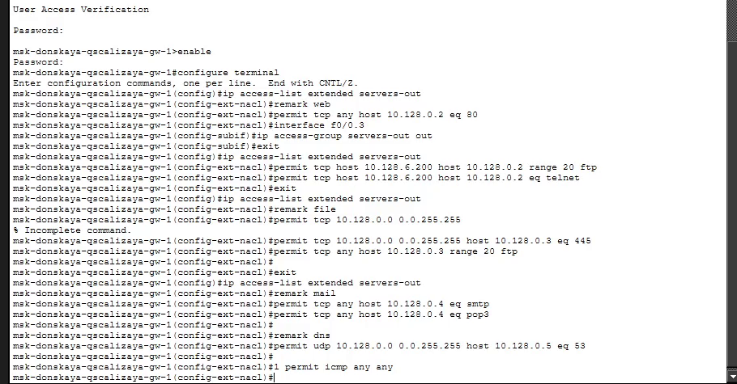

:::
::::::::::::::

## список прав доступа
:::::::::::::: {.columns align=center}

::: {.column width="90%"}

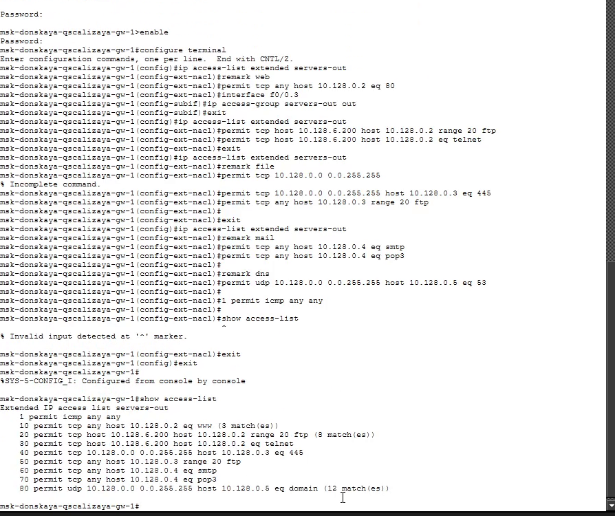

:::
::::::::::::::

## Настройка доступа для сети Other
:::::::::::::: {.columns align=center}

::: {.column width="90%"}

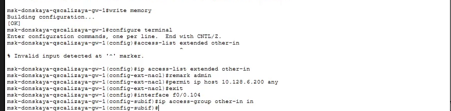

:::
::::::::::::::

## Настройка доступа администратора к сети сетевого оборудования
:::::::::::::: {.columns align=center}

::: {.column width="90%"}

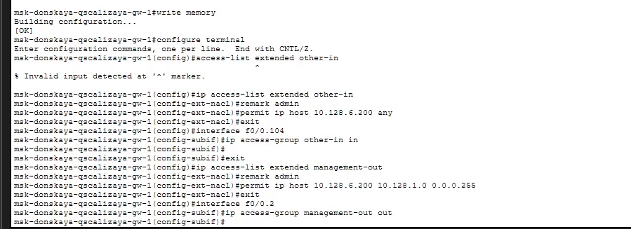

:::
::::::::::::::

# проверка работы списка прав доступа

## проверка DNS-сервера
:::::::::::::: {.columns align=center}

::: {.column width="90%"}

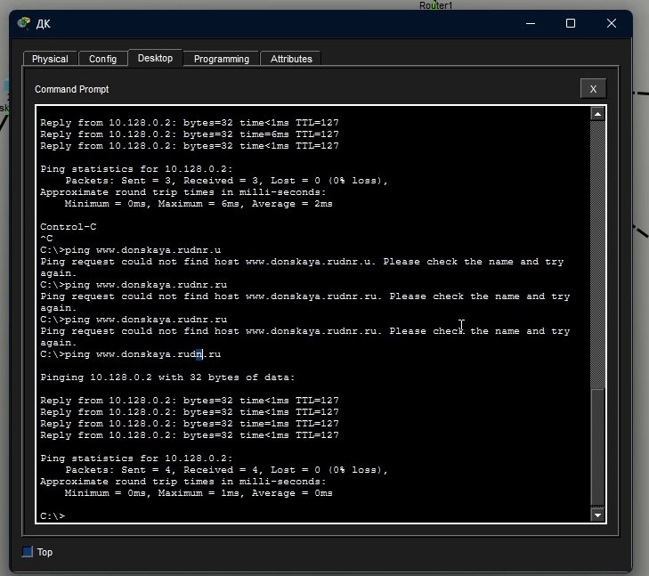

:::
::::::::::::::

## проверка подключения по протоколу ftp c ноутбука admin
:::::::::::::: {.columns align=center}

::: {.column width="90%"}

:::
::::::::::::::

## проверка подключения по протоколу ftp c компьютера ДК
:::::::::::::: {.columns align=center}

::: {.column width="90%"}

:::
::::::::::::::

## настройка FILE-сервера
:::::::::::::: {.columns align=center}

::: {.column width="90%"}

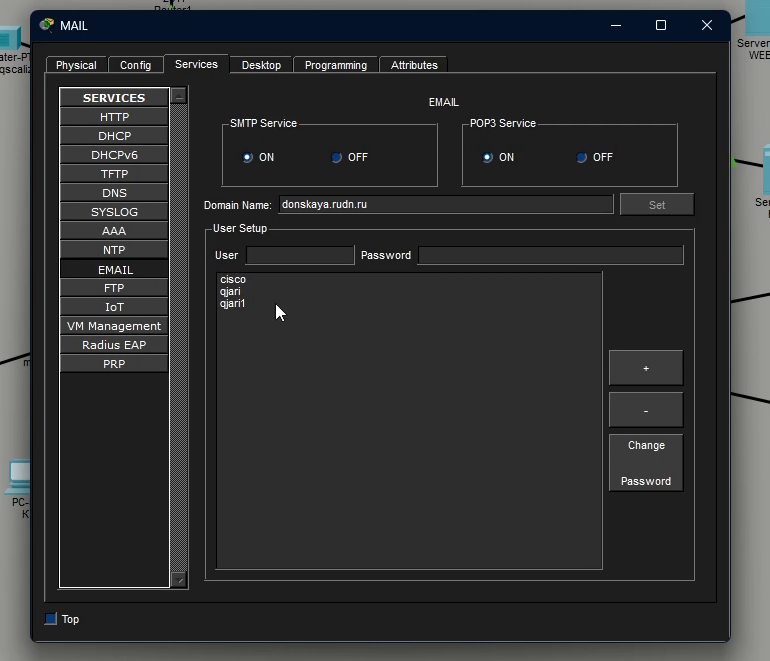

:::
::::::::::::::

## настройка email в компьютера ДК
:::::::::::::: {.columns align=center}

::: {.column width="90%"}

:::
::::::::::::::

## проверка работы email в компьютере ДК
:::::::::::::: {.columns align=center}

::: {.column width="90%"}

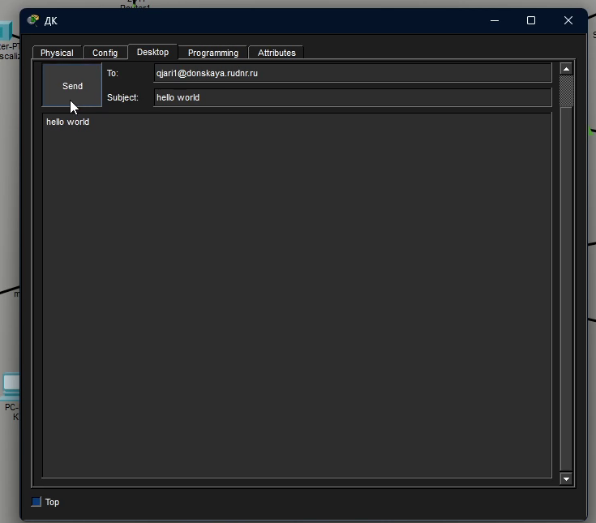

:::
::::::::::::::

## сообщение правильноработности email
:::::::::::::: {.columns align=center}

::: {.column width="90%"}

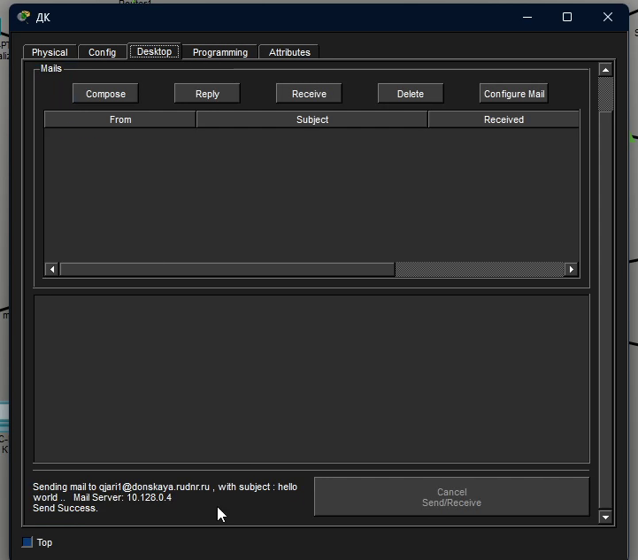

:::
::::::::::::::

## получение письмо 
:::::::::::::: {.columns align=center}

::: {.column width="90%"}

:::
::::::::::::::

## проверка подключения к IP-адресу 10.128.0.4
:::::::::::::: {.columns align=center}

::: {.column width="90%"}

:::
::::::::::::::

# настройка сети pavlovskaya

## Настройка компьютера Д1 в сети pavlovskaya
:::::::::::::: {.columns align=center}

::: {.column width="90%"}

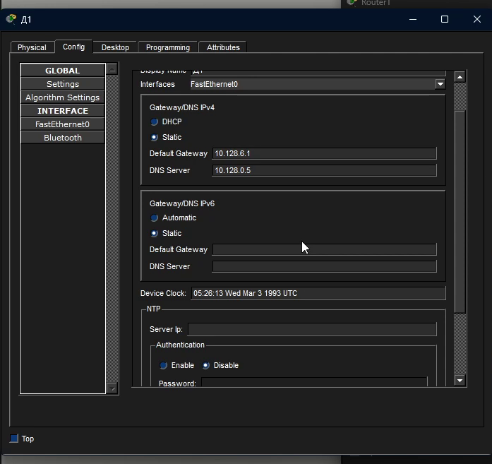

:::
::::::::::::::

## Настройка компьютера Д1 в сети pavlovskaya
:::::::::::::: {.columns align=center}

::: {.column width="90%"}

:::
::::::::::::::

## Настройка маршрутизатора gw-1
:::::::::::::: {.columns align=center}

::: {.column width="90%"}

:::
::::::::::::::

## проверка работы списка прав доступа
:::::::::::::: {.columns align=center}

::: {.column width="90%"}

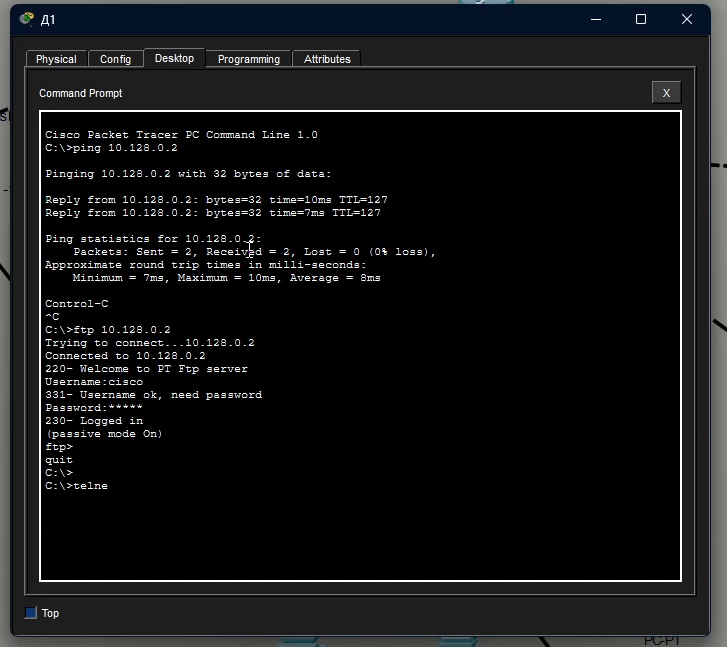

:::
::::::::::::::

## проверка работы списка прав доступа
:::::::::::::: {.columns align=center}

::: {.column width="90%"}

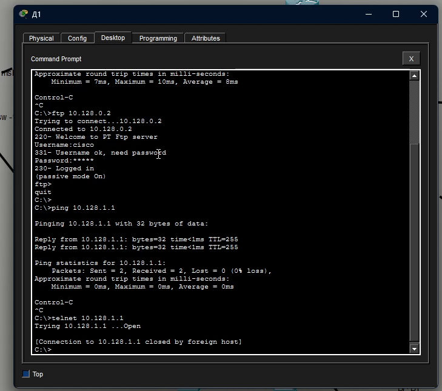

:::
::::::::::::::

## проверка работы списка прав доступа
:::::::::::::: {.columns align=center}

::: {.column width="90%"}

:::
::::::::::::::
