---
## Author
author:
  name: Кхари Жекка Кализая арсе
  email: 1032234412@rudn.ru
  affiliation:
    - name: Российский университет дружбы народов
      country: Российская Федерация
      postal-code: 117198
      city: Москва
      address: ул. Миклухо-Маклая, д. 6

## Title
title: "отчёт по лабораторной работе №10"
subtitle: "Настройка списков управления доступом (ACL)"
license: "CC BY"
---

# Цель работы

Освоить настройку прав доступа пользователей к ресурсам сети.

# Задание

1. Требуется настроить следующие правила доступа:
    1. web-сервер: разрешить доступ всем пользователям по протоколу HTTP через порт 80 протокола TCP, а для администратора открыть доступ по протоколам Telnet и FTP;
    2. файловый сервер: с внутренних адресов сети доступ открыт по портам для общедоступных каталогов, с внешних — доступ по протоколу FTP;
    3. почтовый сервер: разрешить пользователям работать по протоколам SMTP и POP3 (соответственно через порты 25 и 110 протокола TCP), а для администратора — открыть доступ по протоколам Telnet и FTP;
    4. DNS-сервер: открыть порт 53 протокола UDP для доступа из внутренней сети;
    5. разрешить icmp-сообщения, направленные в сеть серверов;
    6. запретить для сети Other любые запросы за пределы сети, за исключением администратора;
    7. разрешить доступ в сеть управления сетевым оборудованием только администратору сети.
2. Требуется проверить правильность действия установленных правил доступа.
3. Требуется выполнить задание для самостоятельной работы по настройке прав доступа администратора сети на Павловской.
4. При выполнении работы необходимо учитывать соглашение об именовании (см. раздел 2.5).

# Выполнение лабораторной работы

## laptop-PT admin

Сначала этой лабораторной работы я открыл проекта и добавил новый ноутбук Admin ([рис. @fig-001]).

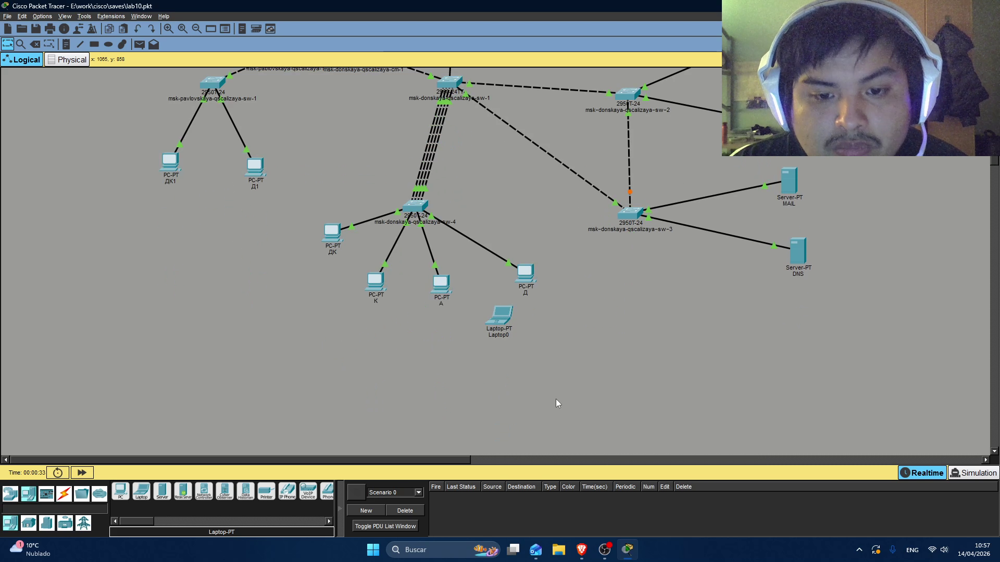{#fig-001 width=70%}

я переназвал его на laptop-pt-qscalizaya-admin  и настроил gateway 10.128.6.1, DNS 10.128.0.5 ([рис. @fig-002])., и IP-адрес 10.128.6.200 ([рис. @fig-003]) и подключил его в порт 24 коммутатора sw1.

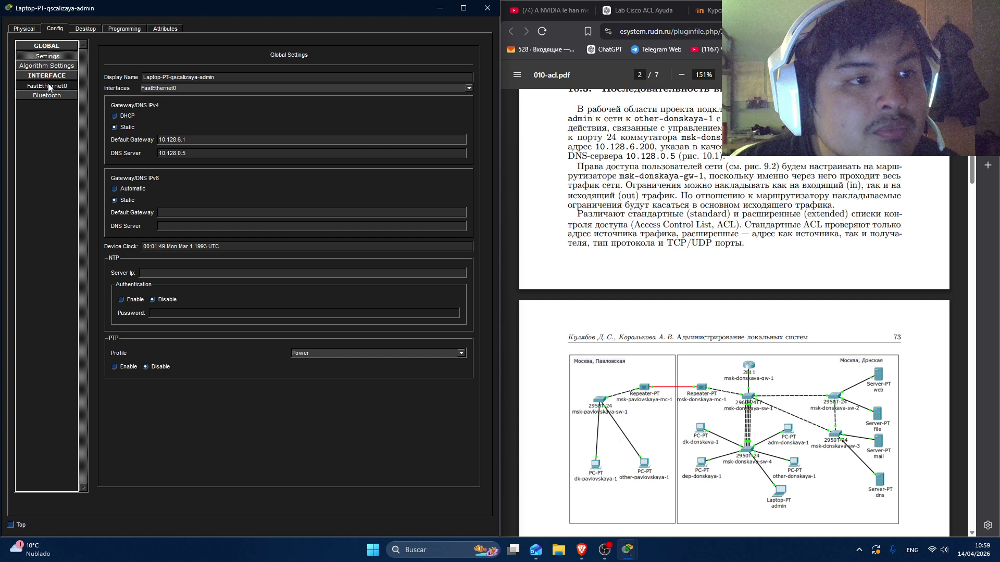{#fig-002 width=70%}

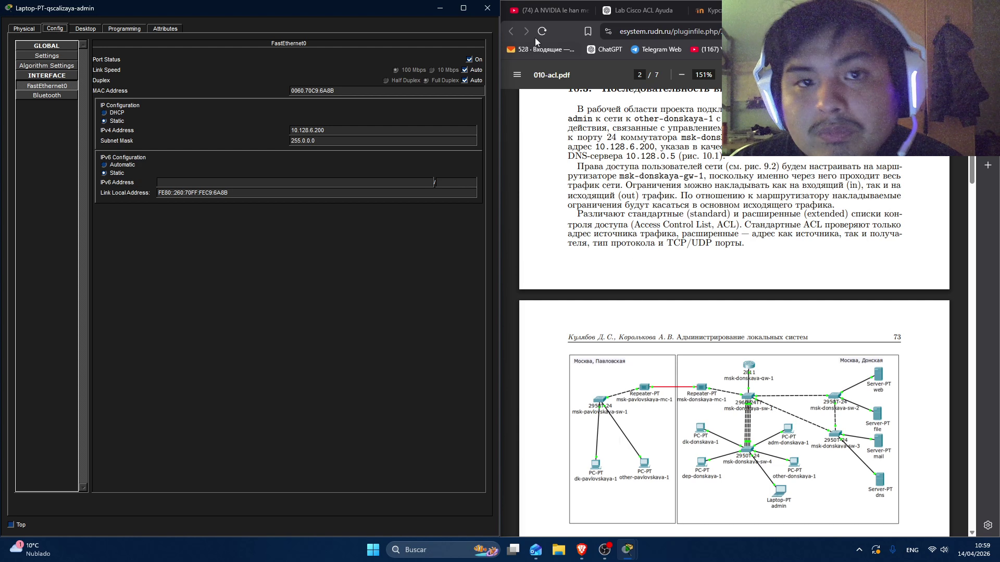{#fig-003 width=70%}

## Размещение ноутбука администратора в сети other-donskaya-1 

Cначала я настроил доступ ноутбука к web-серверу по порту tcp 80 ([рис. @fig-004]).

    msk-donskaya-qscalizaya-gw-1#configure terminal
    msk-donskaya-qscalizaya-gw-1(config)#ip access-list extended servers-out
    msk-donskaya-qscalizaya-gw-1(config-ext-nacl)#remark web
    msk-donskaya-qscalizaya-gw-1(config-ext-nacl)#permit tcp any host 10.128.0.2 eq 80

{#fig-004 width=70%}

Дальше я добавил список управления доступом к интерфейсу ([рис. @fig-005]).

    msk-donskaya-gw-1#configure terminal
    msk-donskaya-gw-1(config)#interface f0/0.3
    msk-donskaya-gw-1(config-subif)#ip access-group servers-out out

{#fig-005 width=70%}

Дальше я настроил дополнительный доступ для администратора по протоколам Telnet и FTP ([рис. @fig-006]).

    msk−donskaya-gw-1#configure terminal
    msk−donskaya-gw-1(config)#ip access-list extended servers-out
    msk−donskaya-gw-1(config-ext-nacl)#permit tcp host 10.128.6.200 host 10.128.0.2 range 20 ftp
    msk−donskaya-gw-1(config-ext-nacl)#permit tcp host 10.128.6.200 host 10.128.0.2 eq telnet

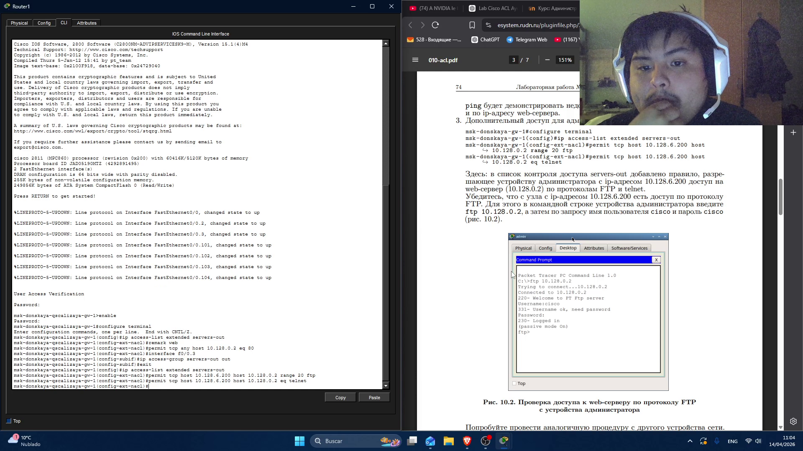{#fig-006 width=70%}

Потом я пытался подключиться к IP-адресу 10.128.0.2 с ноутбука и успешно я вошел

    ftp 10.128.0.2

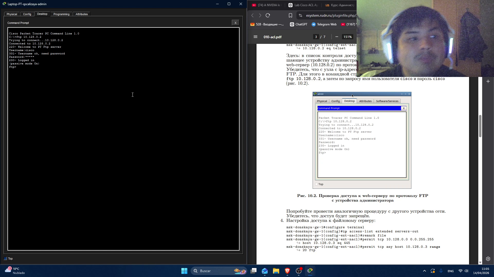{#fig-007 width=70%}

Дальше я пытался повторить то же действие с обычного компьютера и, как и ожидалось, не удалось подключиться ([рис. @fig-011]).
 

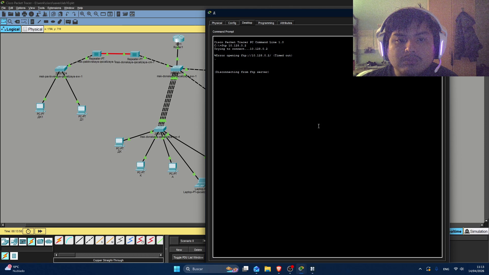{#fig-011 width=70%}

Дальше я настроил доступ к файловому серверу ([рис. @fig-014]).

    msk-donskaya-gw-1#configure terminal
    msk-donskaya-gw-1(config)#ip access-list extended servers-out
    msk-donskaya-gw-1(config-ext-nacl)#remark file
    msk-donskaya-gw-1(config-ext-nacl)#permit tcp 10.128.0.0 0.0.255.255 host 10.128.0.3 eq 445
    msk-donskaya-gw-1(config-ext-nacl)#permit tcp any host 10.128.0.3 range 20 ftp

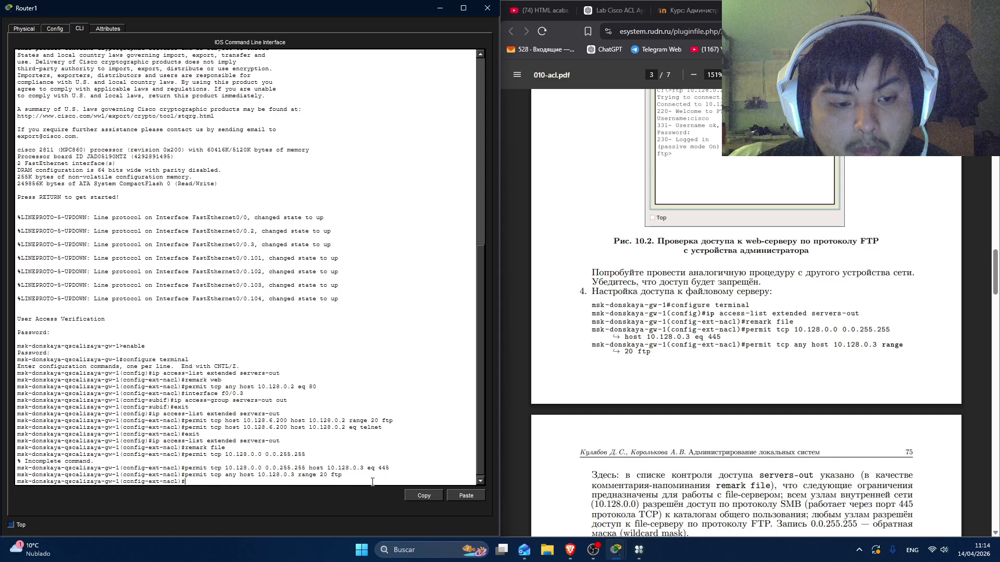{#fig-014 width=70%}

Потом я настроил доступ к почтовому серверу ([рис. @fig-015]).

    msk-donskaya-gw-1#configure terminal
    msk-donskaya-gw-1(config)#ip access-list extended servers-out
    msk-donskaya-gw-1(config-ext-nacl)#remark mail
    msk-donskaya-gw-1(config-ext-nacl)#permit tcp any host 10.128.0.4 eq smtp
    msk-donskaya-gw-1(config-ext-nacl)#permit tcp any host 10.128.0.4 eq pop3

{#fig-015 width=70%}

Дальше я настроил доступ к DNS-серверу ([рис. @fig-016]).

    msk-donskaya-gw-1#configure terminal
    msk-donskaya-gw-1(config)#ip access-list extended servers-out
    msk-donskaya-gw-1(config-ext-nacl)#remark dns
    msk-donskaya-gw-1(config-ext-nacl)#permit udp 10.128.0.0 0.0.255.255 host 10.128.0.5 eq 53

{#fig-016 width=70%}

чтобы проверять работы такого правило я открыл браузер в компьютере и написал адрес www.donskaya.rudn.ru и полуичл ответ сервера ([рис. @fig-017]).

{#fig-017 width=70%}

Потом я настроил разрешение icmp-запросов ([рис. @fig-018]).

    msk-donskaya-gw-1#configure terminal
    msk-donskaya-gw-1(config)#ip access-list extended servers-out
    msk-donskaya-gw-1(config-ext-nacl)#1 permit icmp any any

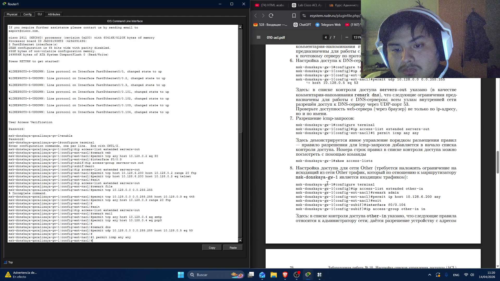{#fig-018 width=70%}

Дальше я смотрел список правил ([рис. @fig-019]).

    show access-list

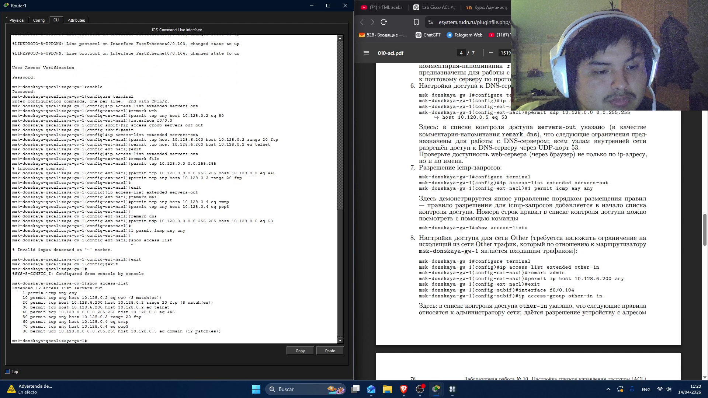{#fig-019 width=70%}

Дальше я настроил доступа для сети Other ([рис. @fig-020]).

    msk-donskaya-gw-1#configure terminal
    msk-donskaya-gw-1(config)#ip access-list extended other-in
    msk-donskaya-gw-1(config-ext-nacl)#remark admin
    msk-donskaya-gw-1(config-ext-nacl)#permit ip host 10.128.6.200 any
    msk-donskaya-gw-1(config-ext−nacl)#exit
    msk-donskaya-gw-1(config-subif)#interface f0/0.104
    msk-donskaya-gw-1(config-subif)#ip access-group other-in in

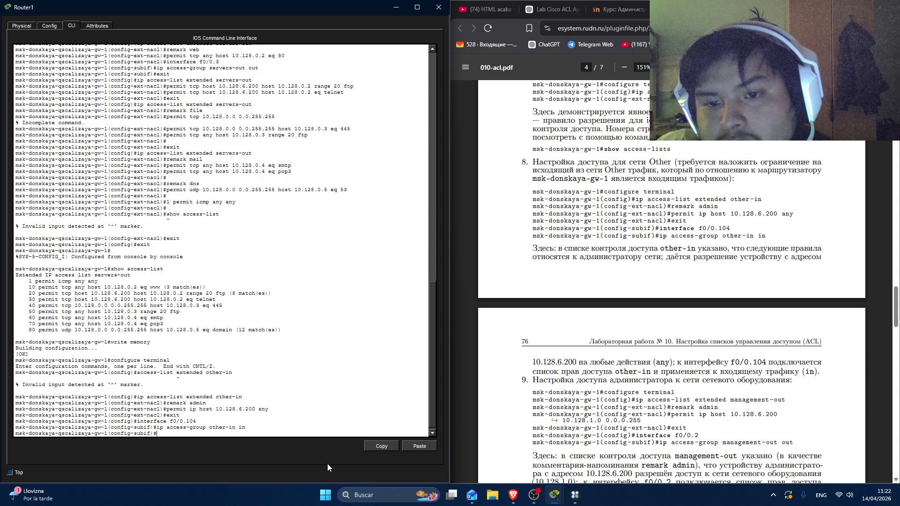{#fig-020 width=70%}

Потом я настроил доступ администратора к сети сетевого оборудования ([рис. @fig-021]).

    msk-donskaya-gw-1#configure terminal
    msk-donskaya-gw-1(config)#ip access-list extended management-out
    msk-donskaya-gw-1(config-ext-nacl)#remark admin
    msk-donskaya-gw-1(config-ext-nacl)#permit ip host 10.128.6.200 10.128.1.0 0.0.0.255
    msk-donskaya-gw-1(config-ext-nacl)#exit
    msk-donskaya-gw-1(config)#interface f0/0.2
    msk-donskaya-gw-1(config-subif)#ip access-group management-out out

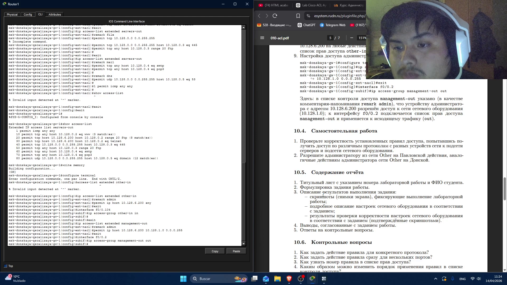{#fig-021 width=70%}

## проверка настроики прав доступа

Сначала я проверил доступ к IP-адресу 10.128.0.2 и смог пингировать без проблем ([рис. @fig-023]).

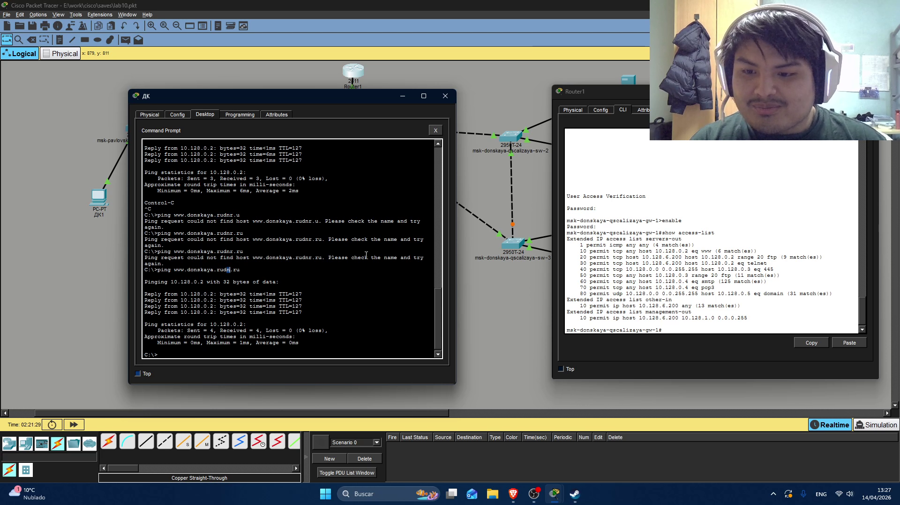{#fig-023 width=70%}

Дальше я еще раз пытался использовать протокол ftp в ноутбуке  ([рис. @fig-024]).

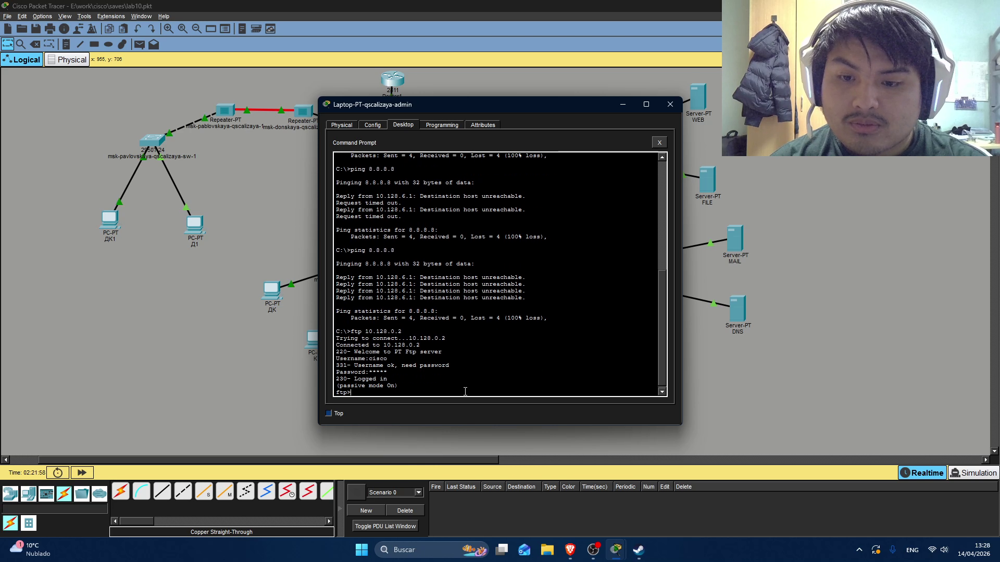{#fig-024 width=70%}

Дальше я пытался ту же проверку но в обычном компьютере ([рис. @fig-025]).

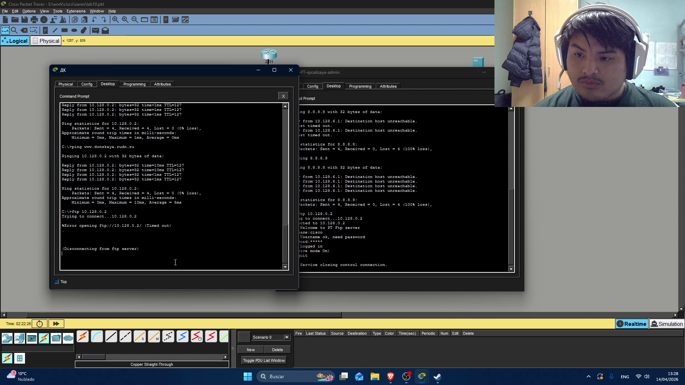{#fig-025 width=70%}

Дальше чтобы проверать работа e-mail я настроил сервер и создал новые аккаунты  ([рис. @fig-026]).

{#fig-026 width=70%}

Дальше в компьютере ДК я настроил email и отправил письмо  ([рис. @fig-027]).

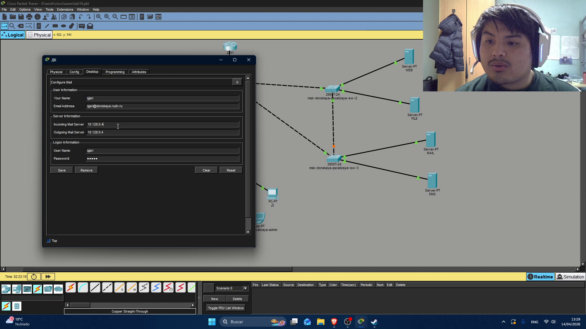{#fig-027 width=70%}

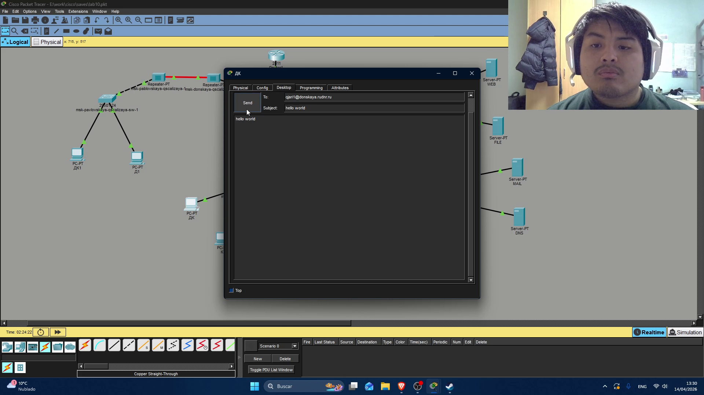{#fig-028 width=70%}

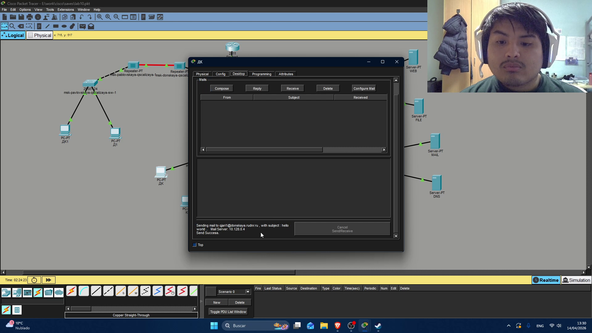{#fig-029 width=70%}

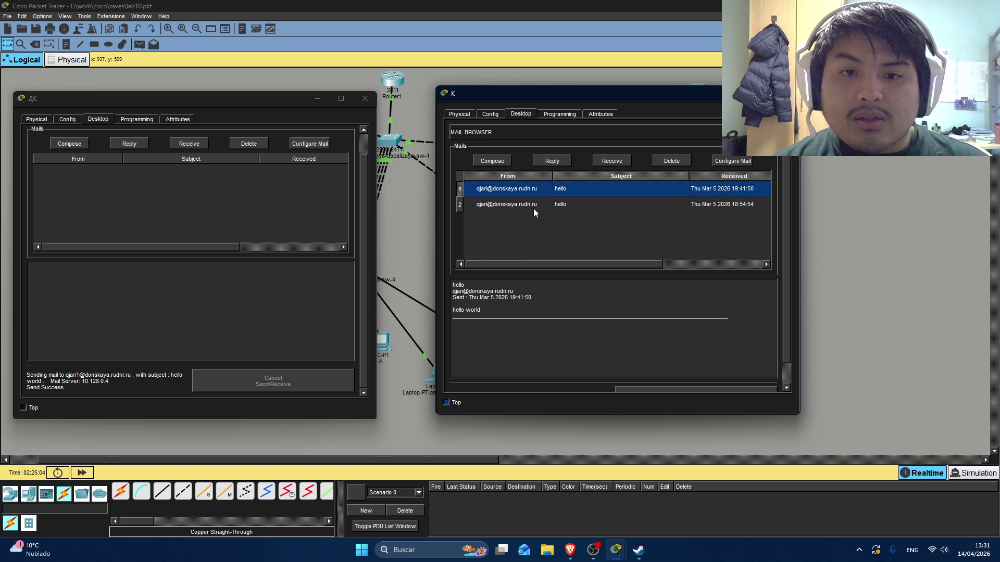{#fig-030 width=70%}
 
Потом я проверил доступ к IP-адресу 10.128.0.4 через компьютер ДК ([рис. @fig-031]).

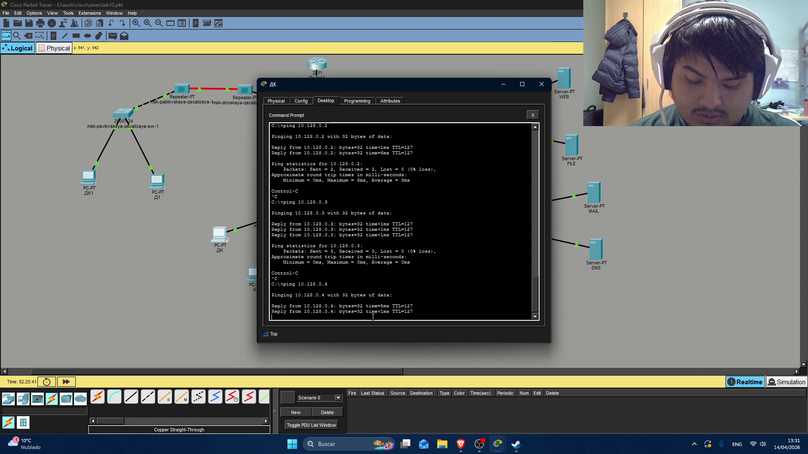{#fig-031 width=70%}

Дальше я проверил доступ к IP-адресу 10.128.6.1 через компьютер Д ([рис. @fig-032]).

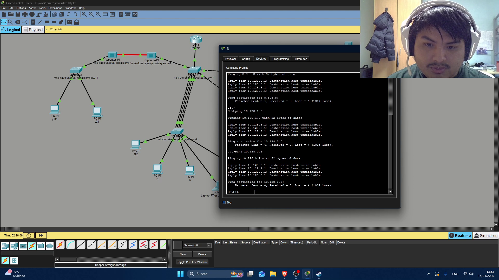{#fig-032 width=70%}

## настройка списка прав доступа для сети pavlovskaya

Сначала я настроил компьютер Д как видно в рисунке ([рис. @fig-033]) и ([рис. @fig-034]).

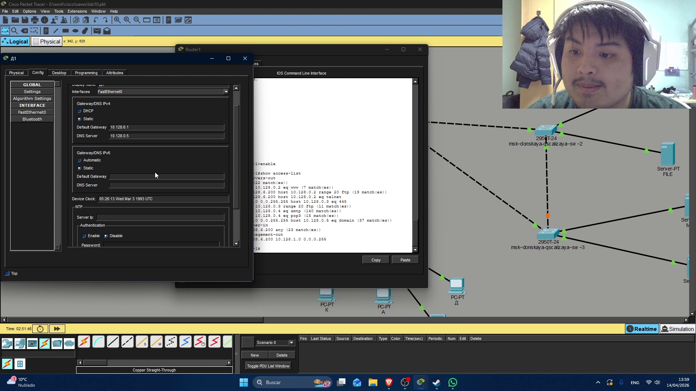{#fig-033 width=70%}

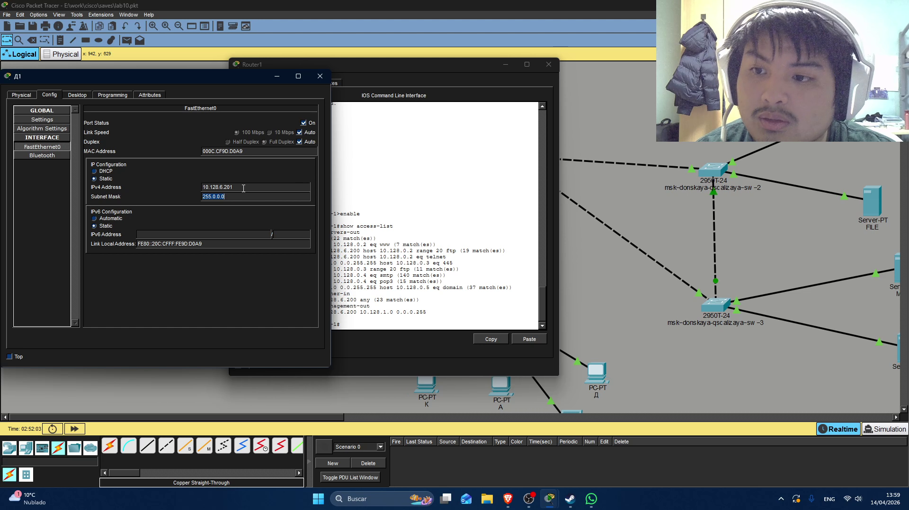{#fig-034 width=70%}

Даьше я добавил следующие команды. они те же которые я уже ввел но с IP-адресом компьютера Д в сети pavlovskaya ([рис. @fig-035]).

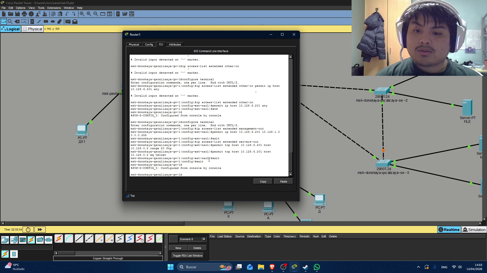{#fig-035 width=70%}

Потом я проверил права доступа к протоколу ftp ([рис. @fig-036]).

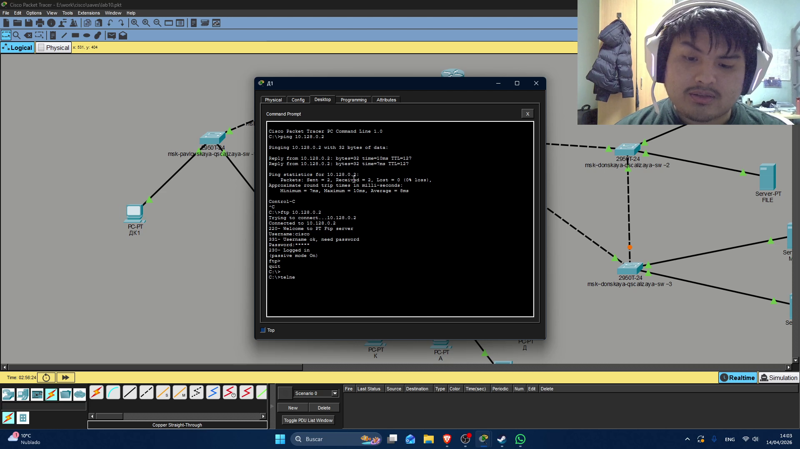{#fig-036 width=70%}

Дальше я проверил работу почты ([рис. @fig-038]).

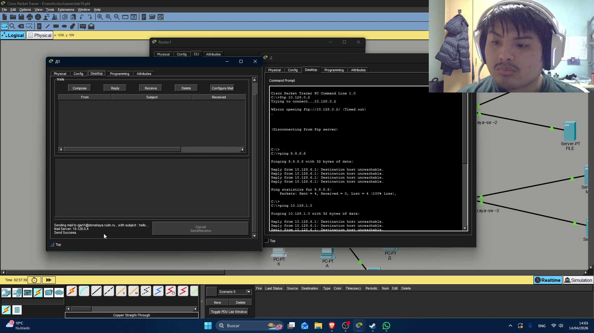{#fig-038 width=70%}

# Выводы

в этой лабораторной работы, я смог смотреть как настроить список прав доступа в маршрутизаторе для сети donskaya

# Список литературы{.unnumbered}

::: {#refs}
:::
