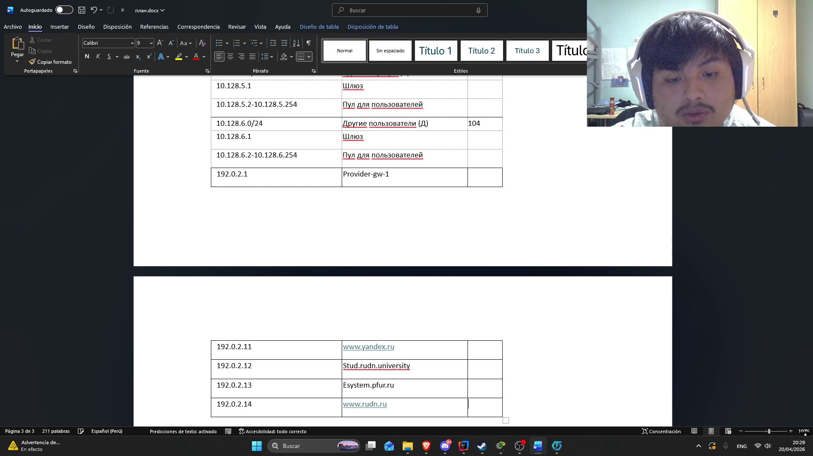
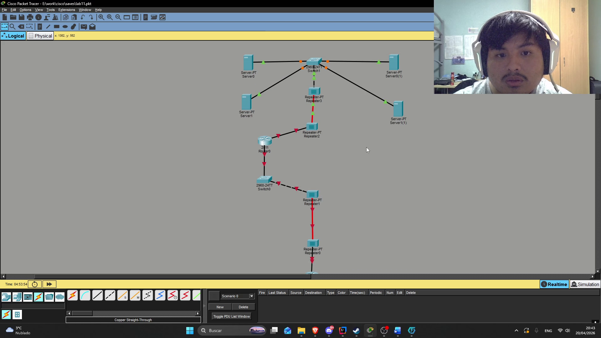
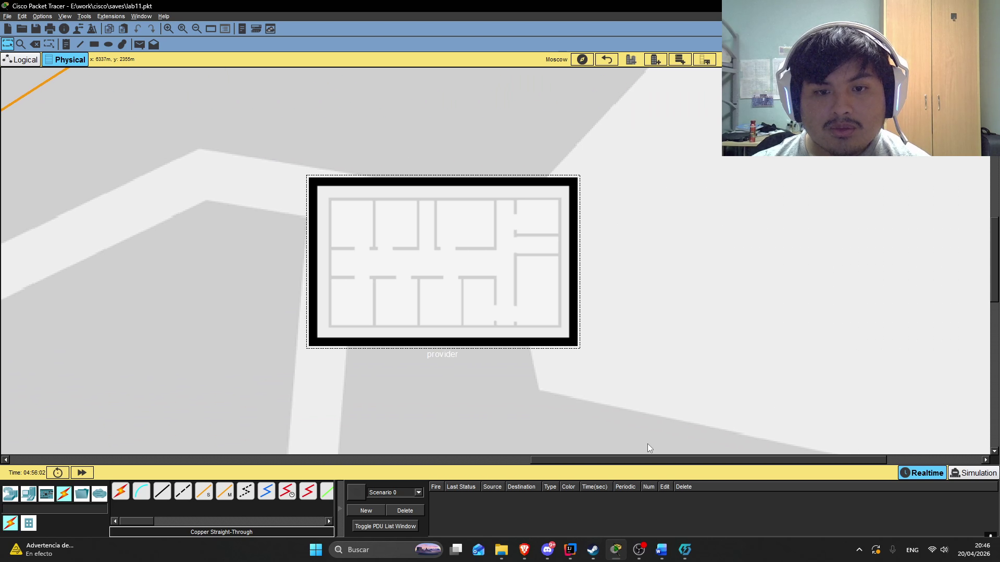
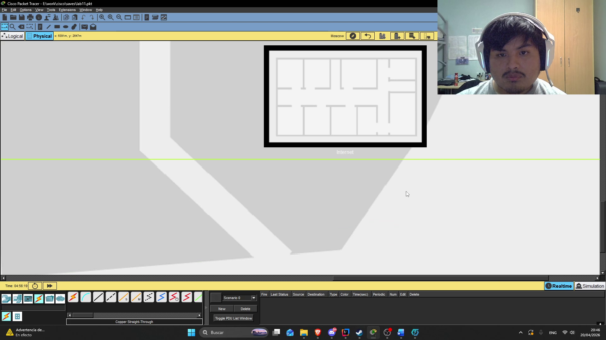
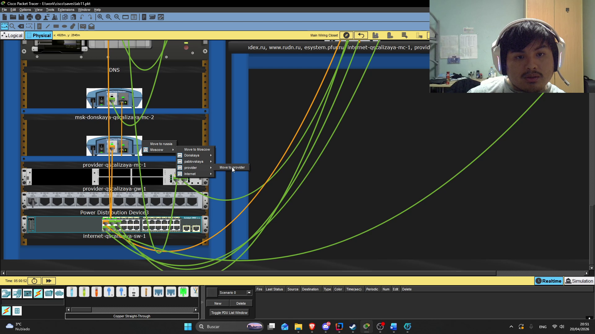
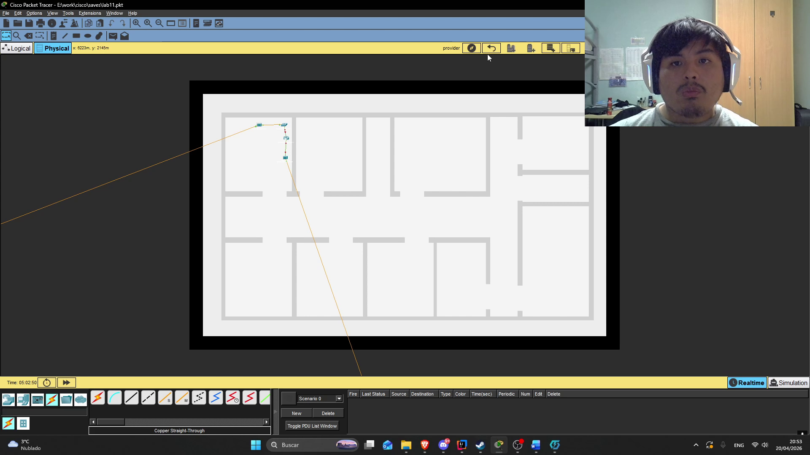
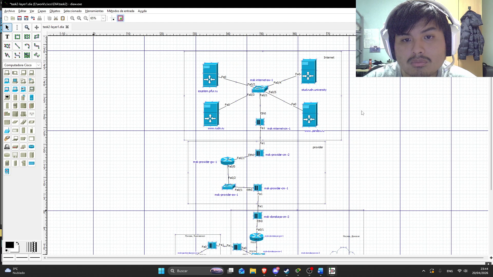

---
## Author
author:
  name: Кхари Жекка Кализая Арсе
  email: 1032234412@rudn.ru
  affiliation:
    - name: Российский университет дружбы народов
      country: Российская Федерация
      postal-code: 117198
      city: Москва
      address: ул. Миклухо-Маклая, д. 6
## Title
title: презентация №11
subtitle:  Настройка NAT. Планирование
license: CC BY
date: today
date-format: "YYYY-MM-DD" # Example: 2025-09-06
---

# обновление таблиц

## таблица IP-адресов

:::::::::::::: {.columns align=center}
::: {.column width="70%"}

:::
::::::::::::::

# изменение модулей повторителей

## таблица IP-адресов

:::::::::::::: {.columns align=center}
::: {.column width="70%"}

:::
::::::::::::::

# расположение устройств 

## для сети provider

:::::::::::::: {.columns align=center}
::: {.column width="70%"}

:::
::::::::::::::

## для сети Internet

:::::::::::::: {.columns align=center}
::: {.column width="70%"}

:::
::::::::::::::

# содание зданий 

## для сети provider

:::::::::::::: {.columns align=center}
::: {.column width="70%"}

:::
::::::::::::::

## для сети Internet

:::::::::::::: {.columns align=center}
::: {.column width="70%"}

:::
::::::::::::::

## измение местоположения
:::::::::::::: {.columns align=center}
::: {.column width="70%"}

:::
::::::::::::::

## здание provider
:::::::::::::: {.columns align=center}
::: {.column width="70%"}

:::
::::::::::::::

## здание Internet
:::::::::::::: {.columns align=center}
::: {.column width="70%"}

:::
::::::::::::::

# изменение диаграммы сети
:::::::::::::: {.columns align=center}
::: {.column width="70%"}

:::
::::::::::::::
