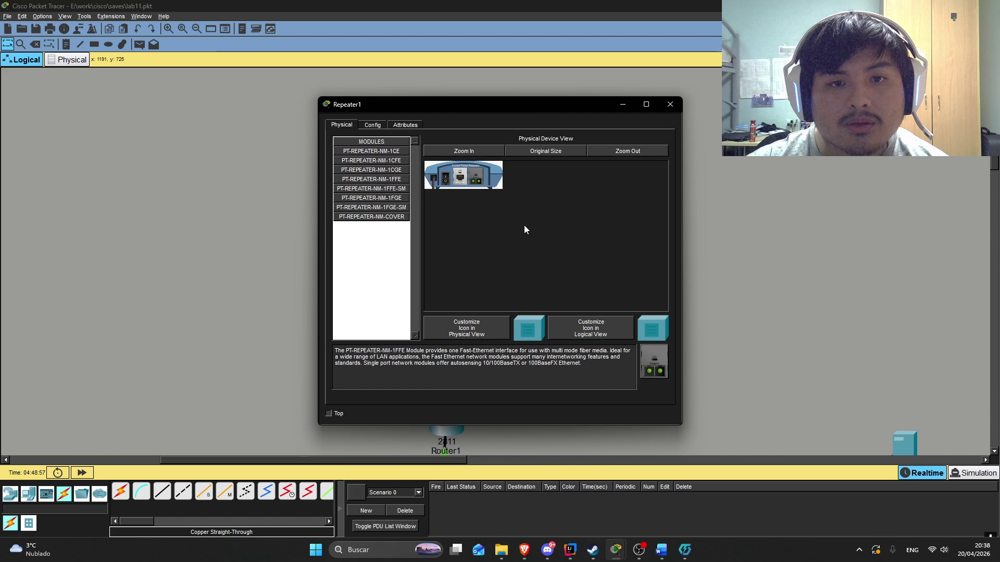
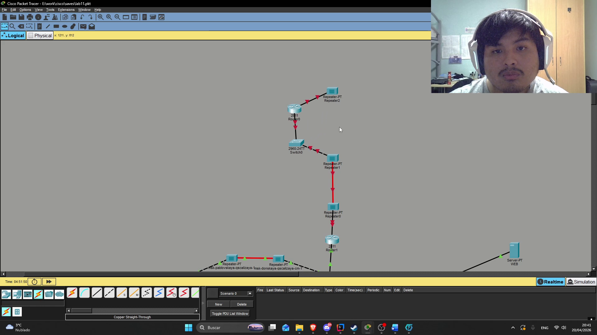
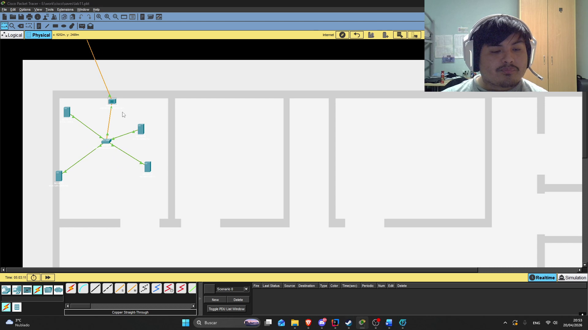

---
## Author
author:
  name: Кхари Жекка Кализая арсе
  email: 1032234412@rudn.ru
  affiliation:
    - name: Российский университет дружбы народов
      country: Российская Федерация
      postal-code: 117198
      city: Москва
      address: ул. Миклухо-Маклая, д. 6

## Title
title: "отчёт по лабораторной работе №11"
subtitle: "Настройка NAT. Планирование"
license: "CC BY"
---

# Цель работы

Провести подготовительные мероприятия по подключению локальной сети
организации к Интернету.

# Задание

1. Построить схему подсоединения локальной сети к Интернету.
2. Построить модельные сети провайдера и сети Интернет (рис. 11.2).
3. Построить схемы сетей L1, L2, L3.
4. При выполнении работы необходимо учитывать соглашение об именовании (см. раздел 2.5).

# Выполнение лабораторной работы

## Обновление таблиц

Сначала я открыл word-файл с таблицей IP-адресов и портов, чтобы обновлять его с новыми данными 

{#fig-001 width=70%}

## расположение новых оборудований

я открыл файл с проектом и там я начал расположать повторители коммутатори и маршрутизаторы  ([рис. @fig-003]). также я изменил модули в повторителях чтобы принимал витую пару по
технологии Fast Ethernet и оптоволокно ([рис. @fig-002]).
 

{#fig-002 width=70%}

## cеть provider

Для сети provider я расположил два повторителя, один коммутатор и один маршрутизатор ([рис. @fig-003]).

{#fig-003 width=70%}

## сеть Internet

Для сети Internet я расположил 4 сервера, 1 коммутатор, один повторитель как видно в рисунке @fig-004

{#fig-004 width=70%}

## создание новые здания

для представления сети провайдера и сети Интернет я создаю 2 здания с соответствующими названиями ([рис. @fig-005] и [рис. @fig-006]).

{#fig-005 width=70%}

{#fig-006 width=70%}

## изменение местоположения устройства

Дальше я изменил местоположение всех устройств чтобы соответствовать вашему соответствующему зданию  [рис. @fig-009], [рис. @fig-010],  [рис. @fig-011]. 

{#fig-009 width=70%}

{#fig-010 width=70%}

{#fig-011 width=70%}

Дальше я обновил диаграмму полной сети ([рис. @fig-012]).

{#fig-012 width=70%}

# Выводы

В этой лабораторнной рабое я смог смотреть планирование сети в разних местах (provider и internet)

# Список литературы{.unnumbered}

::: {#refs}
:::
