---
## Author
author:
  name: Кхари Жекка Кализая арсе
  email: 1032234412@rudn.ru
  affiliation:
    - name: Российский университет дружбы народов
      country: Российская Федерация
      postal-code: 117198
      city: Москва
      address: ул. Миклухо-Маклая, д. 6

## Title
title: "отчёт по лабораторной работе №12"
subtitle: "Настройка NAT"
license: "CC BY"
---

# Цель работы

Приобретение практических навыков по настройке доступа локальной сети
к внешней сети посредством NAT.

# Задание

1. Сделать первоначальную настройку маршрутизатора provider-gw-1 и коммутатора provider-sw-1 провайдера: задать имя, настроить доступ по
паролю и т.п. (см. разделы 12.4.1, 12.4.2).
2. Настроить интерфейсы маршрутизатора provider-gw-1 и коммутатора
provider-sw-1 провайдера: (см. разделы 12.4.3, 12.4.4).
3. Настроить интерфейсы маршрутизатора сети «Донская» для доступа к сети
провайдера (cм. раздел 12.4.5).
4. Настроить на маршрутизаторе сети «Донская» NAT с правилами, указанными в разделе 12.2 (см. разделы 12.4.6–12.4.8).
5. Настроить доступ из внешней сети в локальную сеть организации, как
указано в разделе 12.2 (см. раздел 12.4.9).
6. Проверить работоспособность заданных настроек.
7. При выполнении работы необходимо учитывать соглашение об именовании (см. раздел 2.5).

# Выполнение лабораторной работы

сначала этой лабораторной работы я скопировал файл проекта и переназвал его на lab12

## Первоначальная настройка маршрутизатора provider-gw-1

Чтобы настройть маршрутизатор я открыл его терминал и начал настройку. я ввел следующие команды, которые установлят пароль, количество сеансов, учетные записи шифрованный пароли ([рис. @fig-002]).

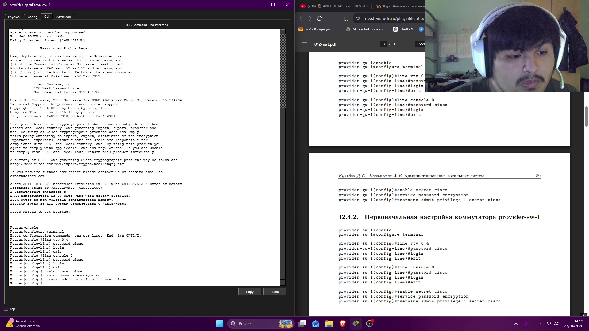{#fig-002 width=70%}

## Первоначальная настройка коммутатора provider-sw-1

я повторил кофигурацию на коммутаторе provider-sw-1  ([рис. @fig-003]).

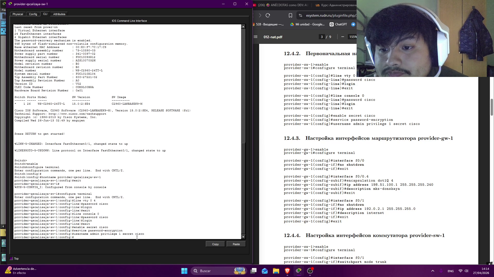{#fig-003 width=70%}

## Настройка интерфейсов маршрутизатора provider-gw-1

потом я начал настроить интерфейсы f0/0 ,f0/0.4 , f0/1. ([рис. @fig-004]).

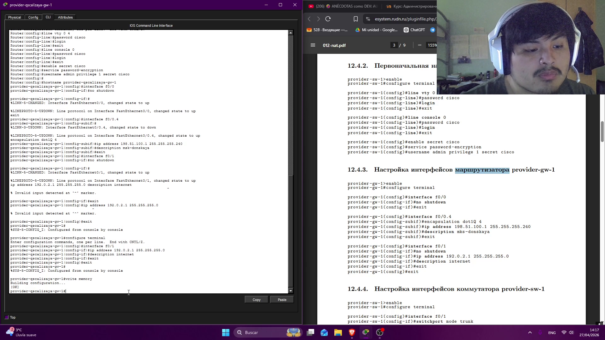{#fig-004 width=70%}

## Настройка интерфейсов коммутатора provider-sw-1

Дальше я настроил интерфейсы коммутатора (f0/1 , f0/1.4) ([рис. @fig-005]).

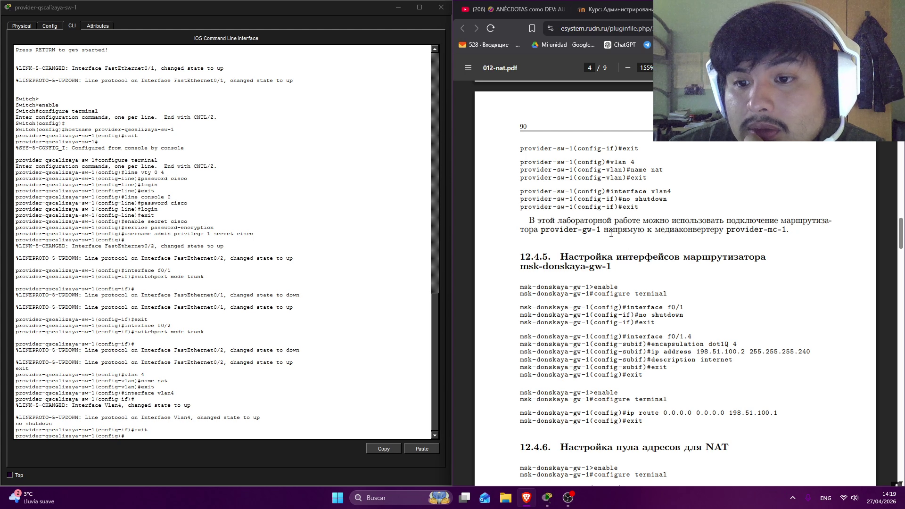{#fig-005 width=70%}

## Настройка интерфейсов маршрутизатора msk-donskaya-gw-1

Здесь я настроил интерфейсы f0/1, f0/1.4 маршрутизатора msk-donskaya-gw-1. я включил интерфейс f0/1 потом я указать применение стандарта IEEE 802.1Q ([рис. @fig-006]).

{#fig-006 width=70%}

## Настройка пула адресов для NAT

потом я определил группу IP-адресов, которые маршрутизатор может использовать чтобы выполнить NAT ([рис. @fig-007]).

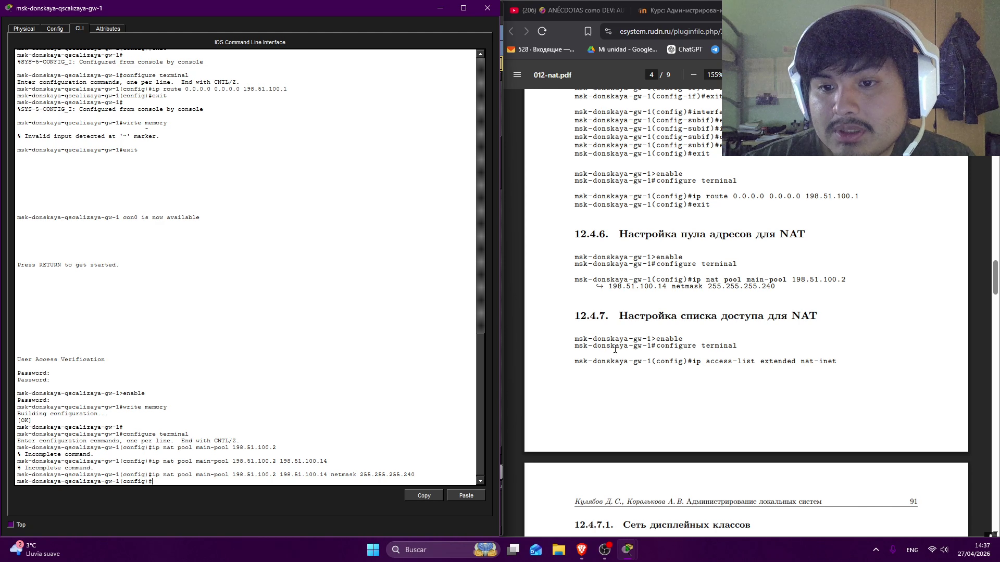{#fig-007 width=70%}

##  Настройка списка доступа для NAT

чтобы обеспечить безопасность сети, я определил список доступа для NAT ([рис. @fig-008]).

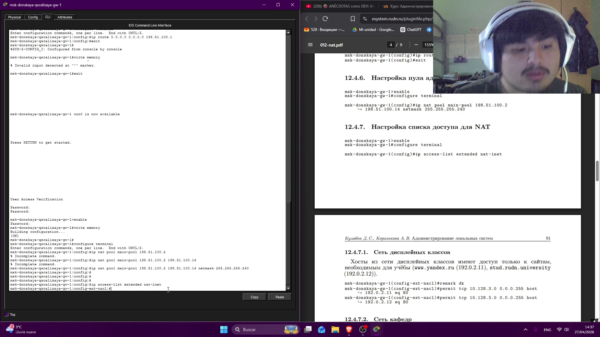{#fig-008 width=70%}

## Сеть дисплейных классов

Потом я начал настройку сети дисплейных классов ([рис. @fig-009]). для того я разрешил подключение с сети 10.128.3.0 (сеть ДК) на сервер 192.0.2.11 (www.yandex.ru) и 192.0.2.12 (stud.rudn.university) 

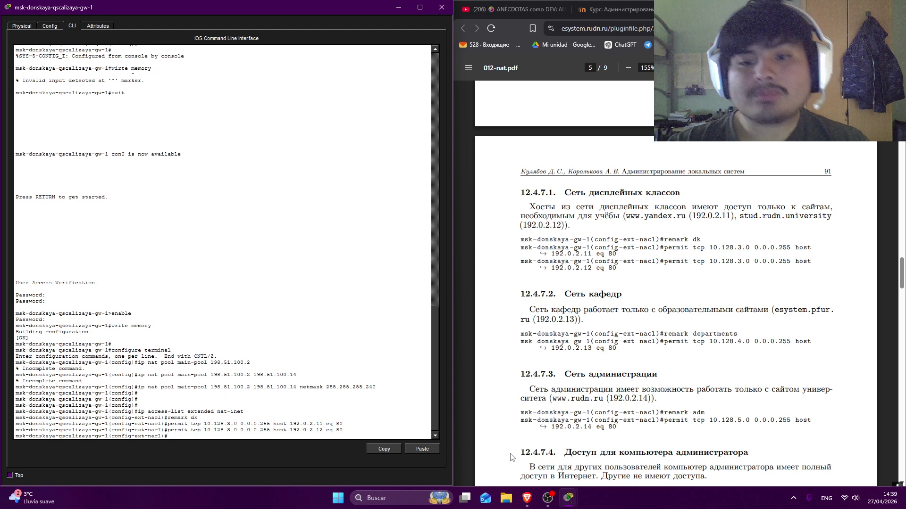{#fig-00 width=70%}

## сеть кафедр

я повторил те же команды для сети дисплейных классов но я изменил сеть от которого соединение выполняется (10.128.4.0 - К ) и хость к которому идет соединение  (192.0.2.13 - esystem.pfur.ru) такое соединение только могут использовать порт 80 ([рис. @fig-010]).

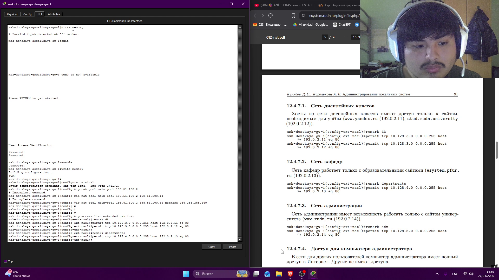{#fig-010 width=70%}

## сеть администрации

Здесь разрешается подключение к серверку www.rudn.ru (192.0.2.14) с сети администрации  ([рис. @fig-011]).

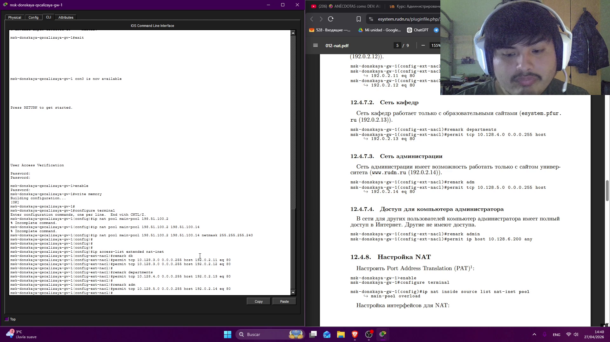{#fig-011 width=70%}

## Доступ для компьютера администратора

Здесь я дал права доступа на все сервер компьютеру администратора ([рис. @fig-012]).

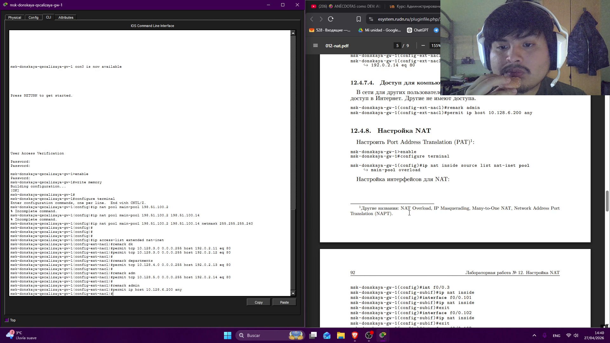{#fig-012 width=70%}

## Настройка NAT

Здесь я начал настройку NAT для того я использовал команду ip nat inside и outside чтобы определить какие сети находятся внутри и которые находятся вне, таким образом маршрутизатор может определить какие интерфейсы переводит ([рис. @fig-014]).

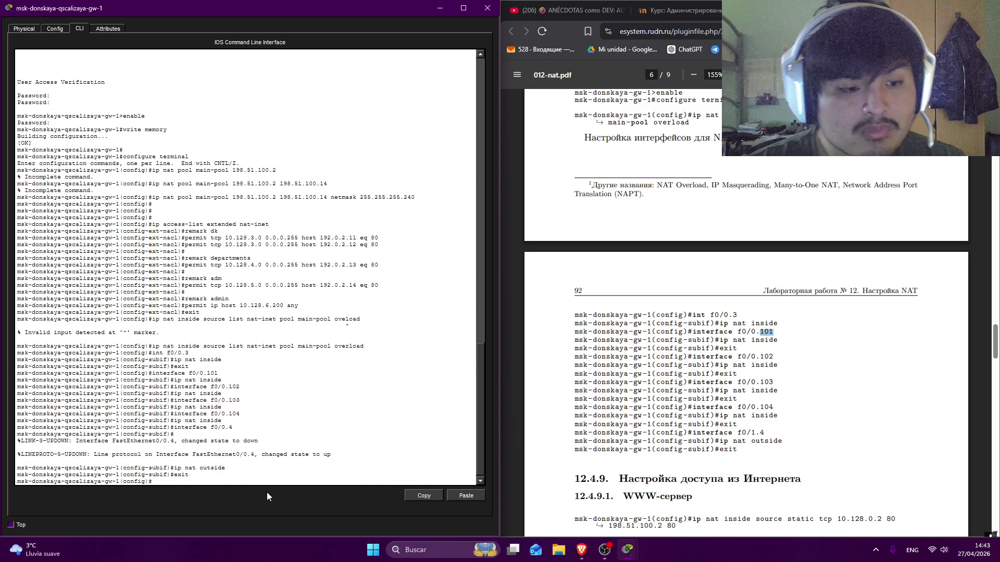{#fig-014 width=70%}

## настройка доступа из интернета

здесь я настраиваю список доступа для подключений, идущих из Интернета в подсети. для того в командах я указываю сеть, IP-адресы сервера и порты ([рис. @fig-015]).

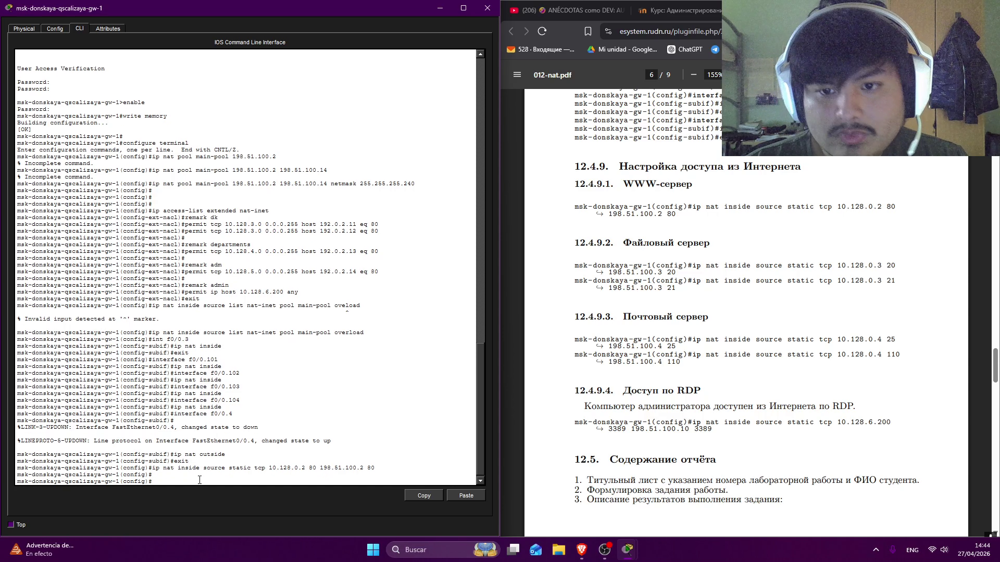{#fig-015 width=70%}

# Выводы

В этой лабораторной работе я настроил пароли в новых устройствах, также я настроил NAT и список прав чтобы разрешить соединение с подсетей к интернету и обратно.

# Список литературы{.unnumbered}

::: {#refs}
:::
