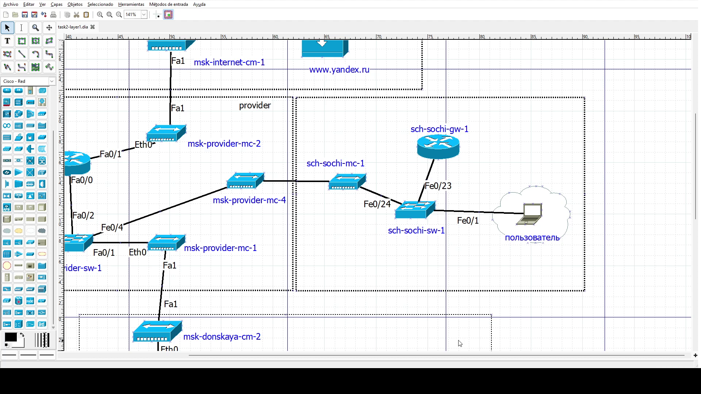
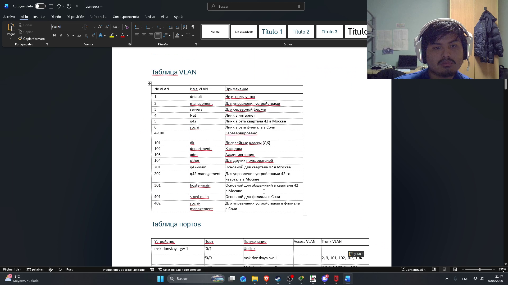
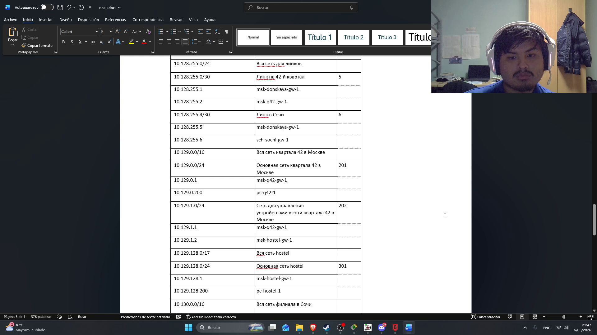
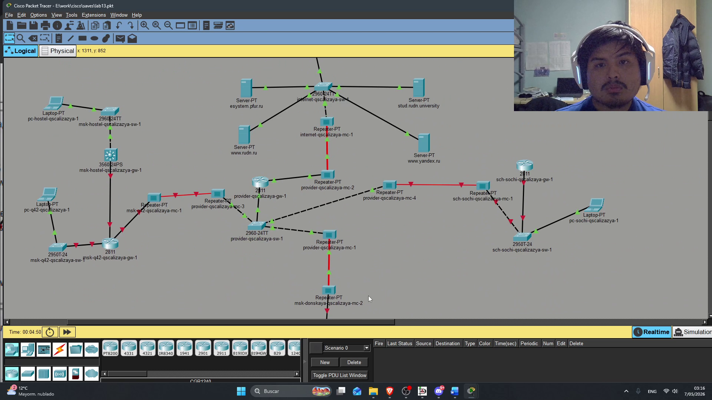
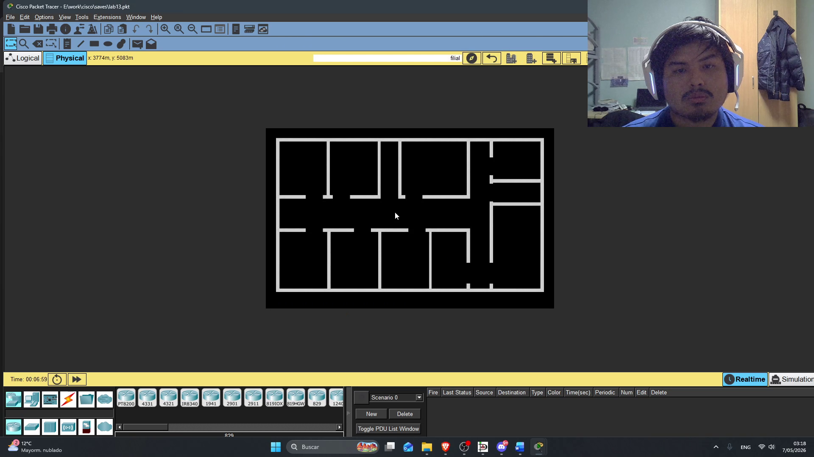
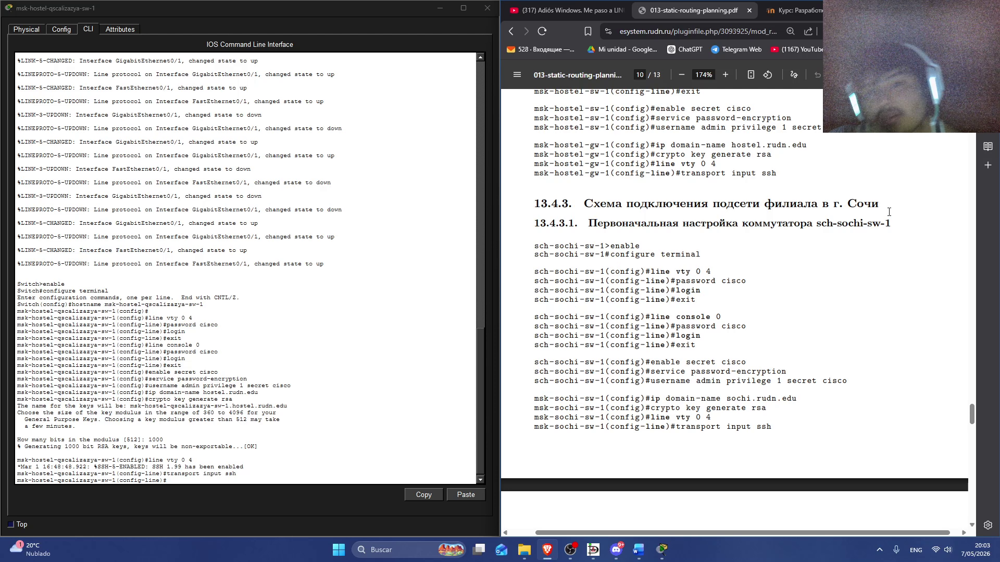
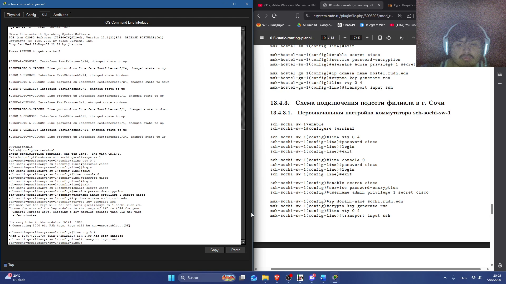
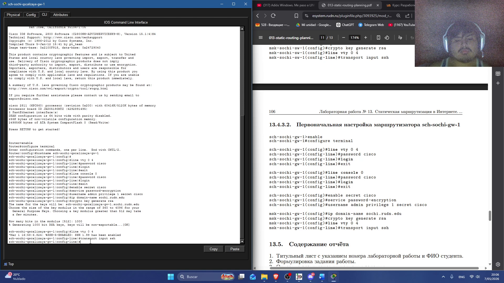

---
## Author
author:
  name: Кхари Жекка Кализая Арсе
  email: 1032234412@rudn.ru
  affiliation:
    - name: Российский университет дружбы народов
      country: Российская Федерация
      postal-code: 117198
      city: Москва
      address: ул. Миклухо-Маклая, д. 6
## Title
title: презентация №13
subtitle:  Статическая маршрутизация в Интернете. Планирование
license: CC BY
date: today
date-format: "YYYY-MM-DD" # Example: 2025-09-06
---

# изменение в таблицах

## диаграмма L1

:::::::::::::: {.columns align=center}

::: {.column width="70%"}

:::
::::::::::::::

## диаграмма L1

:::::::::::::: {.columns align=center}

::: {.column width="70%"}

:::
::::::::::::::

## диаграмма L1

:::::::::::::: {.columns align=center}

::: {.column width="70%"}

:::
::::::::::::::

## таблица VLAN

:::::::::::::: {.columns align=center}

::: {.column width="70%"}

:::
::::::::::::::

## таблица IP-адресов

:::::::::::::: {.columns align=center}

::: {.column width="70%"}

:::
::::::::::::::

# изменения в сети в Cisco-Packet-tracer

## изменения в сети в Cisco-Packet-tracer

:::::::::::::: {.columns align=center}

::: {.column width="70%"}

:::
::::::::::::::

# изменения в область Physical

## создание нового города Сочи

:::::::::::::: {.columns align=center}

::: {.column width="70%"}

:::
::::::::::::::

## создание нового здания Filial

:::::::::::::: {.columns align=center}

::: {.column width="70%"}

:::
::::::::::::::

## создание нового здания квартал 42

:::::::::::::: {.columns align=center}

::: {.column width="70%"}

:::
::::::::::::::

## перемещение устройств на соответственные места

:::::::::::::: {.columns align=center}

::: {.column width="70%"}

:::
::::::::::::::

## перемещение устройств на соответственные места

:::::::::::::: {.columns align=center}

::: {.column width="70%"}

:::
::::::::::::::

# Первоначальная настройка в устройствах

## msk-q42-qscalizaya-gw-1 

:::::::::::::: {.columns align=center}

::: {.column width="70%"}

:::
::::::::::::::

## msk-q42-qscalizaya-sw-1 

:::::::::::::: {.columns align=center}

::: {.column width="70%"}

:::
::::::::::::::

## msk-hostel-qscalizaya-gw-1

:::::::::::::: {.columns align=center}

::: {.column width="70%"}

:::
::::::::::::::

## msk-hostel-qscalizaya-sw-1

:::::::::::::: {.columns align=center}

::: {.column width="70%"}

:::
::::::::::::::

##  sch−sochi-qscalizaya-sw-1

:::::::::::::: {.columns align=center}

::: {.column width="70%"}

:::
::::::::::::::

##  sch−sochi-qscalizaya-gw-1

:::::::::::::: {.columns align=center}

::: {.column width="70%"}

:::
::::::::::::::

# Спасибо за внимание

