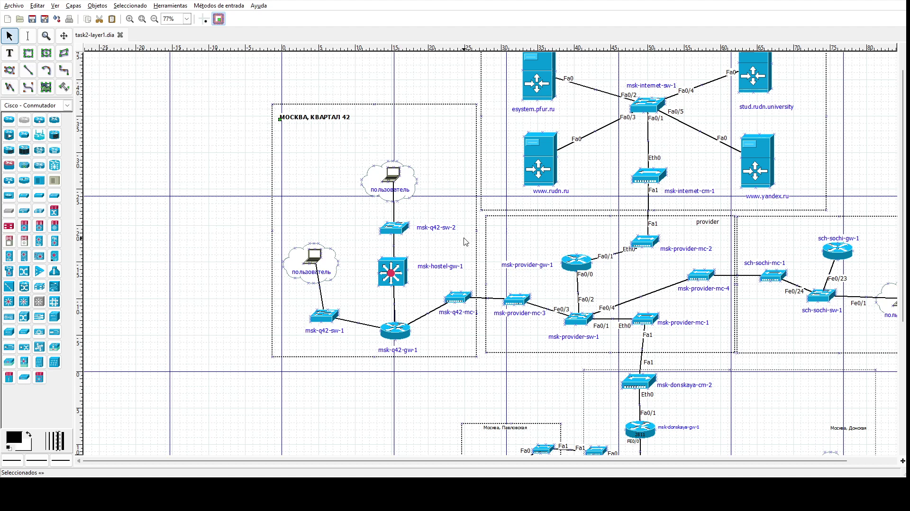
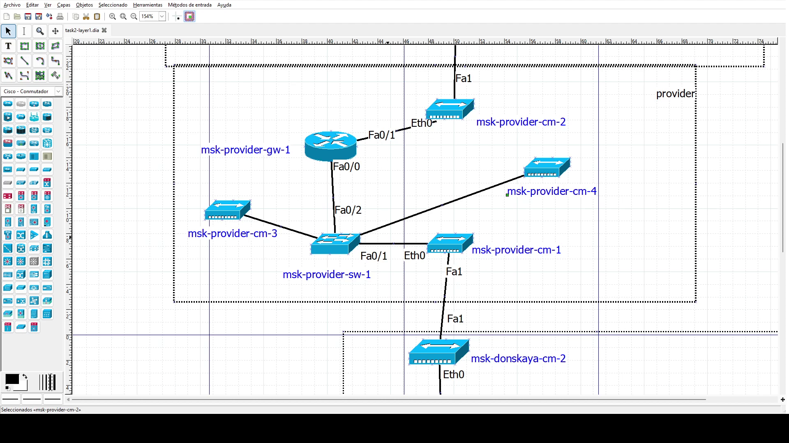
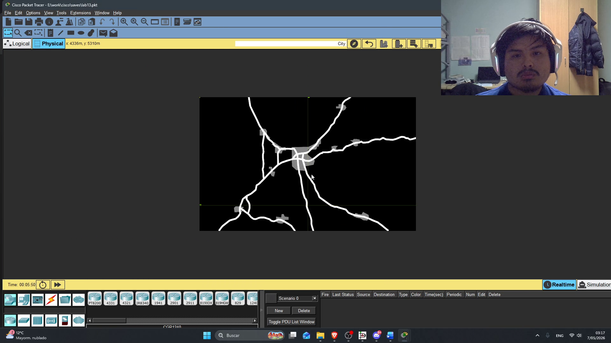
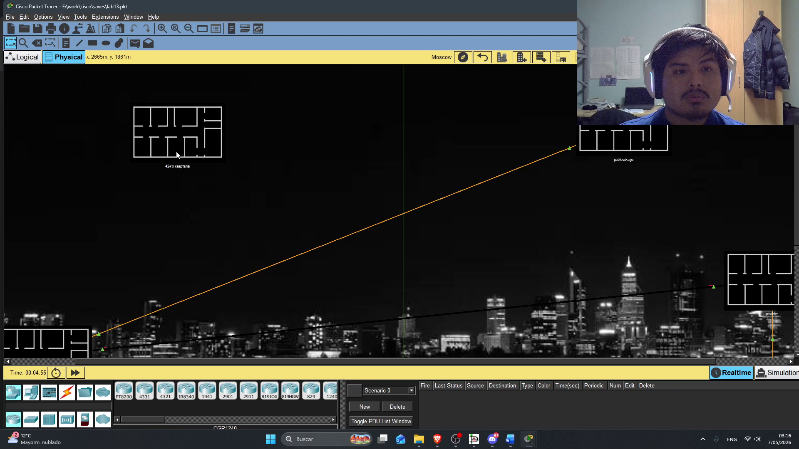
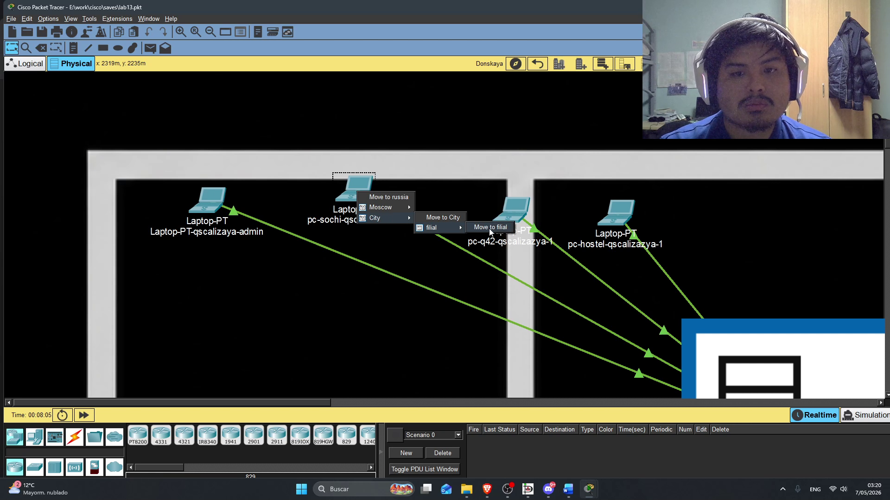
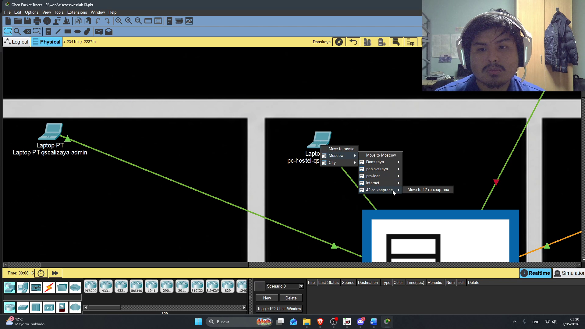
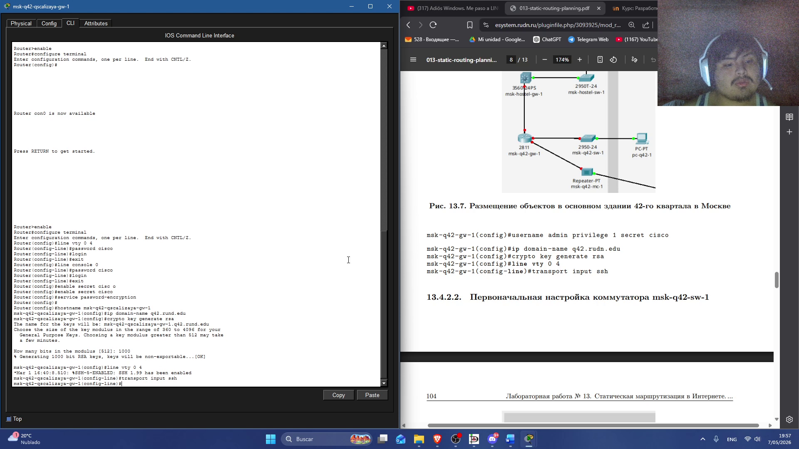
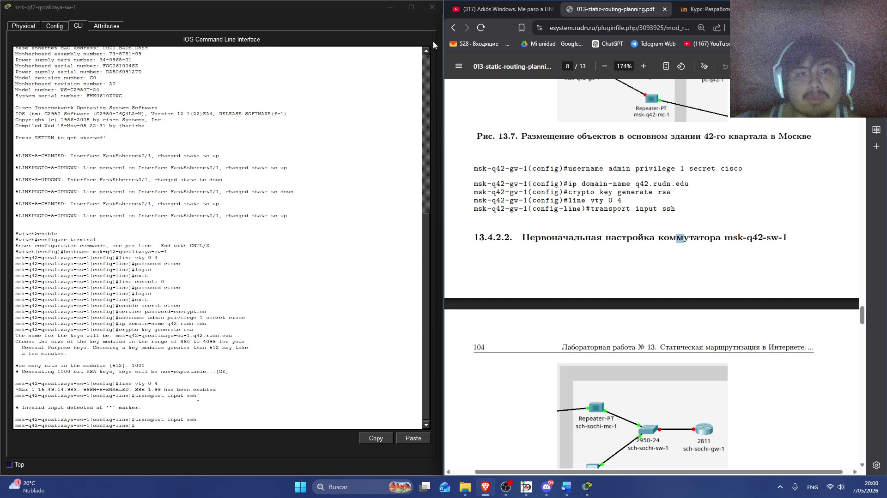
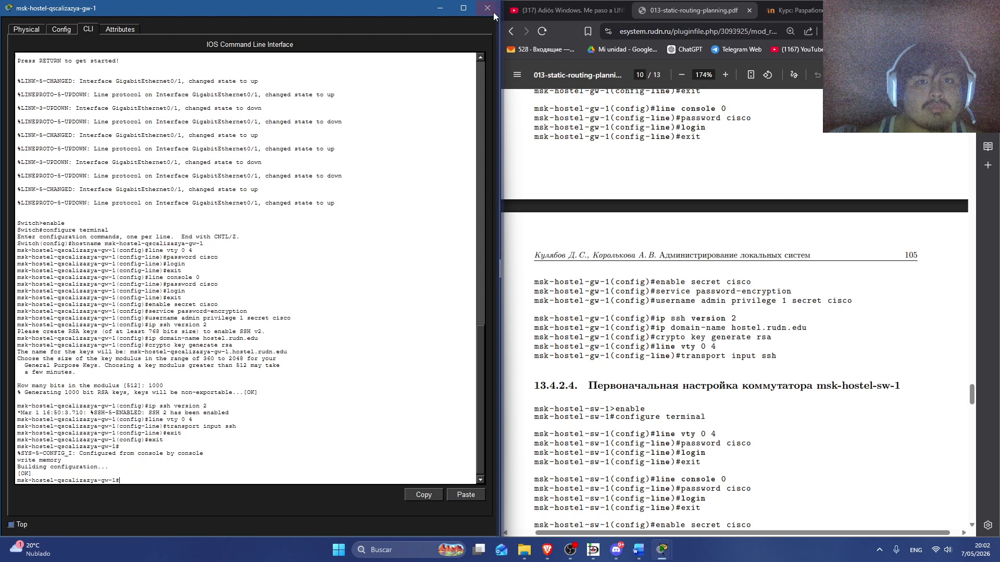

---
## Author
author:
  name: Кхари Жекка Кализая арсе
  email: 1032234412@rudn.ru
  affiliation:
    - name: Российский университет дружбы народов
      country: Российская Федерация
      postal-code: 117198
      city: Москва
      address: ул. Миклухо-Маклая, д. 6

## Title
title: "отчёт по лабораторной работе №13"
subtitle: "Статическая маршрутизация в Интернете. Планирование"
license: "CC BY"
---

# Цель работы

Провести подготовительные мероприятия по организации взаимодействия
через сеть провайдера посредством статической маршрутизации локальной
сети с сетью основного здания, расположенного в 42-м квартале в Москве,
и сетью филиала, расположенного в г. Сочи.

# Задание

1. Внести изменения в схемы L1, L2 и L3 сети, добавив в них информацию о сети основной территории (42-й квартал в Москве) и сети филиала в г. Сочи.
2. Дополнить схему проекта, добавив подсеть основной территории организации 42-го квартала в Москве и подсеть филиала в г. Сочи (раздел 13.4.1).
3. Сделать первоначальную настройку добавленного в проект оборудования (разделы 13.4.2 и 13.4.3).
4. При выполнении работы необходимо учитывать соглашение об именовании (см. раздел 2.5).

# Выполнение лабораторной работы

## обновление диаграммы L1

Сначала я открыл проект в DIA и добавил сеть Сочи ([рис. @fig-002]) и сеть  квартира42 ([рис. @fig-003]). также я добавил повторители в сети provider ([рис. @fig-001]).

{#fig-002 width=70%}

{#fig-003 width=70%}

{#fig-001 width=70%}


## обновление таблиц 

### таблица VLAN

В таблице VLAN я указал какой VLAN принадлежит к сети Nat, q42, sochi, sochi-main, sochi-managment, q42-main, q42-managment, hostel-main. ([рис. @fig-004]).

{#fig-004 width=70%}


### таблица IP-адресов

я обновил таблицы IP-адресов([рис. @fig-005]).
 

{#fig-005 width=70%}


## Создание сетей в Cisco-Packet-Tracer

я расположил все устроиства в рабочем области и переименовал их согласно таблицам и диаграмме

{#fig-006 width=70%}

## Создание новых зданий и города

в городе Moscow я создал новый здание "42го квартала" ([рис. @fig-009]). также я создал новй город "Сочи" ([рис. @fig-007]), в котором я создал новое здание Filial ([рис. @fig-008]).

{#fig-007 width=70%}

{#fig-008 width=70%}

{#fig-009 width=70%}

Дальше я перемещал все устройства на соответственное здание ([рис. @fig-010]).

{#fig-010 width=70%}

{#fig-01 width=70%}


## первоначальная настройка новыйх устройств

на всех устройства я настроил пароль, создал ключ rsa и настроил каким протоколом включается к консолу при использовании virtualteletype


### msk-q42-qscalizaya-gw-1 

```
msk-q42-qscalizaya-gw-1>enable
msk-q42-qscalizaya-gw-1#configure terminal
msk-q42-qscalizaya-gw-1(config)#line vty 0 4
msk-q42-qscalizaya-gw-1(config-line)#password cisco
msk-q42-qscalizaya-gw-1(config-line)#login
msk-q42-qscalizaya-gw-1(config-line)#exit

msk-q42-qscalizaya-gw-1(config)#line console 0
msk-q42-qscalizaya-gw-1(config-line)#password cisco
msk-q42-qscalizaya-gw-1(config-line)#login
msk-q42-qscalizaya-gw-1(config-line)#exit

msk-q42-qscalizaya-gw-1(config)#enable secret cisco
msk-q42-qscalizaya-gw-1(config)#service password-encryption
msk-q42-qscalizaya-gw-1(config)#username admin privilege 1 secret cisco
msk-q42-qscalizaya-gw-1(config)#ip domain-name q42.rudn.edu
msk-q42-qscalizaya-gw-1(config)#crypto key generate rsa
msk-q42-qscalizaya-gw-1(config)#line vty 0 4
msk-q42-qscalizaya-gw-1(config-line)#transport input ssh
```


{#fig-012 width=70%}

### msk-q42-qscalizaya-sw-1 

```
msk-q42-qscalizaya-sw-1>enable
msk-q42-qscalizaya-sw-1#configure terminal
msk-q42-qscalizaya-sw-1(config)#line vty 0 4
msk-q42-qscalizaya-sw-1(config-line)#password cisco
msk-q42-qscalizaya-sw-1(config-line)#login
msk-q42-qscalizaya-sw-1(config-line)#exit
msk-q42-qscalizaya-sw-1(config)#line console 0
msk-q42-qscalizaya-sw-1(config-line)#password cisco
msk-q42-qscalizaya-sw-1(config-line)#login
msk-q42-qscalizaya-sw-1(config-line)#exit
msk-q42-qscalizaya-sw-1(config)#enable secret cisco
msk-q42-qscalizaya-sw-1(config)#service password-encryption
msk-q42-qscalizaya-sw-1(config)#username admin privilege 1 secret cisco
msk-q42-qscalizaya-sw-1(config)#ip domain-name q42.rudn.edu
msk-q42-qscalizaya-sw-1(config)#crypto key generate rsa
msk-q42-qscalizaya-sw-1(config)#line vty 0 4
msk-q42-qscalizaya-sw-1(config-line)#transport input ssh
```

{#fig-013 width=70%}


### msk-hostel-qscalizaya-gw-1


```
msk-hostel-qscalizaya-gw-1>enable
msk-hostel-qscalizaya-gw-1#configure terminal
msk-hostel-qscalizaya-gw-1(config)#line vty 0 4
msk-hostel-qscalizaya-gw-1(config-line)#password cisco
msk-hostel-qscalizaya-gw-1(config-line)#login
msk-hostel-qscalizaya-gw-1(config-line)#exit

msk-hostel-qscalizaya-gw-1(config)#line console 0
msk-hostel-qscalizaya-gw-1(config-line)#password cisco
msk-hostel-qscalizaya-gw-1(config-line)#login
msk-hostel-qscalizaya-gw-1(config-line)#exit

msk-hostel-qscalizaya-gw-1(config)#enable secret cisco
msk-hostel-qscalizaya-gw-1(config)#service password-encryption
msk-hostel-qscalizaya-gw-1(config)#username admin privilege 1 secret cisco
msk-hostel-qscalizaya-gw-1(config)#ip ssh version 2
msk-hostel-qscalizaya-gw-1(config)#ip domain-name hostel.rudn.edu
msk-hostel-qscalizaya-gw-1(config)#crypto key generate rsa
msk-hostel-qscalizaya-gw-1(config)#line vty 0 4
msk-hostel-qscalizaya-gw-1(config-line)#transport input ssh
```

{#fig-014 width=70%}


### msk-hostel-qscalizaya-sw-1


```
msk-hostel-qscalizaya-sw-1>enable
msk-hostel-qscalizaya-sw-1#configure terminal
msk-hostel-qscalizaya-sw-1(config)#line vty 0 4
msk-hostel-qscalizaya-sw-1(config-line)#password cisco
msk-hostel-qscalizaya-sw-1(config-line)#login
msk-hostel-qscalizaya-sw-1(config-line)#exit
msk-hostel-qscalizaya-sw-1(config)#line console 0
msk-hostel-qscalizaya-sw-1(config-line)#password cisco
msk-hostel-qscalizaya-sw-1(config-line)#login
msk-hostel-qscalizaya-sw-1(config-line)#exit
msk-hostel-qscalizaya-sw-1(config)#enable secret cisco
msk-hostel-qscalizaya-sw-1(config)#service password-encryption
msk-hostel-qscalizaya-sw-1(config)#username admin privilege 1 secret cisco
msk-hostel-qscalizaya-sw-1(config)#ip domain-name hostel.rudn.edu
msk-hostel-qscalizaya-sw-1(config)#crypto key generate rsa
msk-hostel-qscalizaya-sw-1(config)#line vty 0 4
msk-hostel-qscalizaya-sw-1(config-line)#transport input ssh
```


{#fig-015 width=70%}


### sch−sochi-qscalizaya-sw-1

```
sch−sochi-qscalizaya-sw-1>enable
sch−sochi-qscalizaya-sw-1#configure terminal
sch−sochi-qscalizaya-sw-1(config)#line vty 0 4
sch−sochi-qscalizaya-sw-1(config-line)#password cisco
sch−sochi-qscalizaya-sw-1(config-line)#login
sch−sochi-qscalizaya-sw-1(config-line)#exit
sch−sochi-qscalizaya-sw-1(config)#line console 0
sch−sochi-qscalizaya-sw-1(config-line)#password cisco
sch−sochi-qscalizaya-sw-1(config-line)#login
sch−sochi-qscalizaya-sw-1(config-line)#exit
sch−sochi-qscalizaya-sw-1(config)#enable secret cisco
sch−sochi-qscalizaya-sw-1(config)#service password-encryption
sch−sochi-qscalizaya-sw-1(config)#username admin privilege 1 secret cisco
sch−sochi-qscalizaya-sw-1(config)#ip domain-name sochi.rudn.edu
sch−sochi-qscalizaya-sw-1(config)#crypto key generate rsa
sch−sochi-qscalizaya-sw-1(config)#line vty 0 4
sch−sochi-qscalizaya-sw-1(config-line)#transport input ssh
```

{#fig-016 width=70%}


### sch-sochi-qscalizaya-sw-1

```
sch-sochi-qscalizaya-sw-1>enable
sch-sochi-qscalizaya-sw-1#configure terminal
sch-sochi-qscalizaya-sw-1(config)#line vty 0 4
sch-sochi-qscalizaya-sw-1(config-line)#password cisco
sch-sochi-qscalizaya-sw-1(config-line)#login
sch-sochi-qscalizaya-sw-1(config-line)#exit
sch-sochi-qscalizaya-sw-1(config)#line console 0
sch-sochi-qscalizaya-sw-1(config-line)#password cisco
sch-sochi-qscalizaya-sw-1(config-line)#login
sch-sochi-qscalizaya-sw-1(config-line)#exit
sch-sochi-qscalizaya-sw-1(config)#enable secret cisco
sch-sochi-qscalizaya-sw-1(config)#service password-encryption
sch-sochi-qscalizaya-sw-1(config)#username admin privilege 1 secret cisco
sch-sochi-qscalizaya-sw-1(config)#ip domain-name sochi.rudn.edu
sch-sochi-qscalizaya-sw-1(config)#crypto key generate rsa
sch-sochi-qscalizaya-sw-1(config)#line vty 0 4
sch-sochi-qscalizaya-sw-1(config-line)#transport input ssh
```

{#fig-017 width=70%}


# Выводы

В этой лабораторной работе я изменил таблицы IP-адресов и VLAN также я выполнил первоначалную настройку в всех устройствах 

# Список литературы{.unnumbered}

::: {#refs}
:::
