---
## Author
author:
  name: Кхари Жекка Кализая Арсе
  email: 1032234412@rudn.ru
  affiliation:
    - name: Российский университет дружбы народов
      country: Российская Федерация
      postal-code: 117198
      city: Москва
      address: ул. Миклухо-Маклая, д. 6
## Title
title: презентация №14 
subtitle: Статическая маршрутизация в Интернете. Настройка
license: CC BY
date: today
date-format: "YYYY-MM-DD" # Example: 2025-09-06
---

# Настройка линка между площадками

## Настройка интерфейсов коммутатора provider-sw-1

:::::::::::::: {.columns align=center}

::: {.column width="90%"}

:::
::::::::::::::

## Настройка интерфейсов маршрутизатора msk-donskaya-gw-1

:::::::::::::: {.columns align=center}

::: {.column width="90%"}

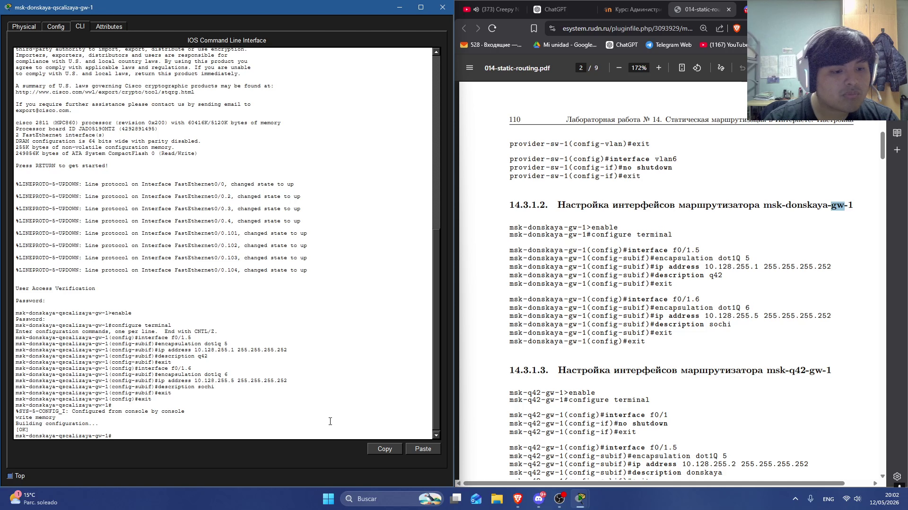

:::
::::::::::::::

## Настройка интерфейсов маршрутизатора msk-q42-gw-1

:::::::::::::: {.columns align=center}

::: {.column width="90%"}

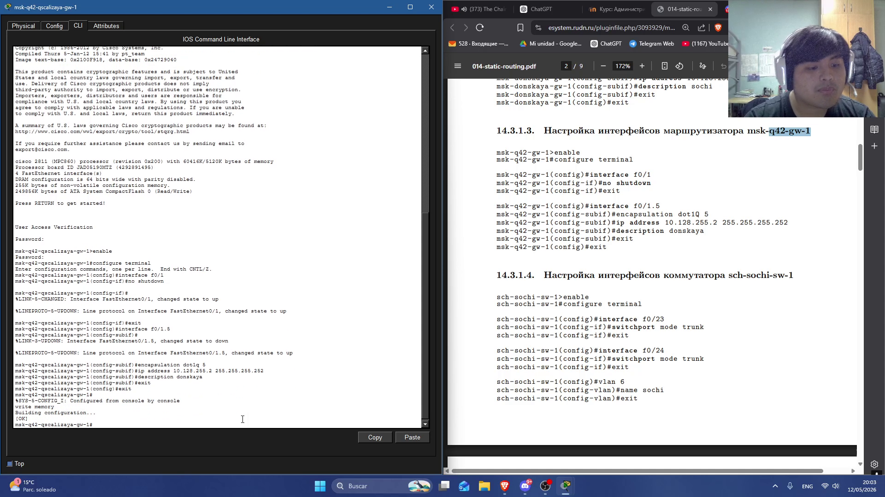

:::
::::::::::::::

## Настройка интерфейсов коммутатора sch-sochi-sw-1

:::::::::::::: {.columns align=center}

::: {.column width="90%"}

:::
::::::::::::::

## Настройка интерфейсов маршрутизатора sch-sochi-gw-1

:::::::::::::: {.columns align=center}

::: {.column width="90%"}

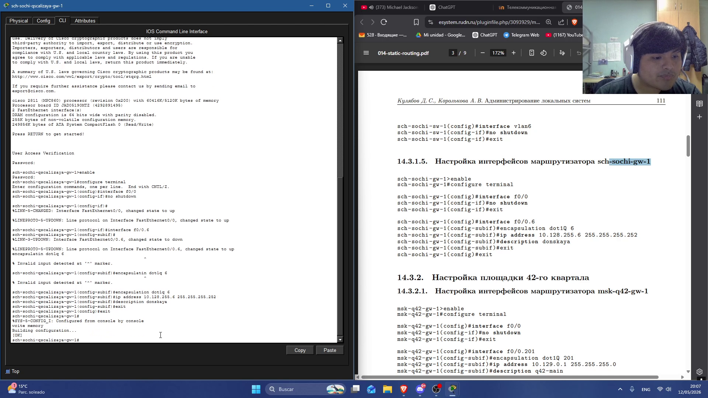

:::
::::::::::::::

# Настройка площадки 42-го квартала

## Настройка интерфейсов маршрутизатора msk-q42-gw-1

:::::::::::::: {.columns align=center}

::: {.column width="90%"}

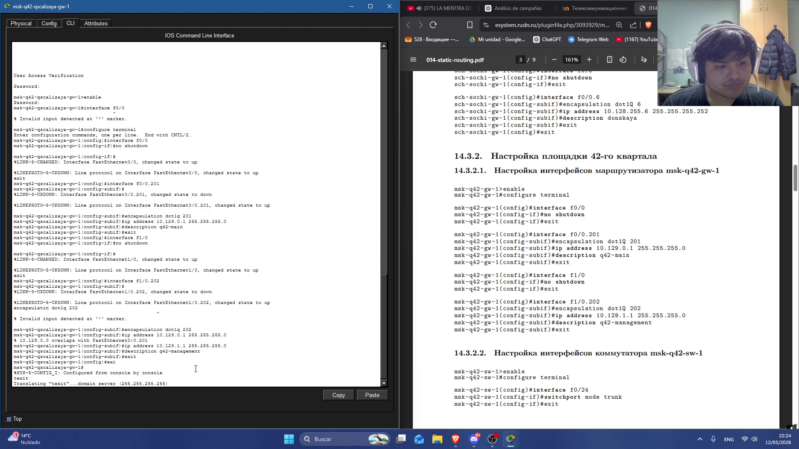

:::
::::::::::::::

## Настройка интерфейсов коммутатора msk-q42-sw-1

:::::::::::::: {.columns align=center}

::: {.column width="90%"}

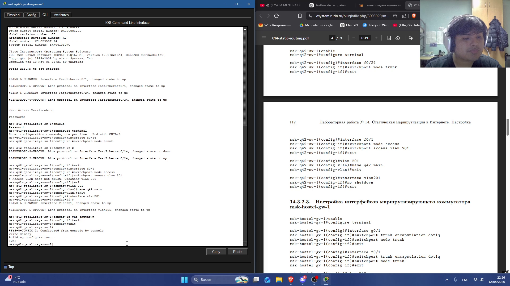

:::
::::::::::::::

## Настройка интерфейсов маршрутизирующего коммутатора msk-hostel-gw-1

:::::::::::::: {.columns align=center}

::: {.column width="90%"}

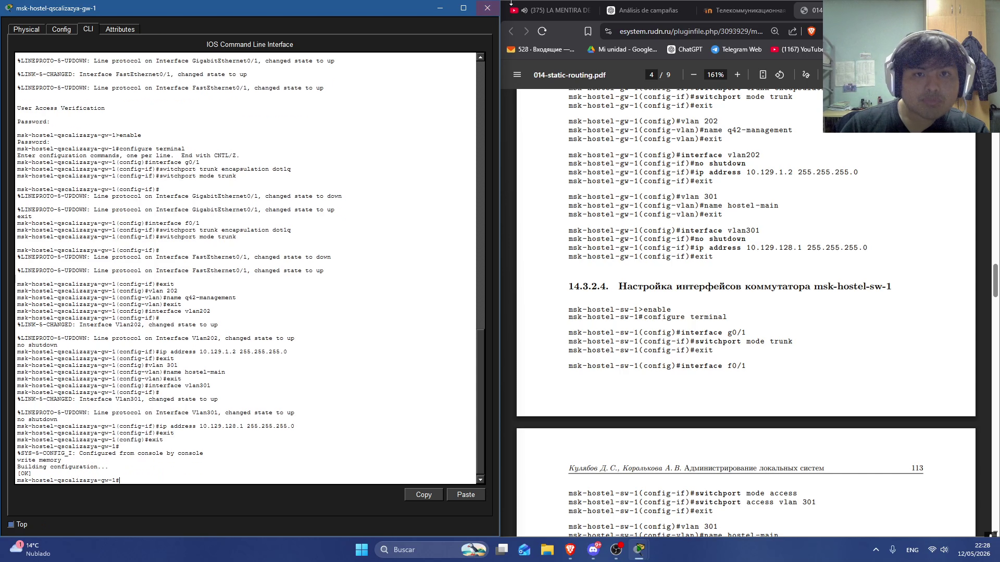

:::
::::::::::::::

## Настройка интерфейсов коммутатора msk-hostel-sw-1

:::::::::::::: {.columns align=center}

::: {.column width="90%"}

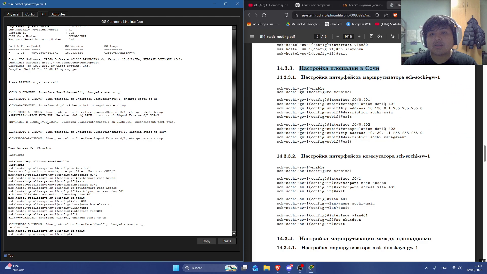

:::
::::::::::::::

# Настройка площадки в Сочи

## Настройка интерфейсов маршрутизатора sch-sochi-gw-1

:::::::::::::: {.columns align=center}

::: {.column width="90%"}

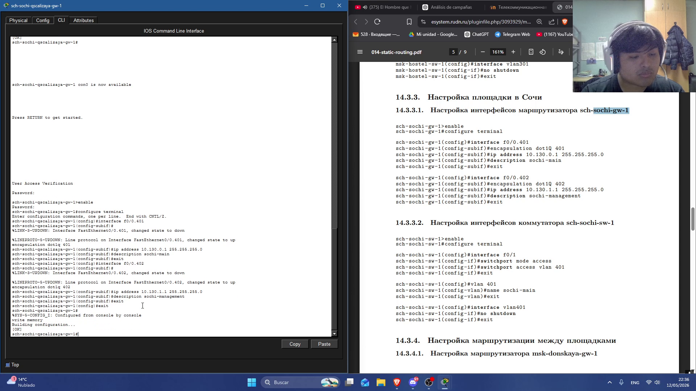

:::
::::::::::::::

## Настройка интерфейсов коммутатора sch-sochi-sw-1

:::::::::::::: {.columns align=center}

::: {.column width="90%"}

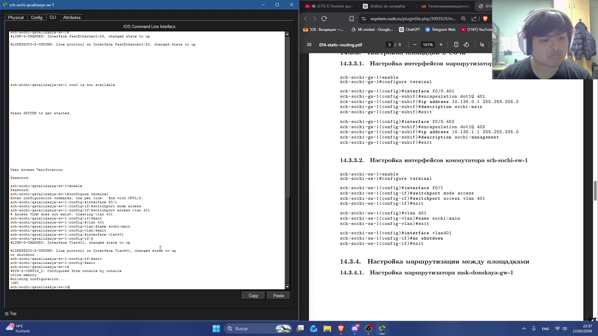

:::
::::::::::::::

# Настройка маршрутизации между площадками

## Настройка маршрутизатора msk-donskaya-gw-1

:::::::::::::: {.columns align=center}

::: {.column width="90%"}

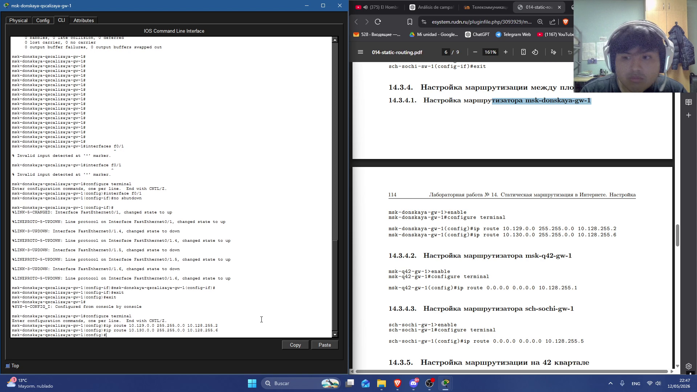

:::
::::::::::::::

## Настройка маршрутизатора msk-q42-gw-1

:::::::::::::: {.columns align=center}

::: {.column width="90%"}

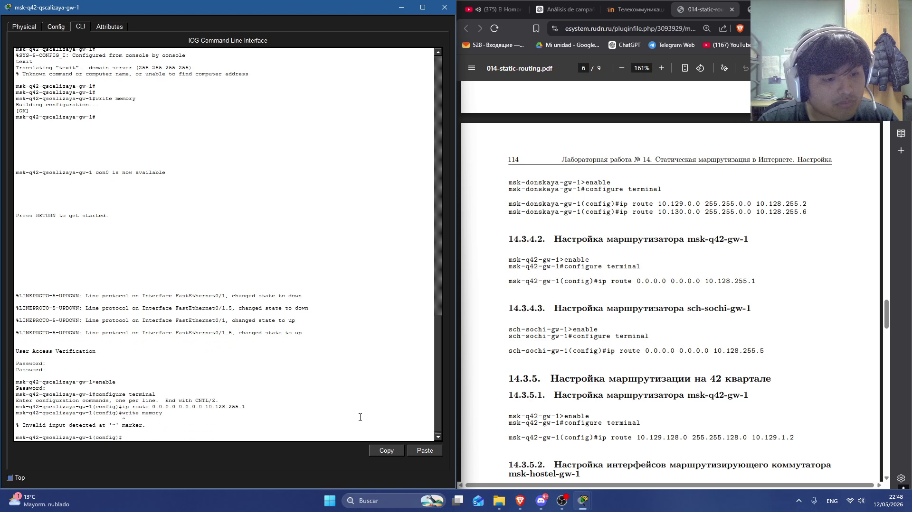

:::
::::::::::::::

## Настройка маршрутизатора sch-sochi-gw-1

:::::::::::::: {.columns align=center}

::: {.column width="90%"}

:::
::::::::::::::

# Настройка маршрутизации на 42 квартале

## Настройка маршрутизатора msk-q42-gw-1

:::::::::::::: {.columns align=center}

::: {.column width="90%"}

:::
::::::::::::::

## Настройка интерфейсов маршрутизирующего коммутатора msk-hostel-gw-1

:::::::::::::: {.columns align=center}

::: {.column width="90%"}

:::
::::::::::::::

# Настройка NAT на маршрутизаторе msk-donskaya-gw-1

## Настройка NAT на маршрутизаторе msk-donskaya-gw-1

:::::::::::::: {.columns align=center}

::: {.column width="90%"}

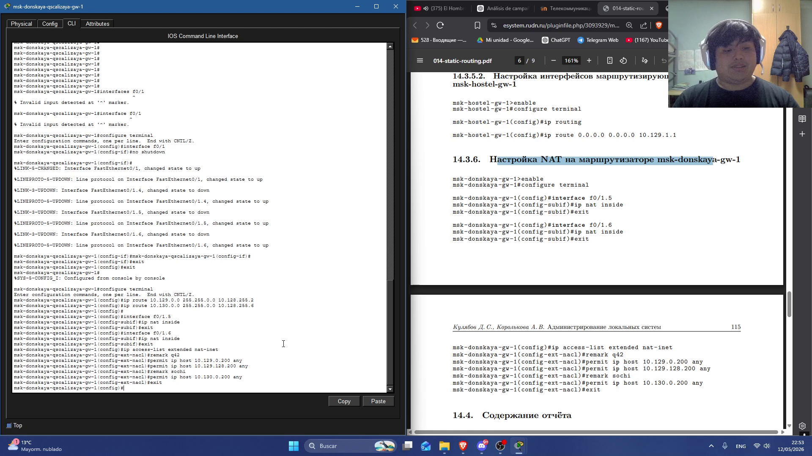

:::
::::::::::::::

# Информация

## change

:::::::::::::: {.columns align=center}
::: {.column width="30%"}

  * 

:::
::: {.column width="70%"}

:::
::::::::::::::
