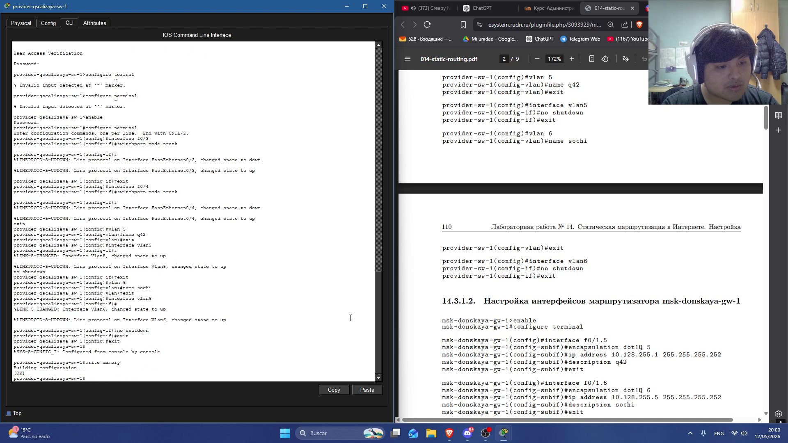
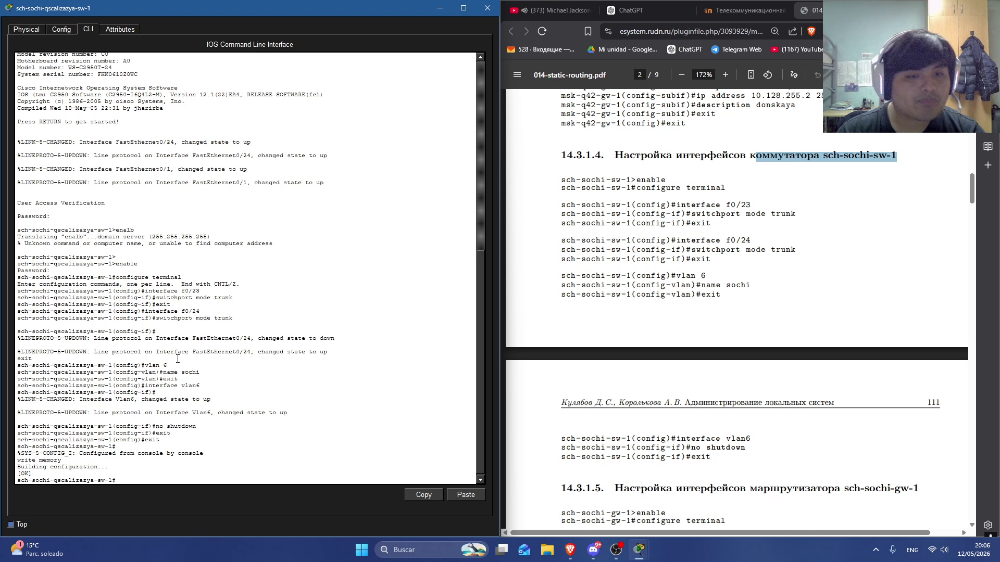
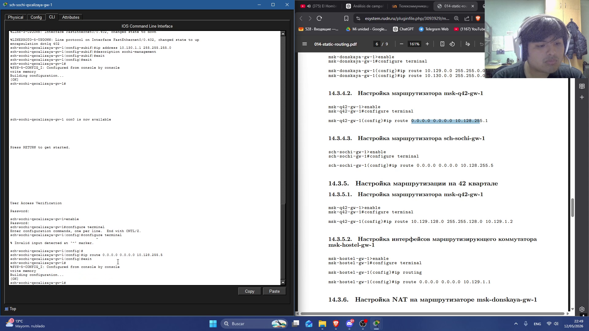
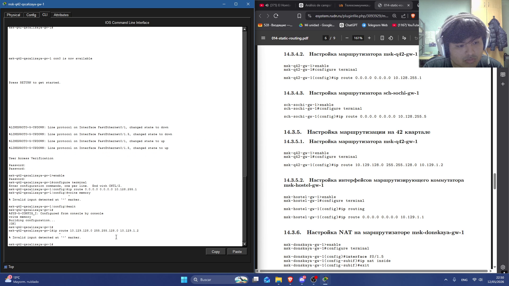
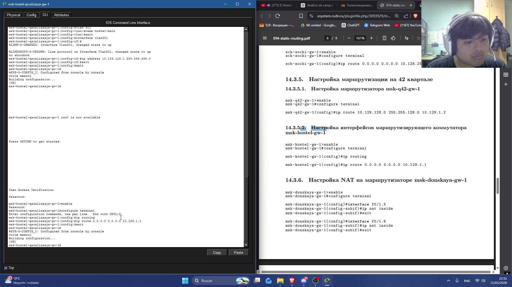

---
## Author
author:
  name: Кхари Жекка Кализая арсе
  email: 1032234412@rudn.ru
  affiliation:
    - name: Российский университет дружбы народов
      country: Российская Федерация
      postal-code: 117198
      city: Москва
      address: ул. Миклухо-Маклая, д. 6

## Title
title: "отчёт по лабораторной работе №14"
subtitle: "Статическая маршрутизация в Интернете. Настройка"
license: "CC BY"
---

# Цель работы

Настроить взаимодействие через сеть провайдера посредством статической маршрутизации локальной сети организации с сетью основного здания, расположенного в 42-м квартале в Москве, и сетью филиала, расположенного в г. Сочи.

# Задание

1. Настроить связь между территориями (см. раздел 14.3.1).
2. Настроить оборудование, расположенное в квартале 42 в Москве (см. раздел 14.3.2).
3. Настроить оборудование, расположенное в филиале в г. Сочи (см. раздел 14.3.3).
4. Настроить статическую маршрутизацию между территориями (см. раздел 14.3.4).
5. Настроить статическую маршрутизацию на территории квартала 42 в г. Москве (см. раздел 14.3.5).
6. Настроить NAT на маршрутизаторе msk-donskaya-gw-1 (см. раздел 14.3.6).
7. При выполнении работы необходимо учитывать соглашение об именовании (см. раздел 2.5).

# Выполнение лабораторной работы

## Настройка линка между площадками

Здесь было создана физическая / логическая связь между штаб-квартирами с помощью транспортных VLANs.

### Настройка интерфейсов коммутатора provider-qscalizaya-sw-1

`
provider-qscalizaya-sw-1> enable
provider-qscalizaya-sw-1# configure terminal
provider-qscalizaya-sw-1( config )# interface f0/3
provider-qscalizaya-sw-1( config-if)# switchport mode trunk
provider-qscalizaya-sw-1( config-if)#exit
provider-qscalizaya-sw-1( config )# interface f0/4
provider-qscalizaya-sw-1( config-if)# switchport mode trunk
provider-qscalizaya-sw-1( config-if)#exit
provider-qscalizaya-sw-1( config )#vlan 5
provider-qscalizaya-sw-1( config-vlan)#name q42
provider-qscalizaya-sw-1( config-vlan)#exit
provider-qscalizaya-sw-1( config )# interface vlan5
provider-qscalizaya-sw-1( config-if)# no shutdown
provider-qscalizaya-sw-1( config-if)#exit
provider-qscalizaya-sw-1( config )#vlan 6
provider-qscalizaya-sw-1( config-vlan)#name sochi
provider-qscalizaya-sw-1( config-vlan)#exit
provider-qscalizaya-sw-1( config )# interface vlan6
provider-qscalizaya-sw-1( config-if)# no shutdown
provider-qscalizaya-sw-1( config-if)#exit
`

Здесь был настроены интерфейсы f0/3 и f0/4 в режиме trunk чтобы использовать виртуальные сети VLAN, также был созданы VLANs VLAN5(q42) и VLAN6(sochi) ([рис. @fig-001]).

{#fig-001 width=70%}

### Настройка интерфейсов маршрутизатора msk-donskaya-qscalizaya-gw-1

`
msk-donskaya-qscalizaya-gw-1> enable
msk-donskaya-qscalizaya-gw-1# configure terminal
msk-donskaya-qscalizaya-gw-1( config )# interface f0 /1.5
msk-donskaya-qscalizaya-gw-1( config-subif )# encapsulation dot1Q 5
msk-donskaya-qscalizaya-gw-1( config-subif )# ip address 10.128.255.1 255.255.255.252
msk-donskaya-qscalizaya-gw-1( config-subif )# description q42
msk-donskaya-qscalizaya-gw-1( config-subif )#exit
msk-donskaya-qscalizaya-gw-1( config )# interface f0 /1.6
msk-donskaya-qscalizaya-gw-1( config-subif )# encapsulation dot1Q 6
msk-donskaya-qscalizaya-gw-1( config-subif )# ip address 10.128.255.5 255.255.255.252
msk-donskaya-qscalizaya-gw-1( config-subif )# description sochi
msk-donskaya-qscalizaya-gw-1( config-subif )#exit
msk-donskaya-qscalizaya-gw-1( config )#exit
`

Здесь былы настроены подинетерфейсы f0/1.5 и f0/1.6 и используется инкапсуляция dot1q ([рис. @fig-002]).

{#fig-002 width=70%}

### Настройка интерфейсов маршрутизатора msk-q42-qscalizaya-gw-1

`
msk-q42-qscalizaya-gw-1> enable
msk-q42-qscalizaya-gw-1# configure terminal
msk-q42-qscalizaya-gw-1( config )# interface f0 /1
msk-q42-qscalizaya-gw-1( config-if)# no shutdown
msk-q42-qscalizaya-gw-1( config-if)#exit
msk-q42-qscalizaya-gw-1( config )# interface f0 /1.5
msk-q42-qscalizaya-gw-1( config-subif)# encapsulation dot1Q 5
msk-q42-qscalizaya-gw-1( config-subif)# ip address 10.128.255.2 255.255.255.252
msk-q42-qscalizaya-gw-1( config-subif)# description donskaya
msk-q42-qscalizaya-gw-1( config-subif)#
`

Здесь включается интерфейс f0/1 и настроется подинтерфейс f0/1.5 чтобы использовал инкапсулянцию dot1q ([рис. @fig-003]).

{#fig-003 width=70%}

### Настройка интерфейсов коммутатора sch-sochi-qscalizaya-sw-1

`
sch-sochi-qscalizaya-sw-1> enable
sch-sochi-qscalizaya-sw-1# configure terminal
sch-sochi-qscalizaya-sw-1( config )# interface f0 /23
sch-sochi-qscalizaya-sw-1( config-if)# switchport mode trunk
sch-sochi-qscalizaya-sw-1( config-if)#exit
sch-sochi-qscalizaya-sw-1( config )# interface f0 /24
sch-sochi-qscalizaya-sw-1( config-if)# switchport mode trunk
sch-sochi-qscalizaya-sw-1( config-if)#exit
sch-sochi-qscalizaya-sw-1( config )#vlan 6
sch-sochi-qscalizaya-sw-1( config-vlan)#name sochi
sch-sochi-qscalizaya-sw-1( config-vlan)#exit
sch-sochi-qscalizaya-sw-1( config )# interface vlan6
sch-sochi-qscalizaya-sw-1( config-if)# no shutdown
sch-sochi-qscalizaya-sw-1( config-if)#exit
`

Здесь былы настроены интерфейсы f0/23 и f0/24 чтобы работать с виртуальными LAN ([рис. @fig-004]).

{#fig-004 width=70%}

### Настройка интерфейсов маршрутизатора sch-sochi-qscalizaya-gw-1

`
sch-sochi-qscalizaya-gw-1> enable
sch-sochi-qscalizaya-gw-1# configure terminal
sch-sochi-qscalizaya-gw-1( config )# interface f0 /0
sch-sochi-qscalizaya-gw-1( config-if)# no shutdown
sch-sochi-qscalizaya-gw-1( config-if)#exit
sch-sochi-qscalizaya-gw-1( config )# interface f0 /0.6
sch-sochi-qscalizaya-gw-1( config-subif )# encapsulation dot1Q 6
sch-sochi-qscalizaya-gw-1( config-subif )# ip address 10.128.255.6 255.255.255.252
sch-sochi-qscalizaya-gw-1( config-subif )# description donskaya
sch-sochi-qscalizaya-gw-1( config-subif )#
`

Здесь былы настроены интерфейсы f0/0 и f0/0.6, также я включил инкапсулацию dot1q ([рис. @fig-005]).

{#fig-005 width=70%}

## Настройка площадки 42-го квартала

Здесь былы настроены внутреные сети в полщадке 42-го квартала

### Настройка интерфейсов маршрутизатора msk-q42-gw-1

`
msk-q42-qscalizaya-gw-1> enable
msk-q42-qscalizaya-gw-1# configure terminal
msk-q42-qscalizaya-gw-1( config )# interface f0 /0
msk-q42-qscalizaya-gw-1( config-if)# no shutdown
msk-q42-qscalizaya-gw-1( config-if)#exit
msk-q42-qscalizaya-gw-1( config )# interface f0 /0.201
msk-q42-qscalizaya-gw-1( config-subif)# encapsulation dot1Q 201
msk-q42-qscalizaya-gw-1( config-subif)# ip address 10.129.0.1 255.255.255.0
msk-q42-qscalizaya-gw-1( config-subif)# description q42-main
msk-q42-qscalizaya-gw-1( config-subif)#exit
msk-q42-qscalizaya-gw-1( config )# interface f1 /0
msk-q42-qscalizaya-gw-1( config-if)# no shutdown
msk-q42-qscalizaya-gw-1( config-if)#exit
msk-q42-qscalizaya-gw-1( config )# interface f1 /0.202
msk-q42-qscalizaya-gw-1( config-subif)# encapsulation dot1Q 202
msk-q42-qscalizaya-gw-1( config-subif)# ip address 10.129.1.1 255.255.255.0
msk-q42-qscalizaya-gw-1( config-subif)# description q42-management
msk-q42-qscalizaya-gw-1( config-subif)#exit
`

Здесь я настроил интерфейсы f0/0, f0/0.201, f1/0,  f1/0.202. я включил их, также настроил инкапсулацию и добавил описания также указал какие IP-адресы они будут использовать ([рис. @fig-006]).

{#fig-006 width=70%}

### Настройка интерфейсов коммутатора msk-q42-qscalizaya-sw-1

`
msk-q42-qscalizaya-sw-1> enable
msk-q42-qscalizaya-sw-1# configure terminal
msk-q42-qscalizaya-sw-1( config )# interface f0 /24
msk-q42-qscalizaya-sw-1( config-if)# switchport mode trunk
msk-q42-qscalizaya-sw-1( config-if)#exit
msk-q42-qscalizaya-sw-1( config )# interface f0 /1
msk-q42-qscalizaya-sw-1( config-if)# switchport mode access
msk-q42-qscalizaya-sw-1( config-if)# switchport access vlan 201
msk-q42-qscalizaya-sw-1( config-if)#exit
msk-q42-qscalizaya-sw-1( config )#vlan 201
msk-q42-qscalizaya-sw-1( config-vlan)#name q42-main
msk-q42-qscalizaya-sw-1( config-vlan)#exit
msk-q42-qscalizaya-sw-1( config )# interface vlan201
msk-q42-qscalizaya-sw-1( config-if)# no shutdown
msk-q42-qscalizaya-sw-1( config-if)#exit
`

Здесь былы настроены интерфейсы f0/24 и f0/1, добавил описания и именил режим порта интерфейса f0/1 на access  ([рис. @fig-007]).

{#fig-007 width=70%}

### Настройка интерфейсов маршрутизирующего коммутатора msk-hostel-qscalizaya-gw-1

`
msk-hostel-qscalizaya-gw-1> enable
msk-hostel-qscalizaya-gw-1# configure terminal
msk-hostel-qscalizaya-gw-1( config )# interface g0 /1
msk-hostel-qscalizaya-gw-1( config-if)# switchport trunk encapsulation dot1q
msk-hostel-qscalizaya-gw-1( config-if)# switchport mode trunk
msk-hostel-qscalizaya-gw-1( config-if)#exit
msk-hostel-qscalizaya-gw-1( config )# interface f0 /1
msk-hostel-qscalizaya-gw-1( config-if)# switchport trunk encapsulation dot1q
msk-hostel-qscalizaya-gw-1( config-if)# switchport mode trunk
msk-hostel-qscalizaya-gw-1( config-if)#exit
msk-hostel-qscalizaya-gw-1( config )#vlan 202
msk-hostel-qscalizaya-gw-1( config-vlan)#name q42- management
msk-hostel-qscalizaya-gw-1( config-vlan)#exit
msk-hostel-qscalizaya-gw-1( config )# interface vlan202
msk-hostel-qscalizaya-gw-1( config-if)# no shutdown
msk-hostel-qscalizaya-gw-1( config-if)# ip address 10.129.1.2 255.255.255.0
msk-hostel-qscalizaya-gw-1( config-if)#exit
msk-hostel-qscalizaya-gw-1( config )#vlan 301
msk-hostel-qscalizaya-gw-1( config-vlan)#name hostel-main
msk-hostel-qscalizaya-gw-1( config-vlan)#exit
msk-hostel-qscalizaya-gw-1( config )# interface vlan301
msk-hostel-qscalizaya-gw-1( config-if)# no shutdown
msk-hostel-qscalizaya-gw-1( config-if)# ip address 10.129.128.1 255.255.255.0
msk-hostel-qscalizaya-gw-1( config-if)#exit
`

Здесь былы настроены интерфейсы g0/1, f0/1 также VLAN 202, 301. Я изменил его режим работы на trunk и настроил инкапсулацию, также добавил описания и IP-адресы ([рис. @fig-008]).

{#fig-008 width=70%}

### Настройка интерфейсов коммутатора msk-hostel-qscalizaya-sw-1

`
msk-hostel-qscalizaya-sw-1> enable
msk-hostel-qscalizaya-sw-1# configure terminal
msk-hostel-qscalizaya-sw-1( config )# interface g0 /1
msk-hostel-qscalizaya-sw-1( config-if)# switchport mode trunk
msk-hostel-qscalizaya-sw-1( config-if)#exit
msk-hostel-qscalizaya-sw-1( config )# interface f0 /1
msk-hostel-qscalizaya-sw-1( config-if)# switchport mode access
msk-hostel-qscalizaya-sw-1( config-if)# switchport access vlan 301
msk-hostel-qscalizaya-sw-1( config-if)#exit
msk-hostel-qscalizaya-sw-1( config )#vlan 301
msk-hostel-qscalizaya-sw-1( config-vlan)#name hostel-main
msk-hostel-qscalizaya-sw-1( config-vlan)#exit
msk-hostel-qscalizaya-sw-1( config )# interface vlan301
msk-hostel-qscalizaya-sw-1( config-if)# no shutdown
msk-hostel-qscalizaya-sw-1( config-if)#exit
`

Здесь я настроил интерфейсы g0/1 и  f0/1 чтобы работали в режиме trunk и access соответственно также я добавил описание на vlan 301 и включил его ([рис. @fig-009]).

{#fig-009 width=70%}

## Настройка площадки в Сочи

Здесь я повторил действия как и в площадке 42-го квартала

### Настройка интерфейсов маршрутизатора sch-sochi-qscalizaya-gw-1

`
sch-sochi-qscalizaya-gw-1> enable
sch-sochi-qscalizaya-gw-1# configure terminal
sch-sochi-qscalizaya-gw-1( config )# interface f0 /0.401
sch-sochi-qscalizaya-gw-1( config-subif )# encapsulation dot1Q 401
sch-sochi-qscalizaya-gw-1( config-subif )# ip address 10.130.0.1 255.255.255.0
sch-sochi-qscalizaya-gw-1( config-subif )# description sochi-main
sch-sochi-qscalizaya-gw-1( config-subif )#exit
sch-sochi-qscalizaya-gw-1( config )# interface f0 /0.402
sch-sochi-qscalizaya-gw-1( config-subif )# encapsulation dot1Q 402
sch-sochi-qscalizaya-gw-1( config-subif )# ip address 10.130.1.1 255.255.255.0
sch-sochi-qscalizaya-gw-1( config-subif )# description sochi- management
sch-sochi-qscalizaya-gw-1( config-subif )#exit
`

Здесь былы настроены интерфейсы f0/0.401 и f0/0.402 и выключил инкапсулацию dot1q 401 и 402, также я настроил статические IP-адресы и добавил соответственные описания ([рис. @fig-010]).

{#fig-010 width=70%}

### Настройка интерфейсов коммутатора sch-sochi-qscalizaya-sw-1

`
sch-sochi-qscalizaya-sw-1> enable
sch-sochi-qscalizaya-sw-1# configure terminal
sch-sochi-qscalizaya-sw-1( config )# interface f0 /1
sch-sochi-qscalizaya-sw-1( config-if)# switchport mode access
sch-sochi-qscalizaya-sw-1( config-if)# switchport access vlan 401
sch-sochi-qscalizaya-sw-1( config-if)#exit
sch-sochi-qscalizaya-sw-1( config )#vlan 401
sch-sochi-qscalizaya-sw-1( config-vlan)#name sochi-main
sch-sochi-qscalizaya-sw-1( config-vlan)#exit
sch-sochi-qscalizaya-sw-1( config )# interface vlan401
sch-sochi-qscalizaya-sw-1( config-if)# no shutdown
sch-sochi-qscalizaya-sw-1( config-if)#exit
`

Здесь я настроил интерфейсы f0/1, я изменил режим работы на access на vlan401. также настроил VLAN 401, я добавил им описание и выклчил его ([рис. @fig-011]).

{#fig-011 width=70%}

## Настройка маршрутизации между площадками

здесь были настроены маршруты, по которым сети будут обмениваться данными

### Настройка маршрутизатора msk-donskaya-qscalizaya-gw-1

`
msk-donskaya-qscalizaya-gw-1> enable
msk-donskaya-qscalizaya-gw-1# configure terminal
msk-donskaya-qscalizaya-gw-1( config )# ip route 10.129.0.0 255.255.0.0 10.128.255.2
msk-donskaya-qscalizaya-gw-1( config )# ip route 10.130.0.0 255.255.0.0 10.128.255.6
`

это значит что маршрутизатор будет отправит пакеты которые проходят через маршрутизаторы msk-q42-qscalizaya-gw-1 и sch-sochi-qscalizaya-gw-1 соответственно ([рис. @fig-012]).

{#fig-012 width=70%}

### Настройка маршрутизатора msk-q42-qscalizaya-gw-1

`
msk-q42-qscalizaya-gw-1> enable
msk-q42-qscalizaya-gw-1# configure terminal
msk-q42-qscalizaya-gw-1( config )# ip route 0.0.0.0 0.0.0.0 10.128.255.1
`

здесь я настроил маршрутизатор чтобы он отправил по умолчанию  все пакеты на msk-donskaya-qscalizaya-gw-1  ([рис. @fig-013]).

{#fig-013 width=70%}

### Настройка маршрутизатора sch-sochi-qscalizaya-gw-1

`
sch-sochi-qscalizaya-gw-1> enable
sch-sochi-qscalizaya-gw-1# configure terminal
sch-sochi-qscalizaya-gw-1( config )# ip route 0.0.0.0 0.0.0.0 10.128.255.5
`

тоже самое как и в маршрутизаторе msk-q42-qscalizaya-gw-1, по умолчанию  он отправит все пакеты на msk-donskaya-gw-1 ([рис. @fig-014]).

{#fig-014 width=70%}

## Настройка маршрутизации на 42 квартале

### Настройка маршрутизатора msk-q42-qscalizaya-gw-1

`
msk-q42-qscalizaya-gw-1> enable
msk-q42-qscalizaya-gw-1# configure terminal
msk-q42-qscalizaya-gw-1( config )# ip route 10.129.128.0 255.255.128.0 10.129.1.2
`

здесь были проложены внутренние маршруты, чтобы основная московская сеть могла добраться до хостела ([рис. @fig-015]).

{#fig-015 width=70%}

### Настройка интерфейсов маршрутизирующего коммутатора msk-hostel-qscalizaya-gw-1

`
msk-hostel-qscalizaya-gw-1> enable
msk-hostel-qscalizaya-gw-1# configure terminal
msk-hostel-qscalizaya-gw-1( config )# ip routing
msk-hostel-qscalizaya-gw-1( config )# ip route 0.0.0.0 0.0.0.0 10.129.1.1
`

здесь путь была настроена чтобы использовать маршрутизатор msk-q42-qscalizaya-gw-1 если он не знает куда отправить пакеты ([рис. @fig-016]).

{#fig-016 width=70%}

## Настройка NAT на маршрутизаторе msk-donskaya-qscalizaya-gw-1

`
msk-donskaya-qscalizaya-gw-1> enable
msk-donskaya-qscalizaya-gw-1# configure terminal
msk-donskaya-qscalizaya-gw-1( config )# interface f0 /1.5
msk-donskaya-qscalizaya-gw-1( config-subif )# ip nat inside
msk-donskaya-qscalizaya-gw-1( config-subif )#exit
msk-donskaya-qscalizaya-gw-1( config )# interface f0 /1.6
msk-donskaya-qscalizaya-gw-1( config-subif )# ip nat inside
msk-donskaya-qscalizaya-gw-1( config-subif )#exit

msk-donskaya-qscalizaya-gw-1( config )# ip access-list extended
msk-donskaya-qscalizaya-gw-1( config-ext-nacl)# remark q42
msk-donskaya-qscalizaya-gw-1( config-ext-nacl)# permit ip host 10.129.0.200 any
msk-donskaya-qscalizaya-gw-1( config-ext-nacl)# permit ip host 10.129.128.200 any
msk-donskaya-qscalizaya-gw-1( config-ext-nacl)# remark sochi
msk-donskaya-qscalizaya-gw-1( config-ext-nacl)# permit ip host 10.130.0.200 any
msk-donskaya-qscalizaya-gw-1( config-ext-nacl)#exit
`

Здесь я начала отметил интерфейсы f0/1.5 и f0/1.6 как inside. потом я создал новый список прав доступа ([рис. @fig-017]).

{#fig-017 width=70%}

# Выводы

В этой лаборатоной работе я настроил все остальные сети чтобы разрешать подключения между сетмями, настроил пути и список прав доступа.

# Список литературы{.unnumbered}

::: {#refs}
:::
