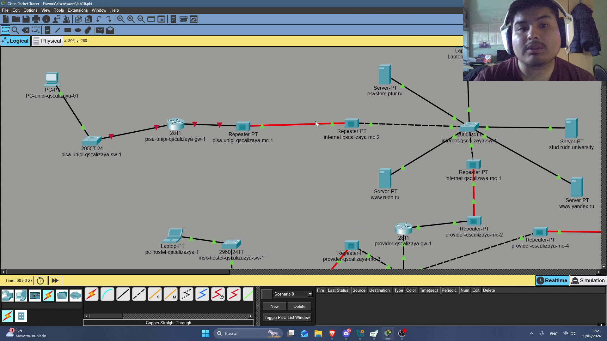
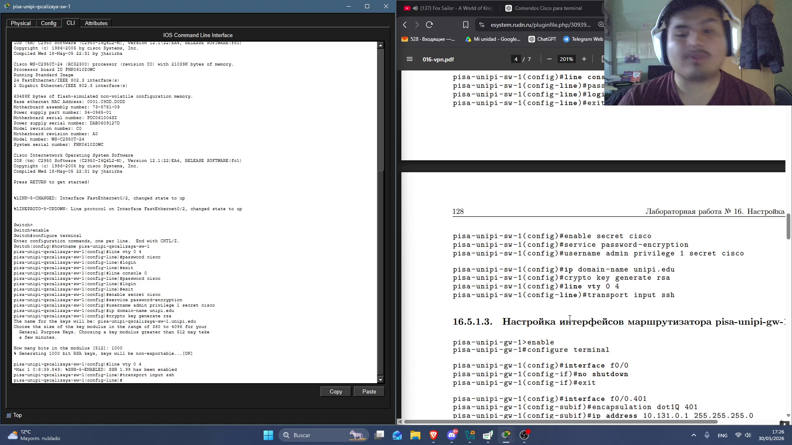

---
## Author
author:
  name: Кхари Жекка Кализая Арсе
  email: 1032234412@rudn.ru
  affiliation:
    - name: Российский университет дружбы народов
      country: Российская Федерация
      postal-code: 117198
      city: Москва
      address: ул. Миклухо-Маклая, д. 6
## Title
title: презентация №16
subtitle: Настройка VPN
license: CC BY
date: today
date-format: "YYYY-MM-DD" # Example: 2025-09-06
---

# новая сеть Пиза

## расположение оборудований

:::::::::::::: {.columns align=center}

::: {.column width="90%"}

:::
::::::::::::::

## переименование оборудований

:::::::::::::: {.columns align=center}

::: {.column width="90%"}

:::
::::::::::::::

# настройка оборудований

## Первоначальная настройка маршрутизатора pisa-unipi-gw-1

:::::::::::::: {.columns align=center}

::: {.column width="90%"}

:::
::::::::::::::

## Первоначальная настройка коммутатора pisa-unipi-sw-1

:::::::::::::: {.columns align=center}

::: {.column width="90%"}

:::
::::::::::::::

## Настройка интерфейсов маршрутизатора pisa-unipi-gw-1

:::::::::::::: {.columns align=center}

::: {.column width="90%"}

:::
::::::::::::::

##  Настройка интерфейсов коммутатора pisa-unipi-sw-1

:::::::::::::: {.columns align=center}

::: {.column width="90%"}

:::
::::::::::::::

# настройка VPN на основе GRE

## Настройка маршрутизатора msk-donskaya-gw-1

:::::::::::::: {.columns align=center}

::: {.column width="90%"}

:::
::::::::::::::

## Настройка маршрутизатора pisa-unipi-gw-1

:::::::::::::: {.columns align=center}

::: {.column width="90%"}

:::
::::::::::::::

