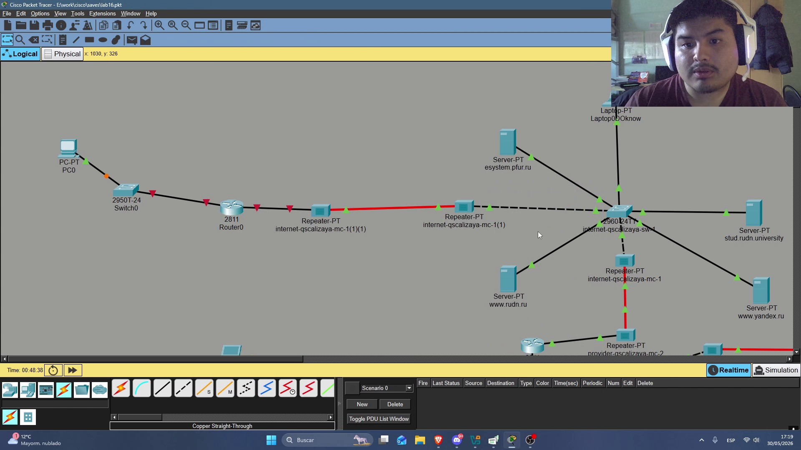
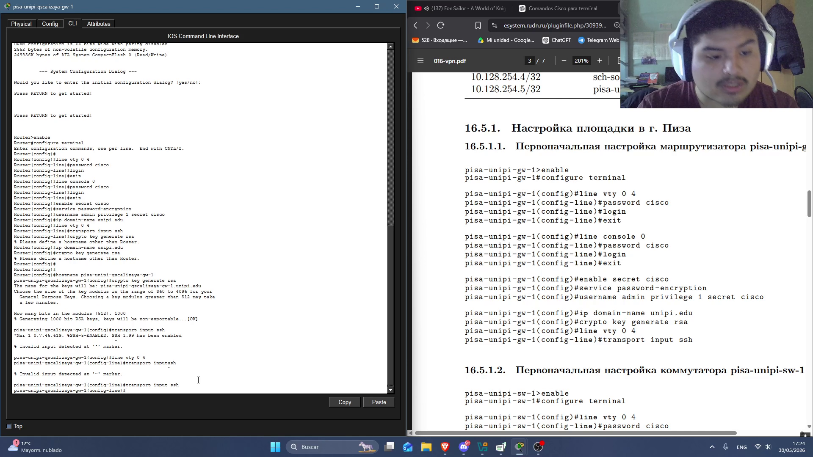
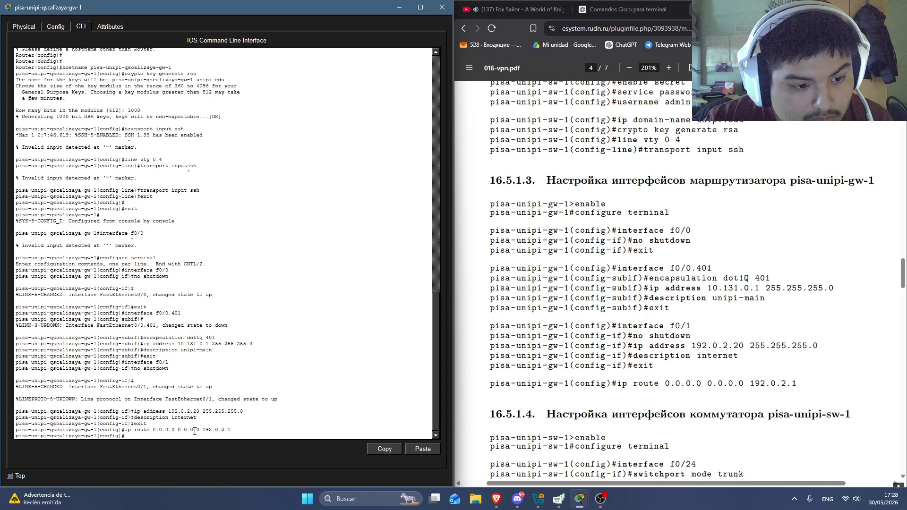
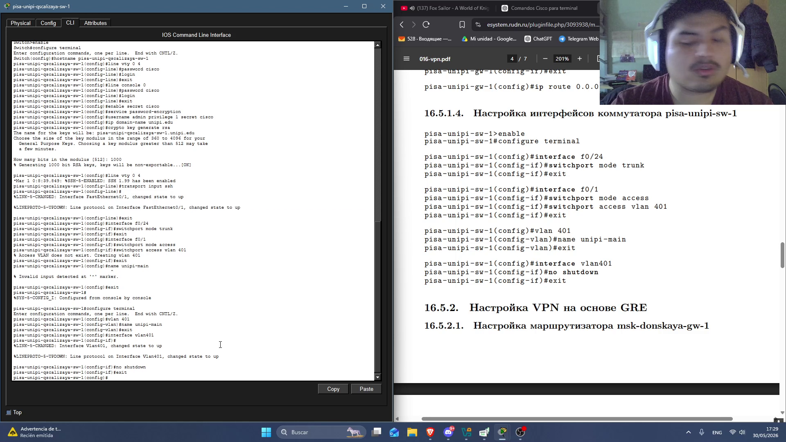
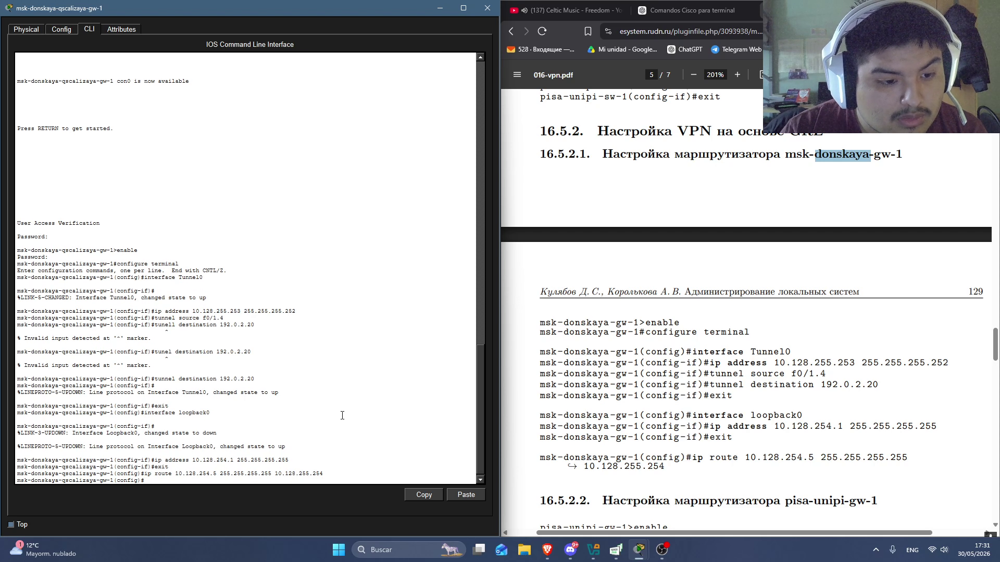
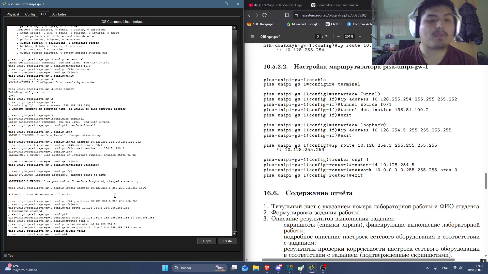

---
## Author
author:
  name: Кхари Жекка Кализая арсе
  email: 1032234412@rudn.ru
  affiliation:
    - name: Российский университет дружбы народов
      country: Российская Федерация
      postal-code: 117198
      city: Москва
      address: ул. Миклухо-Маклая, д. 6

## Title
title: "отчёт по лабораторной работе №"
subtitle: "change"
license: "CC BY"
---

# Цель работы

Получение навыков настройки VPN-туннеля через незащищённое Интернетсоединение.


# Задание

Настроить VPN-туннель между сетью Университета г. Пиза (Италия) и сетью «Донская» в г. Москва (см. рис. 16.1).
При выполнении работы необходимо учитывать соглашение об именовании
(см. раздел 2.5).


# Выполнение лабораторной работы

Сначала я расположил все оборудования для сети Пиза в рабочей области  ([рис. @fig-001]).


{#fig-001 width=70%}


Дальше я переименовал их 

список оборудований:

- pisa-unipi-qscaziaya-mc-1
- pisa-unipi-qscaziaya-gw-1
- pisa-unipi-qscaziaya-sw-1
- pc-unipi-qscalizaya-1

{#fig-002 width=70%}

## настройка оборудований

### Первоначальная настройка маршрутизатора pisa-unipi-qscalizaya-gw-1

```
pisa-unipi-qscalizaya-gw-1>enable
pisa-unipi-qscalizaya-gw-1#configure terminal
pisa-unipi-qscalizaya-gw-1(config)#line vty 0 4
pisa-unipi-qscalizaya-gw-1(config-line)#password cisco
pisa-unipi-qscalizaya-gw-1(config-line)#login
pisa-unipi-qscalizaya-gw-1(config-line)#exit
pisa-unipi-qscalizaya-gw-1(config)#line console 0
pisa-unipi-qscalizaya-gw-1(config-line)#password cisco
pisa-unipi-qscalizaya-gw-1(config-line)#login
pisa-unipi-qscalizaya-gw-1(config-line)#exit
pisa-unipi-qscalizaya-gw-1(config)#enable secret cisco
pisa-unipi-qscalizaya-gw-1(config)#service password-encryption
pisa-unipi-qscalizaya-gw-1(config)#username admin privilege 1 secret cisco
pisa-unipi-qscalizaya-gw-1(config)#ip domain-name unipi.edu
pisa-unipi-qscalizaya-gw-1(config)#crypto key generate rsa
pisa-unipi-qscalizaya-gw-1(config)#line vty 0 4
pisa-unipi-qscalizaya-gw-1(config-line)#transport input ssh
```

здесь настроются вход в систему, пароль и протоколы соединения (ssh) также создается ключ rsa

{#fig-003 width=70%}


### Первоначальная настройка коммутатора pisa-unipi-qscalizaya-sw-1

```
pisa-unipi-qscalizaya-sw-1>enable
pisa-unipi-qscalizaya-sw-1#configure terminal
pisa-unipi-qscalizaya-sw-1(config)#line vty 0 4
pisa-unipi-qscalizaya-sw-1(config-line)#password cisco
pisa-unipi-qscalizaya-sw-1(config-line)#login
pisa-unipi-qscalizaya-sw-1(config-line)#exit
pisa-unipi-qscalizaya-sw-1(config)#line console 0
pisa-unipi-qscalizaya-sw-1(config-line)#password cisco
pisa-unipi-qscalizaya-sw-1(config-line)#login
pisa-unipi-qscalizaya-sw-1(config-line)#exit
pisa-unipi-qscalizaya-sw-1(config)#enable secret cisco
pisa-unipi-qscalizaya-sw-1(config)#service password-encryption
pisa-unipi-qscalizaya-sw-1(config)#username admin privilege 1 secret cisco
pisa-unipi-qscalizaya-sw-1(config)#ip domain-name unipi.edu
pisa-unipi-qscalizaya-sw-1(config)#crypto key generate rsa
pisa-unipi-qscalizaya-sw-1(config)#line vty 0 4
pisa-unipi-qscalizaya-sw-1(config-line)#transport input ssh
```

как и маршрутизатора, я еще раз настроил пароль, вход в систему, т.п.

{#fig-004 width=70%}

### Настройка интерфейсов маршрутизатора pisa-unipi-qscalizaya-gw-1

```
pisa-unipi-qscalizaya-gw-1>enable
pisa-unipi-qscalizaya-gw-1#configure terminal
pisa-unipi-qscalizaya-gw-1(config)#interface f0/0
pisa-unipi-qscalizaya-gw-1(config-if)#no shutdown
pisa-unipi-qscalizaya-gw-1(config-if)#exit
pisa-unipi-qscalizaya-gw-1(config)#interface f0/0.401
pisa-unipi-qscalizaya-gw-1(config-subif)#encapsulation dot1Q 401
pisa-unipi-qscalizaya-gw-1(config-subif)#ip address 10.131.0.1 255.255.255.0
pisa-unipi-qscalizaya-gw-1(config-subif)#description unipi-main
pisa-unipi-qscalizaya-gw-1(config-subif)#exit
pisa-unipi-qscalizaya-gw-1(config)#interface f0/1
pisa-unipi-qscalizaya-gw-1(config-if)#no shutdown
pisa-unipi-qscalizaya-gw-1(config-if)#ip address 192.0.2.20 255.255.255.0
pisa-unipi-qscalizaya-gw-1(config-if)#description internet
pisa-unipi-qscalizaya-gw-1(config-if)#exit
pisa-unipi-qscalizaya-gw-1(config)#ip route 0.0.0.0 0.0.0.0 192.0.2.1
```

в маршрутизаторе я включил интерфейс f0/0, также создал новый подинтерфейс f0/0.401, которому дал encapsuation dot1q 401, также указал какой IP-адрес он будет использовать и добавил описание (unipi-main). также включил интерфейс f0/1 и указал его IP-адрес и добавил описание (internet). Также я настроил путь по умолчанию (192.0.2.1) для всех пакетов

{#fig-005 width=70%}

###  Настройка интерфейсов коммутатора pisa-unipi-qscalizaya-sw-1

```
pisa-unipi-qscalizaya-sw-1>enable
pisa-unipi-qscalizaya-sw-1#configure terminal
pisa-unipi-qscalizaya-sw-1(config)#interface f0/24
pisa-unipi-qscalizaya-sw-1(config-if)#switchport mode trunk
pisa-unipi-qscalizaya-sw-1(config-if)#exit
pisa-unipi-qscalizaya-sw-1(config)#interface f0/1
pisa-unipi-qscalizaya-sw-1(config-if)#switchport mode access
pisa-unipi-qscalizaya-sw-1(config-if)#switchport access vlan 401
pisa-unipi-qscalizaya-sw-1(config-if)#exit
pisa-unipi-qscalizaya-sw-1(config)#vlan 401
pisa-unipi-qscalizaya-sw-1(config-vlan)#name unipi-main
pisa-unipi-qscalizaya-sw-1(config-vlan)#exit
pisa-unipi-qscalizaya-sw-1(config)#interface vlan401
pisa-unipi-qscalizaya-sw-1(config-if)#no shutdown
pisa-unipi-qscalizaya-sw-1(config-if)#exit
```

здесь я включил интерфейс f0/24 (к компьютеру) также я изменил его режим работу на trunk. Потом я настроил интерфейс f0/1, я изменил его режим работы на access и указал vlan401, Потом создал VLAN 401 и дал ему название unipi-main. Дальше включил его

{#fig-006 width=70%}


## Настройка VPN на основе GRE

###  Настройка маршрутизатора msk-donskaya-gw-1

```
msk-donskaya-gw-1>enable
msk-donskaya-gw-1#configure terminal
msk-donskaya-gw-1(config)#interface Tunnel0
msk-donskaya-gw-1(config-if)#ip address 10.128.255.253 255.255.255.252
msk-donskaya-gw-1(config-if)#tunnel source f0/1.4
msk-donskaya-gw-1(config-if)#tunnel destination 192.0.2.20
msk-donskaya-gw-1(config-if)#exit
msk-donskaya-gw-1(config)#interface loopback0
msk-donskaya-gw-1(config-if)#ip address 10.128.254.1 255.255.255.255
msk-donskaya-gw-1(config-if)#exit
msk-donskaya-gw-1(confi)#ip route 10.128.254.5 255.255.255.255 10.128.255.254

```

Здесь я начал настроить VPN, для того я сначала создал интерфейс Tunnel0, которому дал IP-адрес 10.128.255.253, дальше я указал с какого интерфейса пакеты приходять (f0/1.4) и куда они идут (192.0.2.20). дальше я создал новый интерфейс loopback0, которому дал IP-адрес 10.128.254.1. Также настроил путь по умольчанию (10.128.254.5)

{#fig-007 width=70%}


### Настройка маршрутизатора pisa-unipi-gw-1

```
pisa-unipi-gw−1>enable
pisa-unipi-gw-1#configure terminal
pisa-unipi-gw-1(config)#interface Tunnel0
pisa-unipi-gw-1(config-if)#ip address 10.128.255.254 255.255.255.252
pisa-unipi-gw-1(config-if)#tunnel source f0/1
pisa-inipi-gw-1(config-if)#tunnel destination 198.51.100.2
pisa-unipi-gw-1(config-if)#exit
pisa-unipi-gw-1(config)#interface loopback0
pisa-unipi-gw-1(config-if)#ip address 10.128.254.5 255.255.255.255
pisa-unipi-gw-1(config-if)#exit
pisa-unipi-gw-1(config)#ip route 10.128.254.1 255.255.255.255 10.128.255.253
pisa-unipi-gw-1(config)#router ospf 1
pisa-unipi-gw-1(config-router)#router-id 10.128.254.5
pisa-unipi-gw-1(config-router)#network 10.0.0.0 0.255.255.255 area 0
pisa-unipi-gw-1(config-router)#exit
```


в маршрутизаторе pisa-unipi-qscalizaya-gw-1 я еще раз создал интерфейс Tunnel0 с IP-адресом 10.128.255.254, также еще раз указал откуда и куда идут пакеты (source и destination). Дальше я создал интерфейс loopback0 и указал его IP-адрес 10.128.254.5. Потом настроил путь по умолчанию 10.128.254.1 и включил OSPF. также  дал маршрутизатору IP-адрес 10.128.254.5. Также включил OSPF в всех интерфейсах, которые включаются в диапазоне 10.0.0.0/8 и что они будут в area 0


{#fig-008 width=70%}

# Выводы

В этой лабораторной работе я смог смотреть как создать и настроить VPN в сети. какие команды надо использовать и как они работают

# Список литературы{.unnumbered}

::: {#refs}
:::
